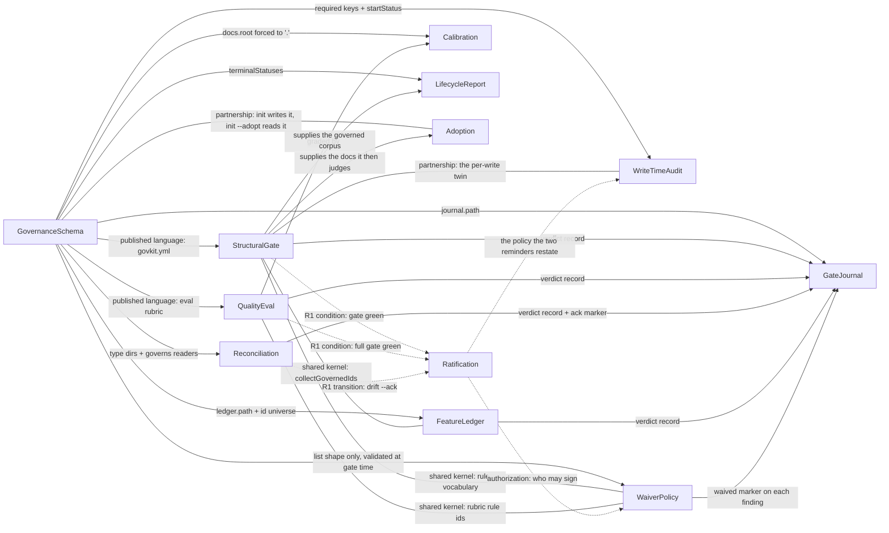

Decomposition of the govkit engine from artifacts that exist in this repo. **No workshop, no
domain expert** — `1-understand` and `2-discover` were skipped deliberately, so there is no
`business-model.md`, no `discovery/` timeline and no attributed rule. Every invariant below traces
to `packages/govkit/src/**`, `govkit.yml`, `AGENTS.md`, `README.md`, `docs/product/PRD-0001` or
`docs/rfc/**` with a `file:line` citation and the enclosing symbol. A rule with no such source is
an open question, listed as one — never an invariant.

**Citation snapshot: 2026-07-28T16:15+07.** A sibling agent was editing `config.ts`, `util.ts`,
`verify.ts` and `eval.ts` while this was written (per-type `recursive:` / `idFilenameConvention:`
layout switches). Every citation therefore carries its **symbol** as well as its line, so a shifted
line stays resolvable.

## Context map

`A --> B` is the `direction` axis alone: A is upstream, B depends on A. `A --- B` is a `peer` edge,
where an arrowhead would assert a dependency the model denies. Dotted is **honor-system** — no code
*enforces* it (`govkit.yml:128-134`), and the only place any reaches code is WriteTimeAudit's two
non-blocking reminders (`audit-write.ts:88-136`). **30** relationships across the twelve
`model.yaml` files, minus **3** `separate-ways` — a declaration that there is *no* integration, so
a line would be a lie — equals the **27** links above. The three: StructuralGate ↔ QualityEval,
Adoption ↔ QualityEval, Calibration ↔ WaiverPolicy (load-bearing — a signed exception must never
move the confusion matrix that judges the rubric). `ddd_check.py --strict-symmetry` holds the two
model sides to each other; that arithmetic is what holds this drawing to them, by hand until
something reads the fence.

## Sub-domain classification

| Bounded Context | Sub-domain type | Tactical pattern | Why |
|---|---|---|---|
| StructuralGate | core | full-domain-model | The binary merge-blocking gate. Owns 11 violation kinds (`config.ts:19 VIOLATION_KINDS`) and the only corpus-level invariants in the system. |
| Reconciliation | core | full-domain-model | The spec↔code claim gate + its ack ritual + the recency advisory. PRD-0001:64 sources the differentiation: "no tool has deterministic drift detection". |
| Calibration | supporting | transaction-script | A regression harness for QualityEval, not a capability a consumer runs — which is what `supporting` means here. **Contested**: its OUTPUT is the product's north star (PRD-0001:37-42, :75-76), so `core-domain-chart.md` places it highest on differentiation and proposes promoting it. |
| Ratification | supporting | crud | Committed config + prose that binds actors, never the engine (`govkit.yml:128-134`). No code, no state, no aggregate — the only context whose invariants have zero runtime enforcement. Its measured value is removed interrupt load (RFC-0027:52-73), an internal cost saving; no source claims differentiation. |
| WaiverPolicy | supporting | full-domain-model | The recorded, EXPIRING exception — the only mechanism that can stop a finding blocking. Earns an aggregate despite being supporting: a waiver has identity in the config list, a lifecycle (active → expiring-soon → expired), and a rule-times-scope consistency boundary. **Landed during this modelling run.** |
| QualityEval | supporting | transaction-script | A deterministic structural FLOOR, explicitly *not* a substance judge (`README.md:52-58`). Scoring is one pure function (`eval.ts:103 scoreArtifact`); no lifecycle, no identity. |
| FeatureLedger | supporting | full-domain-model | Append-only evidence over a committed JSON file. Light in code, but its append-only invariant is corpus-level, so it earns one aggregate. |
| WriteTimeAudit | supporting | transaction-script | A stateless decision function on a PreToolUse payload (`audit-write.ts:36`). Defer-by-default; it decides, it stores nothing. |
| Adoption | supporting | transaction-script | Scaffold a greenfield repo or migrate a brownfield corpus. Regex extraction plus a sentinel; no lifecycle. |
| GateJournal | supporting | transaction-script | Append-only JSONL sensor. One record shape, no reads, no queries. |
| LifecycleReport | supporting | crud | A read-only histogram plus one deterministic renderer. Never blocks (`cli.ts:764-775`). |
| GovernanceSchema | master-data | crud | `govkit.yml` is the pluggable contract every context reads (`govkit.yml:1-4`). Load-time validation is real, but there is no model to own — no aggregate, deliberately. |

**Two** core contexts out of twelve, and only **four** carry aggregates (StructuralGate 3,
Reconciliation 1, FeatureLedger 1, WaiverPolicy 1). The prior pass of this file labelled four
contexts `core`; Calibration and Ratification were demoted in this run, because `5-strategize`'s
rule is that a chart calling everything core has not thought about differentiation — and because
neither is a capability a consumer runs. Both demotions are argued in `core-domain-chart.md`, and
Calibration's is proposed for reversal there. The remaining eight are deliberately light:
`aggregates: []` with a stated reason is the correct, complete model for a stateless measurement, a
policy an actor honours, or a read-only projection.

## The load-bearing extraction seam

**`govkit.yml` as Published Language.** The one artifact every context reads and none owns
behaviourally — doc dirs, required keys, status enums, terminal sets, `refs`, risk tiers, the eval
rubric and the ratification tiers all live there (`govkit.yml:5-153`), behind a single reader
(`config.ts:417 loadConfig`). Extract that contract first and every gate becomes independently
deployable. Declined as a context of its own beyond the master-data slice: it owns validation rules
but no domain model. Owner is GovernanceSchema; every consumer conforms.

## Shared artifacts and their sharing level

| Artifact | Between | Level | Cost / note |
|---|---|---|---|
| `govkit.yml` / `GovkitConfig` | GovernanceSchema → all ten others | Published Language | Versioned by `schemaVersion` (`config.ts:501`). One reader (`loadConfig`), so drift is structurally impossible. |
| `collectGovernedIds` (the id universe) | StructuralGate ↔ FeatureLedger | **Shared Kernel — flagged** | `util.ts:156` exists precisely "so the two can never disagree on which ids exist". A real shared domain function: changing what counts as a governed id changes both gates at once. Cost accepted deliberately; the comment is the mutual-consent note. |
| `scanGoverned` (the `governs:` reader) | drift ↔ stale, inside Reconciliation | Building Block | `util.ts:147` — "ONE scanner so the two governs-readers can never disagree". This shared scanner is the evidence that drift and stale are one context, not two. |
| `stripNonProse` + `headingLines` | StructuralGate ↔ QualityEval | Building Blocks | `util.ts:60,70` — both must judge "a section" identically across the two trust layers. No business meaning; version like a library. |
| `typeDir` | every reader + the write-time hook | Building Block | `util.ts:22` — one resolver so a non-`.` `docs.root` cannot be honoured by some readers and bypassed by others. |
| The waiver `rule` vocabulary (verify kinds ∪ rubric rule ids) | WaiverPolicy ↔ StructuralGate ↔ QualityEval | **Shared Kernel — flagged** | `config.ts:296 knownRuleKeys` unions two contexts' enums into one namespace. Cost: adding a violation kind or a rubric rule silently widens what a waiver may name, in a third context. Mutual-consent change across three boundaries. |
| `JournalRecord` | five gates → GateJournal | Published Language | `journal.ts:14-46`. Additive-only: optional fields are omitted, never null, so old lines stay readable. |

## Ubiquitous language — the polysemy that justifies these boundaries

The same word means different things in different contexts. That is the point of the split, not a
naming clash.

| Term | In this context | Means something else in |
|---|---|---|
| **drift** | governed content moved past the doc's recorded claim (`drift.ts:176`) | Adoption: a status value outside the configured enum (`adopt.ts:31 AdoptConfigDrift`) |
| **check** | the composite CLI gate, verify then eval (`cli.ts:696`) | FeatureLedger: the human-readable command string that earned `passes` (`ledger.ts:25`) |
| **violation** | one of 9 verify kinds (`config.ts:19`) | FeatureLedger: one of 6 ledger kinds (`ledger.ts:28`) — two disjoint enums, deliberately not shared |
| **stale** | Reconciliation: governed code has newer commits than its doc (`stale.ts:7`) | StructuralGate: an INDEX row whose cell no longer matches front-matter (`verify.ts:186 checkIndex`) |
| **required** | StructuralGate: a front-matter key that must be present (`verify.ts:102`) | QualityEval: a rubric rule that blocks CI when it fails (`config.ts:130-135`) |
| **scope** | WaiverPolicy: a path glob a waiver covers (`config.ts:366 globToRegExp`) | StructuralGate: `--changed` narrowing of a report (`verify.ts:472`) |
| **claim** | Reconciliation: a content hash a doc vouches for (`drift.ts:28`) | FeatureLedger: a done-ness assertion about a feature (`ledger.ts:18`) |
| **ok** | zero *blocking* violations (`verify.ts:620`) | eval: every artifact cleared its floor (`eval.ts:179`) · ack: nothing left unackable (`drift.ts:366`) |
| **terminal** | StructuralGate: the coherence parent test (`verify.ts:309`) | LifecycleReport: the "✓ decided" marker (`report.ts:81`) · WriteTimeAudit: the reminder trigger (`audit-write.ts:94`) |

## Declined context candidates (capability-vs-context test)

| Candidate | Why declined | What would promote it |
|---|---|---|
| **The CLI / gate runner** (`cli.ts`) | A composition root, not a domain. It decides flag legality, exit-code mapping and journal wiring, but owns no invariant about governed docs. Its decisions are recorded under the contexts they belong to. | A runtime it had to schedule, retry or resume — none exists. |
| **Front-matter parsing** (`frontmatter.ts`) | One block grammar shared by every reader (`frontmatter.ts:32 frontMatterSpan`). A Building Block, not a boundary — it has no rule of its own beyond "one grammar, one owner". | Multiple competing metadata formats. |
| **Changed-set scoping** (`--changed`) | A *report filter* on StructuralGate and a *scored-set filter* on QualityEval (`verify.ts:472`, `eval.ts:168`) — a capability of two contexts, not a third. | A persistent adoption backlog with its own lifecycle. |
| **Risk tiers** (`tiers:`) | One field on a violation, assigned once (`verify.ts:618`). No model. | Per-tier workflow — suppression windows, expiry, an owner per tier. |
| **Substance judging** | Deliberately outside the engine: keyed, opt-in, never in no-key CI (`README.md:52-58`, RFC-0019). Not modelled here because no code in `packages/govkit/src` implements it. | Nothing — the non-goal is explicit (`PRD-0001:82-83`). |

## Event-flow continuity check

**The system emits exactly one domain event.** Every gate returns a verdict *synchronously* to its
caller; nothing is published and nothing subscribes. The only durable, past-tense fact is the
journal line (`journal.ts:14 JournalRecord`, `journal.ts:64 appendJournal`), written by five
commands (`journal.ts:17`).

| Event (emitter) | Consumer |
|---|---|
| `GateRunRecorded` (GateJournal, on behalf of verify · eval · check · drift · ledger) | **No in-process consumer.** RFC-0017's distiller reads `.govkit/journal.jsonl` out of band; nothing in `packages/govkit/src` reads a journal line back. |

That is a finding, not an omission: a twelve-context model with one event and zero subscribers is
evidence that the coupling here is **call-stack coupling**, not message coupling. See
`core-domain-chart.md` § Investment mismatch and `message-flows/README.md` finding F-1.

## Conflicts & reconciliation

| Concept | Source A | Source B | Chosen (authoritative) | Flag for human |
|---|---|---|---|---|
| Which docs `verify` scans | `util.ts:33 listMarkdown` doc-comment (pre-edit): "Non-recursive by design — governed docs live flat in their type dir" | Live code at snapshot: `listMarkdown(dir, ignore, def.recursive)` with a per-type `recursive?: boolean` (`config.ts:52`, `verify.ts:554`) | **Live code** | A sibling agent is mid-change. `docs/domain/**` is a nested tree, so whether this model's own files become governed depends on that change landing. |
| Is `docs/domain` a governed doc type? | This tree exists and carries `DOMAIN-*` front-matter | `govkit.yml` (mtime 07-24) declares only `prd, rfc, adr, us, rel` (`govkit.yml:14-75`) | **govkit.yml** — these docs are **not** governed today | Adding a `domain:` type is a `govkit.yml` edit nobody has authorised; out of scope for this agent. |
| Effective `required` front-matter keys | `verify.ts:541-547` + the documented rule at `config.ts:100-106`: `(base.required − excludeBase) ∪ type.required` | `audit-write.ts:58`: `base.required ∪ type.required` — `excludeBase` is never subtracted | **verify** — `config.ts:100-106` states the subtraction as the contract, and CI is the gate of record | A type declaring `excludeBase` would be BLOCKED at write time for a key CI does not require. Not asserted as a defect; no source says which side is intended. |
| Which files a type's readers walk | `verify.ts:573` and `eval.ts:252` pass the per-type `recursive` flag | at the snapshot, `report.ts` and `adopt.ts` called `listMarkdown` without it | **Resolved in live code, not by this map** — every reader now passes it: `report.ts:90`, `adopt.ts:144`, `util.ts:166`, `doctor.ts:286` | Was: a nested design tree gated and graded but under-counted in its lifecycle view and skipped by the migrator. Re-measured this round; the divergence is closed. `util.ts:17-19` still names honouring a path in some readers and not others as the "looks-governed-but-isn't" leak. |
| What `bun run check` runs | `AGENTS.md:45`: "biome + typecheck + build + tests + `verify` + `eval`" | `package.json:28` also chains `calibrate`, `drift` and `ledger` | **package.json** — it is the executable definition | The repo's agent-facing doc understates its own gate by three commands, all git-backed. A doc fix. |
| Is `stale` one context with `drift`, or its own? | Two RFCs, two verdict vocabularies (`stale.ts:7` vs `drift.ts:33`) | One shared scanner asserted as a correctness property (`util.ts:147`) | **One context (Reconciliation)** | Recorded, not hidden — if `stale` grows its own lifecycle the split is cheap. |

## Open questions

- **Does `docs/domain/**` need a `governs:`/`reconciled:` pair of its own?** Every other design
  artifact in this repo is governed; this tree is not. `docs/rfc/AGENTS.md` — no such file exists.
  *Owner decides.*
- **Is `GateRunRecorded` the only event, or the only event *so far*?** No code publishes anything
  else. Naming more would be fabrication. Measured: 151 journal lines carry three `cmd` values
  (`check` 77, `drift` 40, `ledger` 34); `verify` and `eval` never appear alone, and `calibrate`
  cannot appear at all (`journal.ts:17`).
- **`calibrate` runs in CI but may not journal.** `package.json:25` runs it on every `bun run
  check`; the `cmd` union excludes it. The north-star metric (`PRD-0001:37-42`) is the one gate
  outcome the learning-loop sensor never records. *Owner — additive if wanted.*
- **What is the aggregate boundary of `Ratification`?** It has invariants (`govkit.yml:141-153`)
  and no state. Modelled as a policy; if an R1 flip ever needs a recorded packet artifact inside
  the repo, it acquires one.
- **No consumer evidence for any context's differentiation except via PRD-0001.** The two named
  proving grounds (`customs-platform`, `alert-triage-agent`, `PRD-0001:18-23`) are not in this
  repo, so every adoption claim on the chart is second-hand.

## Changelog (2026-07-28)

Update mode over the prior pass of this tree (9 `model.yaml` files + this map, no canvases, no
flows, no chart, no index).

- **Added:** `WaiverPolicy` (DOMAIN-0005) — 1 aggregate, 18 invariants. The implementation landed
  in `config.ts`, `verify.ts` and `eval.ts` **while the prior pass was being written**, so that
  pass does not mention waivers at all. Also added: `Adoption` (DOMAIN-0010) and `LifecycleReport`
  (DOMAIN-0011) `model.yaml` files, for two contexts the prior pass had named in this map and left
  as empty directories.
- **Added:** twelve Bounded Context Canvases (`7-define`), three message flows plus their index
  (`4-connect`), `core-domain-chart.md` (`5-strategize`), and `INDEX.md`.
- **Updated:** `subdomain_type` for `Calibration` and `Ratification`, `core` → `supporting`, with
  the reason recorded in each file's `notes` and argued in `core-domain-chart.md`. Four `core`
  labels out of eleven contradicted `5-strategize`'s at-most-two rule; the chart proposes reversing
  Calibration's demotion on sourced evidence, which is the disagreement working as designed.
- **Updated:** 62 `verify.ts` and `config.ts` citations across 7 files. The sibling agent's waiver
  work shifted `verify.ts` by ~100 lines and `config.ts` by ~225, so the prior pass's line numbers
  no longer resolved. Every citation in this tree is now machine-checked against the repo: 318
  citations, 73 symbol-anchored, all resolving.
- **Preserved:** every `DOMAIN-*` id, every `status: draft` / `owner: TBD`, and all 9 prior
  `model.yaml` files' invariants and relationships, edited only where a citation had drifted.
- **Added (symmetry pass):** the 8 missing counterpart declarations — 6 of them WaiverPolicy's,
  which named six counterparts while none named it back and this map drew two. One fact, three
  sources, three answers, every gate green, because `ddd_check.py` had no rule reading a
  relationship's other side. It has one now (`relationship-one-way` / `relationship-asymmetric`,
  `info`, blocking under `--strict-symmetry`): 8 → 0. Same pass reconciled the mermaid, which
  disagreed on 14 of 27 links (5 absent, 5 peers arrowheaded, 4 arrows against `direction`).
- **Flagged:** nothing is on disk but absent from the model. Three new Conflicts rows record
  cross-context divergences found BY the modelling (`excludeBase`, `recursive`, `bun run check`);
  none is asserted as a defect, because no source states which side is intended.
