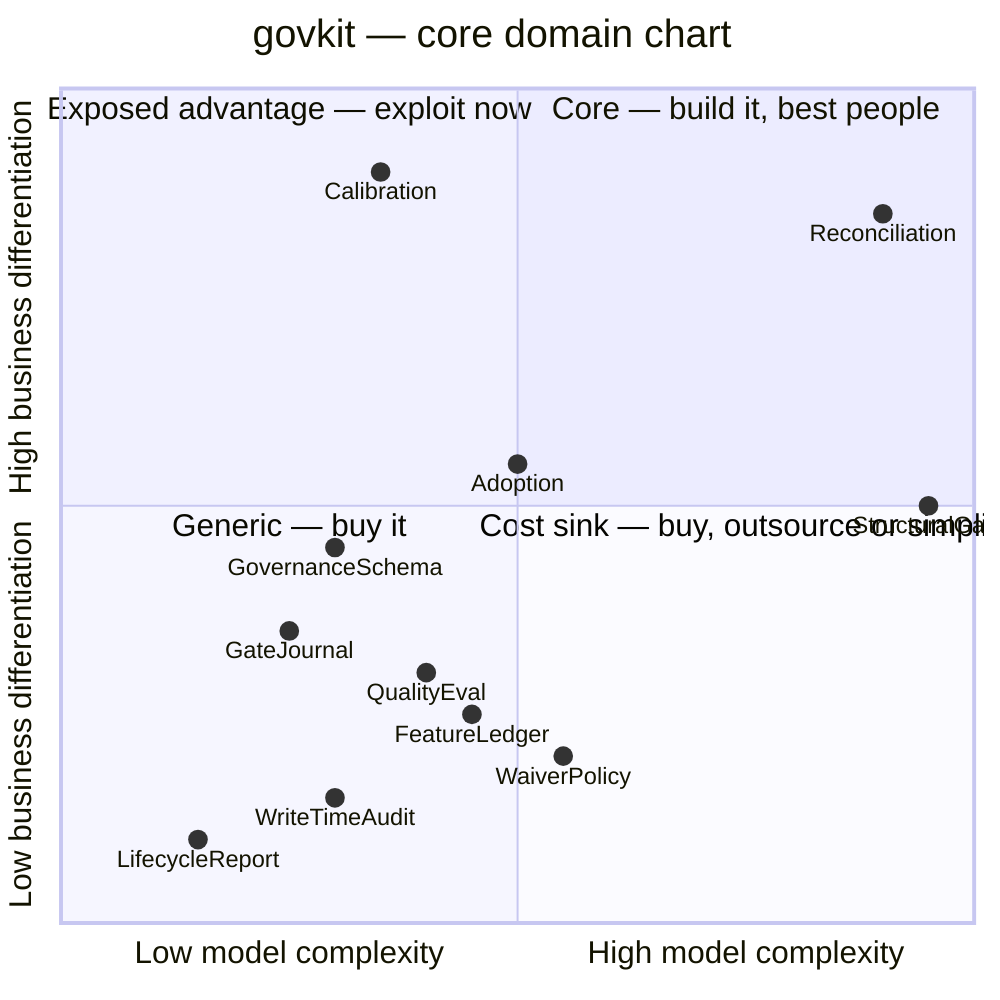

# Core domain chart

## How this was assessed

**Nobody was in the room.** `1-understand` and `2-discover` were skipped: there is no workshop, no
domain expert and no `business-model.md`, so the differentiation axis has exactly one source —
`docs/product/PRD-0001`, approved, owner `baodq97`. Where that document does not speak, the y value
is `unknown` and stays that way.

The x axis is measured from this model: aggregates, invariants, entities + value objects, and
source lines of the code each context owns. Every measured number is followed by a judged
adjustment with its reason, kept separate — a number carried in without its adjustment is
precision pretending to be accuracy.

## Chart

`Ratification` is deliberately **unplotted**: it has zero model mass by construction (no code at
all), so an x value would be meaningless rather than low.

## Placement

| Context | x | Evidence (measured) | Adjustment (judged) | y | Source for y | Quadrant |
|---|---|---|---|---|---|---|
| StructuralGate | 0.95 | 1 aggregate (root = the CORPUS, not the doc), **14 invariants**, 658 LoC, 11 violation kinds | — none needed; the largest model here by every measure | 0.50 | `RFC-0001:97` (no linter is config-driven over a doc chain) but **`PRD-0001` never names it as what govkit competes on** | Exposed advantage / borderline |
| Reconciliation | 0.90 | 1 aggregate, **18 invariants**, 465 LoC (drift 368 + stale 97), 4 verdict values | **+** operational: the content-hash amendment was forced by a live CI escape (squash merges orphaning acks) | 0.85 | `PRD-0001:64` — the Fowler SDD review: *"no tool has deterministic drift detection"* | **Core** |
| Calibration | 0.35 | `aggregates: []`, 11 invariants, 204 LoC | **+** the numbers it produces are the product's success criterion, not a diagnostic | 0.90 | `PRD-0001:37-42` (north star = the confusion matrix), `:40-41` ("the corpus, not rule count, is the compounding asset"), `:75-76` ("the immune system") | **Core — and mislabelled** |
| WaiverPolicy | 0.55 | 1 aggregate, **18 invariants** — joint-most with Reconciliation — ~230 LoC across 3 files | **−** the mass is refusals guarding one 5-field record | 0.20 | none — no source claims differentiation | Cost-sink edge |
| Adoption | 0.50 | `aggregates: []`, 15 invariants, 300 LoC (adopt 191 + init 109) | — | 0.55 | `PRD-0001:57` names onboarding as the measured n=2 wall (theme R0/R1) | Exposed advantage |
| QualityEval | 0.40 | `aggregates: []`, 11 invariants, 256 LoC | **−** one pure function; the rubric itself is config | 0.30 | `RFC-0001:102-108` — the layer explicitly *cannot* judge substance; the differentiating verdict was delegated out | Generic edge |
| FeatureLedger | 0.45 | 1 aggregate, 12 invariants, 262 LoC, 4 ordered layers | — | 0.25 | none | Cost-sink edge |
| GovernanceSchema | 0.30 | `aggregates: []`, 10 invariants, all load-time validation | **+** it is the extraction seam every other context conforms to | 0.45 | `PRD-0001:58` (theme R1: generality hardening is a named roadmap theme) | Generic / supporting |
| GateJournal | 0.25 | `aggregates: []`, 10 invariants, 67 LoC | — | 0.35 | `PRD-0001:64` theme R7 — the sense half of the flywheel; enabling, not differentiating | Generic |
| WriteTimeAudit | 0.30 | `aggregates: []`, 13 invariants, 140 LoC | — | 0.15 | none | Generic |
| LifecycleReport | 0.15 | `aggregates: []`, 8 invariants, 117 LoC | **−** one config-grounded judgement and one refusal | 0.10 | none | Generic |
| Ratification | — | **0 LoC.** 13 invariants, all in config and prose | unplottable | 0.20 | `RFC-0027:52-73` measures removed interrupt load — an internal cost saving, not a market advantage | unplotted |

## Decisions

| Context | Build / buy / outsource | Modelling rigour | Team type implied | Rationale |
|---|---|---|---|---|
| Reconciliation | **build**, deepest effort | full domain model | platform, owns the git surface | the one capability an external source says nobody else has |
| Calibration | **build**, and invest in the CORPUS, not the code | the fixtures are the asset; the code should stay 200 lines | whoever owns quality | `PRD-0001:40-41` says so explicitly |
| StructuralGate | **build**, but stop growing | full domain model, feature-frozen | platform | 14 invariants and 9 kinds already; each new kind is a new false-positive surface |
| QualityEval | **build thin**, keep deferring substance | transaction script | same team as Calibration | the ceiling is structural and admitted |
| Adoption | **build**, and measure | transaction script | whoever onboards consumers | the measured wall; unmeasured since |
| GovernanceSchema | **build**, and treat as the extraction seam | reference data | platform | every context conforms to it |
| WaiverPolicy · FeatureLedger · GateJournal · WriteTimeAudit · LifecycleReport | **build, then freeze** | as-is | — | none carries sourced differentiation; adding to them costs the core |
| Ratification | **do not build** | policy only | the owner | building enforcement would break the no-key invariant (`RFC-0027:169-176`) |

## Investment mismatch

The deliverable of this step. Compare where the model mass sits against where the differentiation
sits:

> **StructuralGate carries 14 invariants and 658 lines — the richest model in the
> system — and `PRD-0001` never names it as what govkit competes on. Calibration, which that same
> document calls the north star and the compounding asset, has `aggregates: []`, 204 lines, and
> is labelled `supporting` in its own `model.yaml`.**

Both directions, stated plainly:

| Context | Model mass | Differentiation | Mismatch |
|---|---|---|---|
| StructuralGate | highest of twelve (14 invariants, 658 LoC) | 0.50, and unsourced in the PRD | **effort misallocated, or the PRD under-states the product.** One of the two is wrong |
| Calibration | 11 invariants, no aggregate, 204 LoC | 0.90, sourced three times over | **the differentiator is under-invested** — the more urgent of the two |
| WaiverPolicy | 18 invariants, landed this week | 0.20, unsourced | newest code sits in an undifferentiated context |
| Ratification | 13 invariants, **zero code** | 0.20 | not a mismatch — a deliberate refusal, and the right one |

And the mismatch the repo names about itself: **`PRD-0001:112-113` records that the advanced chain
features "were built for govkit's own repo and adopted by neither consumer."** Of the twelve
contexts here, at least five (Reconciliation, FeatureLedger, Ratification, WaiverPolicy,
LifecycleReport) have no recorded external use at all. Every differentiation number above is
therefore second-hand: sourced from a roadmap, never from a customer.

## Trajectory

| Context | Today | Expected | Trigger that confirms the move |
|---|---|---|---|
| Reconciliation | core | core for ~12 months | a competing tool shipping content-hash drift detection — the Fowler-review gap closing (`PRD-0001:64`) |
| Calibration | supporting label, core placement | core once the corpus grows from an external source | the first fixture added from a consumer's real false block, not the author's imagination |
| StructuralGate | core by necessity | commodity | any generic doc linter learning a config-driven doc chain |
| Adoption | supporting | rises with every new consumer | reaching n≥3 dissimilar usecases (`PRD-0001:62`, gated) |
| GovernanceSchema | master data | rises if it becomes a published contract others implement | a second engine reading `govkit.yml` |

## Disagreements with the current classification

| Context | `subdomain_type` today | Chart says | Proposed delta |
|---|---|---|---|
| Calibration | `supporting` | placed at 0.90 differentiation — the highest on the chart | **propose `core`.** Its own `model.yaml` notes already record the label as contested. `3-decompose` owns the merge |
| StructuralGate | `core` | 0.50, unsourced | **no change proposed.** Core by necessity is still core; the finding is that the PRD should say so, which is a doc change, not a model one |
| Ratification | `supporting` (demoted from `core` in this run) | 0.20, unplottable on x | **no change.** The demotion already happened here; recorded so a later reader sees it was argued |

Two contexts labelled `core` and only one of them placed in the core quadrant. That is the intended
shape — if the chart said everything was core, the differentiation axis would not have been thought
about.

## Open questions

- **Every y value traces to one approved PRD written by the same person who wrote the code.**
  `PRD-0001:106-109` names this risk in its own words: n=2, one author, one week, one meta-taste.
  There is no customer evidence anywhere in this repo.
- **Is StructuralGate's differentiation genuinely 0.50, or unmeasured?** No source rates it either
  way; 0.50 is the honest midpoint of "necessary, unclaimed".
- **Nobody has been asked.** The chart's y axis needs product and business stakeholders in the room
  (`5-strategize`, *Who to involve*). One engineer placed all twelve.
