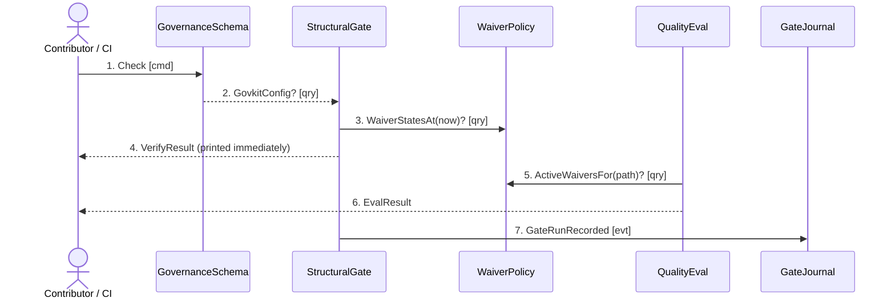

## Scenario

A contributor has edited a governed document and runs the repo's one-shot gate. The composite
`check` entrypoint loads the schema once, runs the structural gate and the quality floor **both
regardless of the other's result**, records one line in the journal, and returns a single exit
code. "Done" means the contributor knows every failure in one pass rather than one per run.

## Flow

| # | From | Message | Type | Contents | To | When |
|---|---|---|---|---|---|---|
| 1 | Contributor / CI | `Check` | command | root, optional `--changed <ref>`, `--journal` | GovernanceSchema | — |
| 2 | GovernanceSchema | `GovkitConfig?` | query | root **→** types, base.required, tiers, rubrics, waivers, docs.root | StructuralGate + QualityEval | — |
| 3 | StructuralGate | `WaiverStatesAt?` | query | the run's single instant **→** active / expired / malformed per entry | WaiverPolicy | — |
| 4 | StructuralGate | `VerifyResult` | query *(return)* | checked, violations[kind,tier,waivedBy], waivers **→** printed before eval runs | Contributor | — |
| 5 | QualityEval | `ActiveWaiversFor?` | query | repo-relative path + rule id **→** the covering waiver, or none | WaiverPolicy | — |
| 6 | QualityEval | `EvalResult` | query *(return)* | artifacts, floorOk, floorPassRate, averageScore, waivers | Contributor | — |
| 7 | StructuralGate | `GateRunRecorded` | event | at, cmd, gitSha, verify+eval counts, ok, durationMs | GateJournal | **after** both reports are printed |

Seven messages. Message 4 is deliberately placed before 5: the structural verdict is printed the
moment it exists, so a `runEval` that throws can never suppress an already-computed FAIL report
(`cli.ts:701-708`).

## Findings

| # | Smell | Evidence (messages) | What it suggests | Proposed change |
|---|---|---|---|---|
| F-1 | **One event, no subscriber** | 7 is the only non-return message in the whole flow, and nothing in `packages/govkit/src` reads a journal line back | The coupling in this model is **call-stack coupling**, not message coupling. Eleven of twelve contexts communicate purely by synchronous return | None. Naming an event bus here would be fiction — recorded as the model's central characteristic, not a defect |
| F-2 | Chatty pair, twice over | 3 and 5 both ask WaiverPolicy the same class of question, from two contexts, with two different local implementations (`verify.ts:422-440` vs `eval.ts:180-183`) | One rule, two code paths, kept in step by hand | Raised as an open question in `waiver-policy/README.md`; a shared applier would invert the dependency, so it is not proposed here |
| F-3 | Query chain of one | 2 is the only cross-context query on the critical path, and it is answered from a single reader | The split is working. A five-context flow with one config read and zero blocking round-trips is evidence the boundaries are cheap | Record as a clean result |
| F-4 | The sensor is off for two commands | `calibrate` runs on every `bun run check` (`package.json:25`) but may not journal (`journal.ts:17`), so the north-star metric never reaches message 7 | The one gate outcome the learning loop most needs is the one it cannot see | Open question for the owner — additive to the `cmd` union |

## Open questions

- Does message 7 belong to StructuralGate or to the CLI composition root? It is built in `cli.ts`
  from both results, so neither context authors it alone. *Owner / `3-decompose`.*
- `--changed` has never appeared in a journalled run (0 of 151 lines), so message 1's scoped variant
  has no recorded evidence at all.
