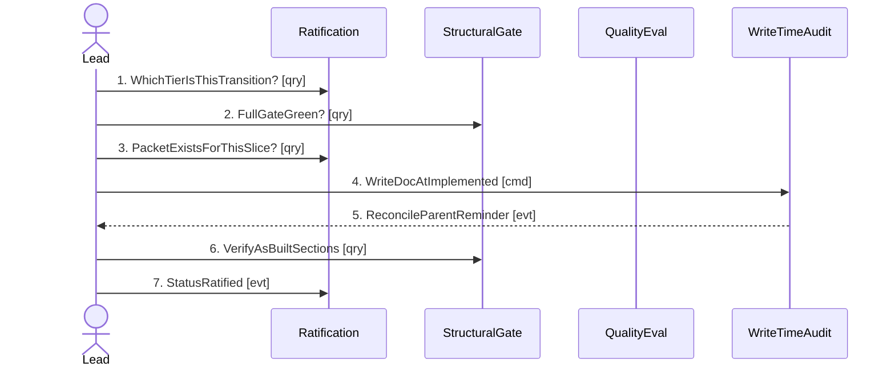

## Scenario

An RFC at `accepted` has shipped. The lead wants it at `implemented` — a **recording of reality**,
not a decision, so the committed policy lets them flip it without a fresh ask, *provided* four
conditions hold and the commit cites the evidence. "Done" means the status has moved and any
reader can reconstruct, from the commit message alone, exactly what authorised it.

This is the path with authority on it, and the flow's whole point is that **most of its messages
cross no code at all**.

## Flow

| # | From | Message | Type | Contents | To | When |
|---|---|---|---|---|---|---|
| 1 | Lead | `WhichTierIsThisTransition?` | query | type + from-status + to-status **→** R0 / R1 / R2 | Ratification (`govkit.yml:141-153`) | — |
| 2 | Lead | `FullGateGreen?` | query | the whole repo **→** ok / not ok, from `bun run check` and never a narrower command | StructuralGate + QualityEval | — |
| 3 | Lead | `PacketExistsForThisSlice?` | query | slice **→** packet runId + red-team verdict ∈ {flip-as-is, flip-after-reconcile} | Ratification (the gate-loop packet) | — |
| 4 | Lead | `WriteDocAtImplemented` | command | the doc, front-matter status flipped | WriteTimeAudit | — |
| 5 | WriteTimeAudit | `ReconcileParentReminder` | event | "re-read its parent; confirm the doc reflects what shipped" + the required as-built sections | Lead | **non-blocking**; the write proceeds regardless |
| 6 | Lead | `VerifyAsBuiltSections` | query | the flipped doc **→** does it carry `As-built` and `Deviations from design`? | StructuralGate | — |
| 7 | Lead | `StatusRatified` | event | the accept commit, citing **both** packet.runId **and** `govkit.yml@<sha>` | Ratification (git history) | — |

Seven messages. Messages 1, 3 and 7 are **honour-system**: no code sends, receives or checks them.
Only 2, 5 and 6 touch the engine, and 5 cannot block.

## Findings

| # | Smell | Evidence (messages) | What it suggests | Proposed change |
|---|---|---|---|---|
| F-5 | **Distributed invariant with no enforcer** | The rule "an R1 flip must cite the packet and the policy sha" spans messages 1, 3 and 7, and no context executes any of them | This is not a defect — `RFC-0027:169-176` argues a stateless no-git gate structurally cannot see a transition, and teaching it to would break the no-key invariant. It IS the model's most important honest boundary, and the flow makes it visible instead of implied | None. Recorded, with the compensating control named: the distiller's after-the-fact audit (`RFC-0027:152-156`) |
| F-6 | The only enforcer is the weakest link | Message 6 is the sole *deterministic* proof in the flow — the as-built sections gate at `implemented` (`govkit.yml:39-40`) | R1 removes the ask, not the proof. But it proves the doc has two headings, not that their content is honest | Record; `RFC-0001:102-108` already concedes a presence rubric cannot judge substance |
| F-7 | Bypassable by tool choice | Message 4 is a `Write`. The same flip performed with an `Edit` skips message 5 entirely (`audit-write.ts:31-41`, and the gap is named at `:100-102`) | The one place the policy surfaces to a human mid-flow is the one an author can route around without noticing | Open question, not a proposed change — closing it needs the hook to parse partial content, which the code rejects on purpose |
| F-8 | A `us: in-progress -> done` R1 flip has no message 6 at all | `requiredSectionsByStatus` is configured for `rfc` and `rel` only (`govkit.yml:39-40`, `:72-73`) | For the US transition, this flow has **zero** deterministic proof — gate + packet only. `RFC-0027:222-225` records this as a known gap | None; the RFC already flags it as a follow-up "unneeded until the first case" |

## Open questions

- **Nothing binds a packet to its slice.** Message 3's condition is `packet_exists`, with no
  matching rule (`govkit.yml:149`), so a stale neighbouring packet satisfies it textually.
- **Message 7 is the only audit record**, and it is prose in a commit message. Its structure is not
  validated anywhere.
- **How does a reader of this flow tell an R1 flip from an R0 one after the fact?** Only by the
  presence of a citation — an absent citation and a legitimate R2 flip look identical.
