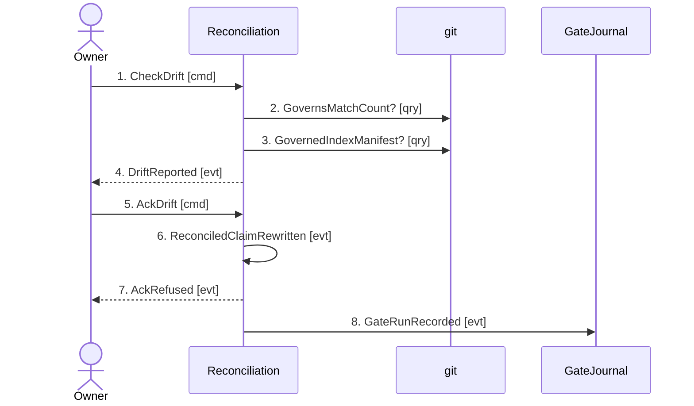

## Scenario

Code under an RFC's `governs:` list has changed, so its recorded content claim no longer matches
and the drift gate turns red. The owner judges the change did not invalidate the design and
re-vouches. **This is the failure path**: one of the two governed docs cannot be acked at all,
because its `governs:` list names a file that no longer exists — and an ack cannot vouch for a
content state that does not exist. "Done" means one doc is green, the other is still red, and the
command says so rather than reporting success.

## Flow

| # | From | Message | Type | Contents | To | When |
|---|---|---|---|---|---|---|
| 1 | Owner | `CheckDrift` | command | root | Reconciliation | — |
| 2 | Reconciliation | `GovernsMatchCount?` | query | each pathspec, **every** governed doc **→** count, or null when git refuses to evaluate it | git | — |
| 3 | Reconciliation | `GovernedIndexManifest?` | query | governs **minus the doc's own path** **→** blob-OID records, or null | git | opted-in docs only |
| 4 | Reconciliation | `DriftReported` | event | per doc: reconciled claim, currentSha, ghost[], problem | Owner | — |
| 5 | Owner | `AckDrift` | command | root, or one doc path | Reconciliation | **after** the owner has re-read the design — nothing checks this |
| 6 | Reconciliation | `ReconciledClaimRewritten` | event | old claim → `sha256:<16 hex>`, written by byte-span surgery into the doc's own front-matter | the governed doc | — |
| 7 | Reconciliation | `AckRefused` | event | path + "governs pathspec(s) match no tracked file" — `ok: false` | Owner | — |
| 8 | Reconciliation | `GateRunRecorded` | event | checked, drifted, skipped, **`ack: true`** | GateJournal | after printing |

Eight messages. Message 2 runs for **every** governed doc, opted in or not (`drift.ts:200-237`) —
a ghost pathspec is a broken declaration on its own, because it silently shrinks coverage.

## Findings

| # | Smell | Evidence (messages) | What it suggests | Proposed change |
|---|---|---|---|---|
| F-9 | **The failure path is the well-modelled one** | 7 exists, is typed, sets `ok: false`, and survives an ack-all (`drift.ts:353-367`) | Rare and worth recording: this is the one flow in the model where the rejection branch is as developed as the happy one. Message 6 and message 7 are peers, not an exception handler | Record as a clean result |
| F-10 | The load-bearing decision has no message | Message 5 says "after the owner has re-read the design", and nothing anywhere establishes that they did | The whole gate reduces to a human judgement it cannot observe. Same class as `DOMAIN-FLOW-0002` F-5, in a context that DOES have code | Open question. It is the honest limit of a content-hash claim |
| F-11 | An ack is an R1 transition that cites nothing | `govkit.yml:146` lists `drift --ack` under R1, requiring a packet runId and a policy sha; `drift.ts` reads neither, and message 8 records no citation | Two contexts hold two halves of one rule and neither knows about the other | Open question for the owner — the marker at message 8 could carry the citation |
| F-12 | Ack granularity is all-or-nothing per doc | Message 6 rewrites one claim covering the whole `governs:` list | A doc governing ten files re-vouches for all ten from one judgement, with no way to say which one was actually examined | Recorded in `reconciliation/README.md` assumptions |

## Open questions

- **Message 3 reads the git INDEX**, so an unstaged edit does not drift and a staged one does.
  Nothing states which is intended.
- **No ack has ever been journalled here** — 0 of 151 lines carry `drift.ack` — so message 8's
  marker invariant (`journal.ts:33-38`) is real code with no observation behind it.
- **Message 7's condition cannot be fixed by an ack at all**; it needs a hand edit to the `governs:`
  list. Nothing routes the owner there beyond the problem text.
