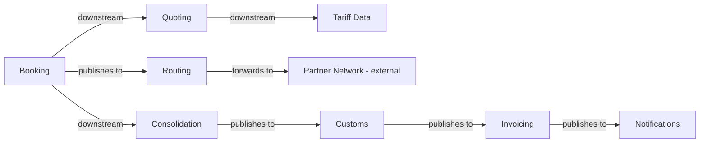

## Context map

## Sub-domain classification

| Bounded Context | Sub-domain type | Why |
|---|---|---|
| Quoting | core | first thing the customer sees |
| Booking | core | where the money is committed |
| Consolidation | supporting | back-office load planning |
| Routing | supporting | hands shipments to carriers |
| Customs | core | regulated, and mistakes are expensive |
| Invoicing | core | the largest and most business-critical system we run |
| Notifications | generic | commodity |

## Shared artifacts

| Artifact | Between | Sharing level |
|---|---|---|
| `ShipmentRef` value object | Booking, Consolidation, Customs, Invoicing | Building Blocks |
| `ConsignmentLine` entity | Booking, Consolidation | **Shared Kernel** — both write it |

## Notes

The classification above has not been revisited since the first modelling session in March.
