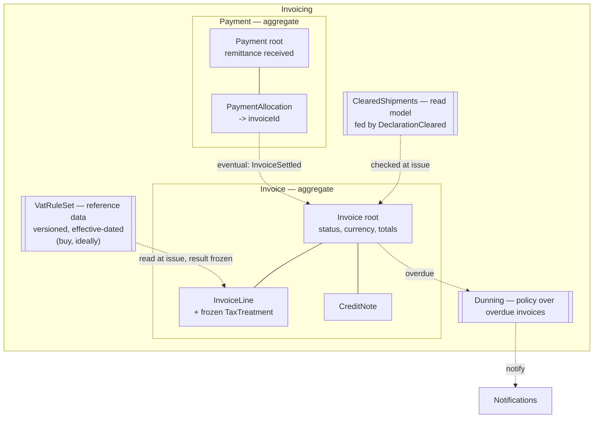

## Scope and evidence base

Target: the Invoicing bounded context, currently 5 aggregates / 34 tables, reported as painful to
change.

Everything below is derived from `docs/domain/**` only. This repo contains no schema, migrations or
code, so the mass figures in `model.yaml` are taken on trust and the 34-table breakdown is
**unverified**. The one measurement that would most change this design is named under
[What I could not verify](#what-i-could-not-verify).

## 1. Diagnosis before design

### 1.1 Invoicing is half the system by mass and carries almost none of its rules

Summed from the seven `model.yaml` files:

| Context | Tables | % of all tables | Attributes | Densest entity | Aggregates | Events | Invariants |
|---|---:|---:|---:|---:|---:|---:|---:|
| **Invoicing** | **34** | **45%** | **311** | **128** | 5 | 1 | 1 |
| Customs | 12 | 16% | 96 | 34 | 1 | 2 | 1 |
| Quoting | 11 | 14% | 78 | 26 | 1 | 2 | 1 |
| Booking | 9 | 12% | 54 | 22 | 1 | 2 | 1 |
| Consolidation | 5 | 7% | 41 | 18 | 1 | 2 | 1 |
| Routing | 3 | 4% | 17 | 9 | 0 | 1 | 0 |
| Notifications | 2 | 3% | 11 | 7 | 0 | 1 | 0 |

Three numbers matter:

- **311 attributes produce 1 domain event and 1 invariant.** Booking gets 2 events out of 54
  attributes. Invoicing holds 5.8x Booking's attribute count and expresses fewer rules. That is the
  definition of an anaemic model: the data is here, the behaviour is somewhere else — in services,
  jobs and reports that no boundary protects.
- **The densest entity holds 128 attributes**, 3.8x the next worst in the system (Customs, 34).
  A 128-column row is not an entity; it is a spreadsheet with a primary key.
- **The single stated invariant — "an invoice line must reference a cleared declaration" — is not
  Invoicing's to enforce.** `Declaration` is owned by Customs (`docs/domain/customs/model.yaml`).
  Today's model therefore protects zero local invariants transactionally.

### 1.2 The cause of "painful to change" is written down in the model

> "Three of the five aggregates exist to model VAT variations across the nine ports; two were added
> when the Finnish tax rules changed in 2024." — `docs/domain/invoicing/model.yaml`

The context grows a new aggregate every time a tax rule changes. Tax variation has been modelled as
*structure* (an aggregate, its tables, its columns) instead of as *data* (a rule row, a rate, an
effective date). Nine ports encoded as columns is the most likely source of the 128-attribute
entity, and the direct reason a Finnish rule change in 2024 cost two aggregates. Any aggregate
design that does not fix this will be re-broken by the next tax change.

### 1.3 The investment is pointed at the wrong context

| Source | What it says about Invoicing |
|---|---|
| `context-map.md` | `core` — "the largest and most business-critical system we run" |
| `business-model.md` | compliance-enforcer, **commodity**, differentiation **no** — *"nobody has ever chosen us because of our invoices"* (commercial director, 2026-05-18) |

Meanwhile Consolidation — the capability the pricing page charges an 18% premium for, and the one
the commercial director names as the thing a new entrant could not copy — gets 5 tables and 1
aggregate, and its load planning still runs partly on a whiteboard in Gothenburg.

Mass has followed the label, not the value. The honest reading is that `core` in `context-map.md`
means "big and scary", not "differentiating". The two documents cannot both drive investment.

**This is a decision for the doc owner, not for me to flip.** What I recommend, with the trade-off:

| Option | For | Against |
|---|---|---|
| **A. Reclassify Invoicing `supporting`, target a thin model, buy tax determination** (recommended) | Matches the business model's own evidence; frees the only people who understand freight to work on Consolidation; tax vendors already cover EU VAT across nine ports and absorb rule changes as a subscription, not as a release | Vendor cost and an integration seam; a genuinely odd freight-billing rule may not fit a generic engine |
| B. Keep `core`, rebuild a rich domain model in-house | Full control of every rule; no vendor lock-in | Pays senior modelling effort into a capability the business says wins no customers; the next tax change is still yours to absorb |
| C. Leave as-is | No spend now | The 2024 Finnish change cost two aggregates; the cost of the next one is unbounded |

The design below is deliberately compatible with A and B: the aggregate boundaries are the same
either way, and only the tax-rule box changes owner.

## 2. The design rule I applied

> An aggregate exists to protect an invariant that must hold at the **end of a single
> transaction**. Everything else is an entity inside one, a value object, reference data, a read
> model, or a policy.

Applied to Invoicing, the candidate rules sort like this:

| # | Rule | Consistency scope | Verdict |
|---|---|---|---|
| I1 | An issued invoice is immutable; corrections happen only by credit note | one invoice | inside **Invoice** |
| I2 | Invoice total = sum of line net + line tax, in one currency | one invoice | inside **Invoice** |
| I3 | At issue time every line's shipment has a recorded clearance | one invoice, checked against locally held Customs facts | inside **Invoice** (see 3.4) |
| I4 | Total credited never exceeds total invoiced | one invoice + its credit notes | put credit notes **inside Invoice** |
| I5 | Allocations of one remittance never exceed the amount received | one payment | inside **Payment** |
| I6 | An invoice's settled amount vs. its total | invoice x payment | **eventual** — an excess is an overpayment, a business event, not a violation |
| I7 | Surcharge rates do not overlap in effective period per lane | tariff reference data | **not Invoicing's** — one owner upstream |
| I8 | Dunning stage follows overdue days and unsettled balance | fully derivable from Invoice | **policy + read model**, not an aggregate |

Two invariants survive as boundaries. Two aggregates.

## 3. Target aggregates

Solid lines are transactional boundaries. Dashed lines cross them and are eventually consistent by
construction.

### 3.1 Aggregate — Invoice

**Root:** `Invoice`. **Identity:** `InvoiceId` (internal) + `DocumentNumber` (legal, assigned only
at issue).

| Element | Kind | Notes |
|---|---|---|
| `Invoice` | root entity | customerId, billingPeriod, currency, status, netTotal, taxTotal, creditedTotal, settledTotal |
| `InvoiceLine` | entity | shipmentRef, description, quantity, unitPrice, netAmount, **taxTreatment** |
| `CreditNote` | entity | own documentNumber, amount, reason, issuedAt |
| `Money` | value object | amount + currency, never a bare decimal |
| `TaxTreatment` | value object | vatCode, rate, basis, legalReference, **ruleSetVersion** — the frozen outcome of a rule, not a link to a live one |
| `ShipmentRef` | value object | already shared across Booking, Consolidation, Customs (`context-map.md`) |
| `DocumentNumber` | value object | series + sequence + year |

**Behaviour on the root** (this is the part missing today):

| Command | Enforces | Emits |
|---|---|---|
| `openDraft(customerId, billingPeriod, currency)` | one currency per invoice | — |
| `addLine(shipmentRef, description, money)` | draft only; currency matches | — |
| `removeLine(lineId)` | draft only | — |
| `issue(clock, taxRules, clearances)` | I1, I2, I3; resolves and **freezes** `TaxTreatment` per line; assigns `DocumentNumber` | `InvoiceIssued` |
| `credit(money, reason)` | I4 — credited + new <= net + tax | `InvoiceCredited` |
| `recordSettlement(money)` | idempotent per allocationId; excess -> overpayment, not a failure | `InvoiceSettled` / `InvoiceOverpaid` |
| `void(reason)` | only before issue | `InvoiceVoided` |

**Why credit notes live inside the invoice rather than beside it.** The only rule a credit note has
is relative to its invoice's balance (I4), it can never exist without one, and the write rate is a
handful per invoice, never concurrent — so the usual reason to split (contention) is absent. Keeping
it inside makes I4 a plain in-memory check instead of a distributed one over money. **Reversal
trigger:** if the business ever issues a standalone goodwill credit with no originating invoice, or
credit notes acquire their own approval workflow, split `CreditNote` into its own root and demote I4
to a policy with a reserved-amount counter.

### 3.2 Aggregate — Payment

**Root:** `Payment` — one remittance received, not one invoice's payment.

| Element | Kind | Notes |
|---|---|---|
| `Payment` | root entity | customerId, receivedAt, amount, bankReference, unallocatedAmount |
| `PaymentAllocation` | entity | invoiceId, amount, allocatedAt |
| `RemittanceRef`, `Money` | value objects | |

| Command | Enforces | Emits |
|---|---|---|
| `receive(money, bankReference)` | — | `PaymentReceived` |
| `allocate(invoiceId, money)` | I5 — sum of allocations <= amount received | `PaymentAllocated` |
| `reverseAllocation(allocationId, reason)` | allocation exists and is not already reversed | `PaymentAllocationReversed` |
| `leaveOnAccount()` | remainder is explicit, never silently lost | `CreditBalanceRecorded` |

**Why this is separate from Invoice.** The customer segment is small and mid-size exporters
(`business-model.md`); they pay several invoices with one bank transfer. A payment therefore has no
single owning invoice, and putting allocation inside `Invoice` would mean one transaction writing N
invoices. `PaymentAllocated` drives `Invoice.recordSettlement` asynchronously — I6 is eventual on
purpose, and an over-allocation surfaces as an overpayment to handle, not an exception to throw.

**Open question for finance:** cash application against bank statements is a solved commodity. If
allocation is mostly automatic matching, this aggregate may be a bought bank-reconciliation tool
plus a thin `PaymentAllocated` feed. Worth asking before building it.

### 3.3 What stops being an aggregate — where the 34 tables went

| Today | Becomes | Why |
|---|---|---|
| 3 aggregates modelling VAT variation across 9 ports | **`VatRuleSet`** — versioned, effective-dated **reference data**, read once at `issue()`, outcome frozen onto the line as `TaxTreatment` | A rate table has no lifecycle of its own and guards no invariant. Modelling it as structure is exactly what made a 2024 Finnish rule change cost two aggregates. As data, the same change is one row. Strongest single recommendation: **buy this**; it is the highest-churn, lowest-differentiation part of the context |
| `SurchargeSchedule` | tariff **reference data with one owner upstream** (Tariff Data / Quoting); Invoicing records the applied surcharge as a line with the frozen rate | Two copies of a rate schedule drift, and the failure mode is customer-visible: invoiced price stops matching quoted price. `Quoting -> TariffData` already exists in the context map; use it. I7 belongs to whoever owns the schedule |
| `DunningCase` | **policy + read model** over overdue, unsettled invoices, emitting to Notifications | I8 is fully derivable from invoice age and settled amount, so a stored case is a cache with a lifecycle bolted on |
| the cross-context clearance check | **`ClearedShipments` read model**, fed by `DeclarationCleared` from Customs | see 3.4 |

**When `DunningCase` earns aggregate status:** only if the business actually negotiates — promises
to pay, instalment plans, agency handover. Those have state a policy cannot derive. If that is real,
it is a **separate Collections context**, not an Invoicing aggregate: its language (case, escalation
stage, promise to pay, write-off) shares almost nothing with issuing an invoice. Note that dunning
appears in no interview in `docs/domain/discovery/timeline.md` — the finance analyst was in the room
and raised the premium and the "consignment" collision, not collections. Ask before modelling.

### 3.4 The cross-context invariant

`model.yaml` states: *"An invoice line must reference a cleared declaration."* `Declaration` lives in
Customs, so this cannot be a transactional invariant — no Invoicing transaction can hold a lock on
another context's data, and `Customs -> Invoicing` is already an event relationship in
`context-map.md`.

Make it enforceable by relocating the fact, not the rule:

1. Customs already publishes `DeclarationCleared(declarationId, clearedAt)`
   (`docs/domain/customs/model.yaml`). Extend the payload with `shipmentRef` — `ShipmentRef` is
   already shared vocabulary across both contexts.
2. Invoicing keeps a local `ClearedShipments` read model fed by that event.
3. `Invoice.issue()` refuses to issue if any line's `shipmentRef` has no recorded clearance.

The rule now holds inside one transaction against facts Invoicing owns a copy of. The residual risk
is lag, not correctness: an invoice can be blocked briefly after clearance. That is the right
failure direction for a compliance rule.

### 3.5 Ubiquitous language fix — "Consignment"

`docs/domain/invoicing/model.yaml` defines **Consignment** as "a billable line on an invoice".
Booking defines it as "the goods a customer hands over as one unit"; Consolidation builds container
loads out of the physical meaning. This is hotspot #2 in `discovery/timeline.md`, raised by the
finance analyst.

Invoicing should drop the term. Use `InvoiceLine` for the billing line and `ShipmentRef` when
pointing at the physical goods. One word, no code change beyond naming, and it removes a standing
translation error at the Customs -> Invoicing seam.

## 4. Before and after

| | Today | Target |
|---|---:|---:|
| Aggregates | 5 | **2** |
| Tables | 34 | **8-10** (estimate, see caveat) |
| Densest entity | 128 attrs | **<= 25** |
| Domain events | 1 | **7** |
| Locally enforceable invariants | 0 | **5** (I1-I5) |
| Files touched to add a port's VAT rule | new aggregate + tables | **1 row** (0 if bought) |

The 8-10 is an estimate, not a measurement: invoice, invoice_line, credit_note, payment,
payment_allocation, cleared_shipment, document_sequence, plus vat_rule_set and surcharge_rate if
they are not bought or moved upstream. The last row is the one that matters — it is the metric the
"painful to change" complaint is actually about.

## 5. Migration — thin slices, each shippable and reversible

Do not big-bang this. Slice 1 alone removes most of the change pain and is reversible in a day.

| # | Slice | Ships | Reversible by |
|---|---|---|---|
| 1 | **Freeze tax at issue time.** Add `TaxTreatment` columns to `invoice_line`, backfill from the existing VAT tables, make the issue path write them. Reads stop joining the three VAT aggregates. | 1 sprint | dropping the columns; the old tables are untouched |
| 2 | Make `Invoice` a real root: issue/credit/void as commands, immutable after issue, `CreditNote` moved under it | 1-2 sprints | keep the old write path behind a flag |
| 3 | Extract `Payment` + allocations; `PaymentAllocated` -> `Invoice.recordSettlement` | 1-2 sprints | dual-write during cutover |
| 4 | Retire the three VAT aggregates behind the frozen VO, or cut over to a bought tax engine | after 1 is proven in production | slice 1 is the abstraction seam; the vendor sits behind it |
| 5 | Decide dunning: policy, buy, or a Collections context | needs the finance conversation first | — |
| 6 | Hand `SurchargeSchedule` ownership upstream to Tariff Data | coordinate with Quoting | — |

Ordering rationale: slice 1 is the only one that touches the actual cause, needs no cross-team
agreement, and turns the tax engine into a swappable box — which is what makes the buy-vs-build
decision in section 1.3 cheap to defer and cheap to reverse.

**Stop rule.** If slice 1 does not reduce the read-path joins per invoice, the 128-attribute entity
is not the VAT tables and this diagnosis is wrong. Stop and re-measure before slice 2.

## 6. What I could not verify

| Gap | Why it matters | How to close it |
|---|---|---|
| No DDL, migrations or ORM models in the repo | The 34/311/128 figures and the claim that the 128-attribute entity is VAT-shaped are inferred from `model.yaml` prose | Point the schema at a data-model audit; confirm which table holds the 128 columns before slice 1 |
| Nobody owns the invoicing P&L (`business-model.md`, cost structure "Unknown") | Buy-vs-build for tax determination needs a cost number | Find the P&L owner |
| Dunning appears in no interview | May be modelling something the business does not do | 30 minutes with the finance analyst |
| `subdomain_type: core` conflicts with the business model's own evidence | Governs how much this refactor is worth | Doc owner decides; do not let an agent flip it |

## 7. Decisions needed from the owner

1. Accept or reject the reclassification of Invoicing to `supporting` (section 1.3). Everything about
   how much to spend here follows from it.
2. Buy or build tax determination. Slice 1 keeps this reversible; slice 4 forces the call.
3. Confirm whether real dunning exists before anyone models a `DunningCase`.
4. Agree with Quoting that Tariff Data owns the surcharge schedule.
