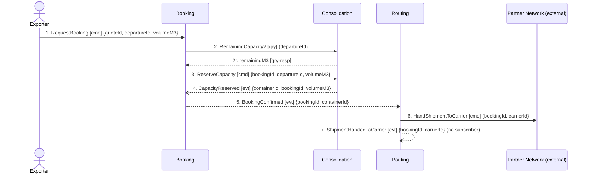

## Scenario

An exporter holds an issued quote and commits a consignment to a specific departure. Nordic Freight
must place that consignment on a container that still has room, confirm the booking to the customer,
and get the shipment moving with a partner carrier. "Done" means the customer has a committed slot
on a named container and the shipment is with the carrier.

This is the scenario the Guaranteed Consolidation premium is sold against: the promise is a
departure slot, so the moment capacity is committed is the moment the product is delivered.

## Flow

| # | From | Message | Type | Contents | To | Source in the model |
|---|---|---|---|---|---|---|
| 1 | Exporter | `RequestBooking` | command | quoteId, departureId, volumeM3 | Booking | **name unconfirmed** — the model records only the resulting event `BookingRequested` (booking/model.yaml) |
| 2 | Booking | `RemainingCapacity?` | query | departureId → remainingM3 | Consolidation | booking/model.yaml relationship note: *"synchronous remaining-capacity check before reserving"*; **name unconfirmed** |
| 3 | Booking | `ReserveCapacity` | command | bookingId, departureId, volumeM3 | Consolidation | implied by `CapacityReserved` (consolidation/model.yaml); **name unconfirmed** |
| 4 | Consolidation | `CapacityReserved` | event | containerId, bookingId, volumeM3 | Booking | timeline #4, confirmed |
| 5 | Booking | `BookingConfirmed` | event | bookingId, containerId | Routing | timeline #5, confirmed |
| 6 | Routing | `HandShipmentToCarrier` | command | bookingId, carrierId | Partner Network | routing/model.yaml `aggregates_rationale`; **name unconfirmed** |
| 7 | Routing | `ShipmentHandedToCarrier` | event | bookingId, carrierId | — (no subscriber on the map) | timeline #6, confirmed |

**Counts:** 7 messages · 3 bounded contexts + 1 external · 1 query crossing a boundary · longest
synchronous chain 2 hops · busiest pair Booking↔Consolidation with 4 of 7 messages.

Three of the seven message *names* are not in the ubiquitous language — only the events are. The
commands and the query are modelled behaviour (relationship notes, aggregate rationale) with no
agreed name. That is itself worth fixing before anyone builds: the team will name them in code.

## Findings

| # | Smell | Evidence (messages) | What it suggests | Proposed change |
|---|---|---|---|---|
| F1 | Check-then-act across a boundary | 2 and 3: Booking asks Consolidation for remaining capacity, then commands Consolidation to reserve. The boundary is crossed twice on the same data, with a gap in between | The no-overbooking invariant is *owned* by Consolidation (consolidation/model.yaml) but *checked* by Booking. Between 2 and 3 another booking can consume the capacity that 2 reported. This is hotspot #1 from discovery — two shipments committed to the same slot in March — now located on two message numbers. Traced in full in DOMAIN-FLOW-0003 | Collapse 2 and 3 into a single `ReserveCapacity` command that Consolidation accepts or rejects. The rejection is a domain outcome and needs a name, not an error code — hand to `domain-discover` (see O1) |
| F2 | Distributed invariant | 2–4, plus booking invariant *"a booking may only be confirmed once its capacity has been reserved"* vs consolidation invariant *"committed volume must never exceed capacity"* | One business rule stated twice, one half per context. Reinforced by the Shared Kernel on `ConsignmentLine` (context-map.md: *"both write it"*) — the same entity is written on both sides of the boundary that the rule runs through | Give the whole rule to `ContainerLoad` in Consolidation; Booking's invariant becomes "confirmed only on an accepted reservation", which is a local check on a message it received. Resolve `ConsignmentLine` to a single writer |
| F3 | Pass-through | 5, 6, 7: Routing receives `BookingConfirmed` and hands the shipment to the carrier selected by the standing contract for the lane. routing/model.yaml: `aggregates: []`, *"It owns no rule of its own"* | Routing decides nothing in this flow. A context that receives a message and forwards it is a hop, not a boundary — and the flow crosses it for no decision | Either delete the hop and let Booking address the partner network directly, or give Routing the one decision it should own (F4). Prefer F4 |
| F4 | Invariant with nothing enforcing it | 6 fires on `BookingConfirmed` (5). `DeclarationSubmitted` does not occur until DOMAIN-FLOW-0002 #3, after `ContainerSealed` | Customs owns *"a shipment cannot be handed to a carrier before its declaration is submitted"* (customs/model.yaml, stated by the customs clerk), but nothing on this flow can enforce it: the hand-off at 6 happens strictly before the declaration exists, and context-map.md has no edge at all between Customs and Routing | Add the gate: Routing waits for `DeclarationSubmitted` before 6. That is a real decision, and it converts Routing from a hop (F3) into a boundary that owns the carrier-release rule |
| F5 | Message carrying no decision data | 5: `BookingConfirmed {bookingId, containerId}` is the only thing Routing receives, yet 6 requires `carrierId` | Routing must resolve lane → standing contract → carrier from data it has not been sent and which the map does not show it holding (routing/model.yaml has 3 tables, no aggregate). Either Routing keeps an undocumented read model of lanes and contracts, or there is a message nobody has drawn | Name Routing's lane/contract data as a read model it owns, or name the missing message. Low severity; it becomes moot if F3 deletes the hop |

## Open questions

- **O1** — When Consolidation cannot fit a booking, what does the business call it and what happens
  next? The rule states *"an overbooked container means a shipment is bumped and the Guaranteed
  Consolidation promise is broken"*, but no event in the timeline models a rejection or a bump. →
  depot planners, via `domain-discover`.
- **O2** — Who checks that the quote is still valid? Quoting owns *"a quote cannot be accepted after
  its validity window"*, but the acceptance happens in Booking at message 1, and no message passes
  between Booking and Quoting in this flow. Either Booking keeps a read model built from
  `QuoteIssued {quoteId, price, validUntil}` — which would be the correct pattern and should be
  recorded — or there is an undrawn synchronous query. → Booking engineers + commercial director.
- **O3** — Does anything consume `ShipmentHandedToCarrier` (message 7)? The map shows no subscriber.
  If nothing consumes it, say so; if Invoicing or Notifications does, the map is missing an edge. →
  finance analyst, planners.
- **O4** — Who owns the shipment when a partner carrier refuses a sealed container (discovery
  hotspot #3)? That path leaves this flow at message 6 and re-enters nowhere. → planners.
