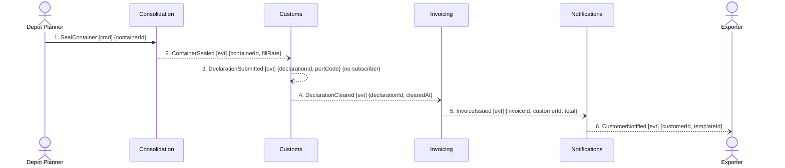

## Scenario

A depot planner closes a container once loading is finished. From that point the shipment must be
declared to customs at the port of departure, cleared, billed to the customer — forwarding margin
plus the Guaranteed Consolidation premium, which is charged whether or not the container ended up
full — and the customer told. "Done" means a cleared declaration and an issued invoice the customer
has been notified of.

Traced because it is the money path (four of the seven contexts, and the only one that reaches
Invoicing) and because it is the second half of the booking scenario: the first half stops at
DOMAIN-FLOW-0001 #7.

## Flow

| # | From | Message | Type | Contents | To | Source in the model |
|---|---|---|---|---|---|---|
| 1 | Depot Planner | `SealContainer` | command | containerId | Consolidation | implied by `ContainerSealed`; **name unconfirmed** |
| 2 | Consolidation | `ContainerSealed` | event | containerId, fillRate | Customs | timeline #7, confirmed; edge from context-map.md |
| 3 | Customs | `DeclarationSubmitted` | event | declarationId, portCode | — (no subscriber on the map) | timeline #8, confirmed |
| 4 | Customs | `DeclarationCleared` | event | declarationId, clearedAt | Invoicing | timeline #9, confirmed |
| 5 | Invoicing | `InvoiceIssued` | event | invoiceId, customerId, total | Notifications | timeline #10, confirmed |
| 6 | Notifications | `CustomerNotified` | event | customerId, templateId | Exporter | timeline #11, **candidate** — inferred from templates, nobody confirmed when it fires |

**Counts:** 6 messages · 4 bounded contexts · **0 queries crossing a boundary** · longest
synchronous chain 0 hops · busiest pair Customs↔Invoicing with 1 message.

## Findings

| # | Smell | Evidence (messages) | What it suggests | Proposed change |
|---|---|---|---|---|
| F6 | **Clean sequencing — record it** | 2–6: five messages, four contexts, every one of them an event, no query crossing any boundary and no context blocked on another being up | The Consolidation → Customs → Invoicing → Notifications spine is the part of the split that works. Each context reacts to a fact and makes its own decision. Do not re-litigate this boundary set on coupling grounds | None. Keep it. The problems below are payload problems, not boundary problems |
| F7 | Message cannot carry its receiver's decision | 2 → 3: `ContainerSealed {containerId, fillRate}` is everything Customs receives, but `Declaration` is keyed on `shipmentRef` and `portCode` (customs/model.yaml) — neither is in the payload | Customs cannot build a declaration from this event. Either it holds an undocumented read model keyed by container, or it queries someone, or a message is missing from the timeline. As drawn, the flow does not work | Establish which. Cheapest fix if it is a gap: extend `ContainerSealed` with the shipment refs and the port. Do **not** add a query — it would put a synchronous hop into the one clean spine in the system |
| F8 | Invoicing is triggered by data it cannot invoice from | 4 → 5: Invoicing receives `DeclarationCleared {declarationId, clearedAt}` and emits `InvoiceIssued {invoiceId, customerId, total}`. Nothing in between supplies customerId, price, volume or the +18% premium. context-map.md gives Invoicing exactly one inbound edge (Customs), and Invoicing's `relationships` list only Customs and Notifications | The commercial facts live in Quoting (price), Booking (customer, consignment) and Consolidation (the premium, whose promise is a departure slot). None of them reaches Invoicing on any path in this model. Either an undocumented dependency exists — likely a shared database — or the invoice cannot be produced | Name the missing inbound flow. Preferred shape: Booking or Quoting publishes a priced commercial fact that Invoicing keeps a read model of, so the clean event spine survives. Hand to `domain-decompose` as a missing relationship, and to `domain-discover` for the message itself |
| F9 | Ubiquitous language collides on the wire | 2, 4, 5, and the `ShipmentRef` shared artifact spanning Booking, Consolidation, Customs, Invoicing | `Consignment` means *the goods handed over as one unit* in Booking and *a billable line* in Invoicing (both model.yaml files, verbatim). This is discovery hotspot #2, unresolved. Any message that ever carries a consignment between those two contexts will be misread | Not a boundary change — a translation obligation. Whatever message closes F8 must be Published Language with an explicit mapping, not a shared shape |
| F10 | Event with no subscriber | 3: `DeclarationSubmitted` goes nowhere on the map | Either it is a fact nobody needs — in which case say so — or it is exactly the message Routing needs to gate the carrier hand-off (DOMAIN-FLOW-0001 F4). The second reading resolves two findings with one edge | Subscribe Routing to `DeclarationSubmitted` (see F4) |

## Open questions

- **O5** — Does `CustomerNotified` (6) fire on `InvoiceIssued`, or on booking confirmation, or on
  both? It is still a *candidate* event in the timeline. The flow as drawn assumes the invoice
  trigger, which is an assumption, not a finding. → whoever owns the notification templates.
- **O6** — Is there a deadline between clearing and invoicing? *"Invoice within 24 hours of
  clearance"*, *"24 hours after clearance"* and *"invoice all cleared shipments every 24 hours"* are
  three different businesses with three different designs, and the model states none of them. →
  finance analyst.
- **O7** — Does the Guaranteed Consolidation premium get billed even when the shipment is bumped?
  The finance analyst stated *"the premium is charged whether or not the container ends up full"*,
  which answers a different question. → finance analyst + commercial director.
