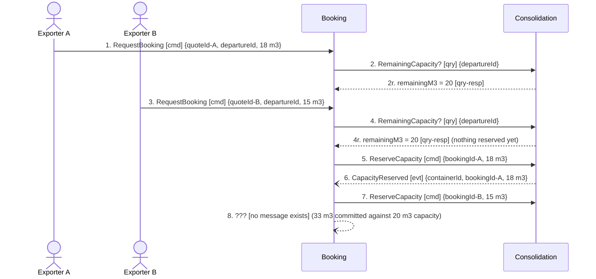

## Scenario

Two exporters commit consignments to the same departure within the same few seconds. The container
has 20 m³ left; one wants 18 m³, the other 15 m³. Only one can fit. "Done" for the business means
one booking is confirmed and the other is told *before* the customer believes they have a slot,
because the Guaranteed Consolidation premium is a promise of a departure slot.

This is discovery hotspot #1 — *"two shipments were committed to the same container slot in March;
nobody agrees where the check should have happened"* — traced as a flow. It introduces **no new
message types**: every message here is already in DOMAIN-FLOW-0001. Only the interleaving is new.

## Flow

| # | From | Message | Type | Contents | To | Note |
|---|---|---|---|---|---|---|
| 1 | Exporter A | `RequestBooking` | command | quoteId-A, departureId, 18 m³ | Booking | |
| 2 | Booking | `RemainingCapacity?` | query | departureId → 20 m³ | Consolidation | A's check |
| 3 | Exporter B | `RequestBooking` | command | quoteId-B, departureId, 15 m³ | Booking | arrives inside the gap |
| 4 | Booking | `RemainingCapacity?` | query | departureId → 20 m³ | Consolidation | B's check. Still 20: message 2 reserved nothing |
| 5 | Booking | `ReserveCapacity` | command | bookingId-A, 18 m³ | Consolidation | acts on the answer from 2 |
| 6 | Consolidation | `CapacityReserved` | event | containerId, bookingId-A, 18 m³ | Booking | 18 of 20 m³ now committed |
| 7 | Booking | `ReserveCapacity` | command | bookingId-B, 15 m³ | Consolidation | acts on the answer from 4, which is now false |
| 8 | Consolidation | **no message exists** | — | — | — | the invariant must reject B here, and the model has nothing to say with |

**Counts:** 8 messages · 2 bounded contexts · **4 queries crossing a boundary** · Booking↔Consolidation
exchange all 8 — the chattiest pair in the model, in the flow where the money is committed.

## Findings

| # | Smell | Evidence (messages) | What it suggests | Proposed change |
|---|---|---|---|---|
| F1 (same as FLOW-0001) | Check-then-act race, proven | The gap between 2 and 5, and between 4 and 7. Message 4 returns 20 m³ *after* the decision in 2 has already been made and *before* 5 acts on it. Nothing in the model closes that window | The March double-commit was not an operator mistake and not a bug in one service. It is the boundary: the query at 2/4 and the command at 5/7 are separated by a network hop, so whatever the query established can be false by the time the command lands. No amount of care inside Booking fixes this | Collapse the pair. One `ReserveCapacity` command; Consolidation decides on its own state inside its own aggregate and answers accepted or rejected. The race disappears because there is no gap left to race in |
| F2 (same) | Distributed invariant, now with a consequence | 6 and 7: `ContainerLoad` holds `capacityM3` and `committedM3` (consolidation/model.yaml) and owns *"committed volume must never exceed capacity"*, yet the decision that consumes capacity was taken in Booking at 2/4 | The rule is enforceable only where the state is. Two aggregates cannot uphold one invariant under concurrency; that is what *"nobody agrees where the check should have happened"* is really reporting | The invariant, the state and the decision go to `ContainerLoad`. Booking keeps only "confirmed once reserved", which it can check locally on message 6 |
| F11 | The rejection has no name | 8: the flow terminates in a state the business has already described — *"an overbooked container means a shipment is bumped and the Guaranteed Consolidation promise is broken"* — and there is no event, no command and no read model for it anywhere in `docs/domain/` | The unhappy path of the highest-value scenario in the business is entirely unmodelled. That is how it ships as a silent overwrite and surfaces as an angry customer in March | Do **not** invent the event here. Take it to `domain-discover` with the planners: what is the business name for a refused reservation, who is told, and is there a compensating action (re-plan onto the next departure, refund the premium)? |
| F12 | Chatty pair | 8 of 8 messages are Booking↔Consolidation, 4 of them queries | Above the ≥5-in-one-scenario threshold. On its own this reads as "merge them" — but check the other flows first: in DOMAIN-FLOW-0002 Consolidation talks to Customs and never to Booking, and Booking does not appear at all | Do not merge. The chattiness is entirely an artifact of F1: fixing check-then-act takes this pair from 8 messages to 3. Re-count after that change rather than moving the boundary now |

## Open questions

- **O1** (restated, and now the blocking one) — what does the business call a refused reservation,
  and what happens to the customer's premium? → depot planners + commercial director, via
  `domain-discover`. Everything about the fix to F1 depends on the answer having a name.
- **O8** — how often does this actually happen? One occurrence is documented (March). The
  frequency decides whether the business would accept eventual consistency with a named
  compensation instead of a single-aggregate decision — but note that "accept eventual consistency"
  still requires naming the compensation, so O1 must be answered either way. → planners.
