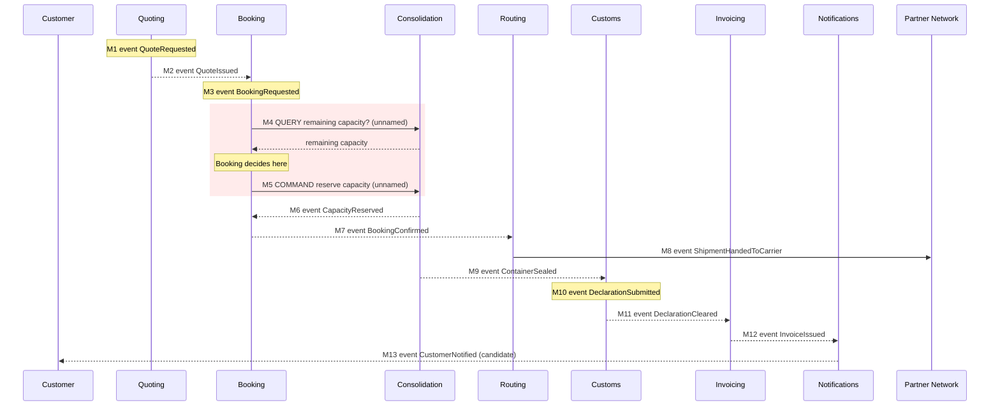

## Scope

One scenario, end to end: a customer asks for a price on a part load and ends up with an invoice.
Quote → booking → capacity → carrier handover → customs → invoice → notification.

This document walks that scenario across the seven contexts in `docs/domain/context-map.md`, types
every message, and records where the split does not survive the walk.

**Nothing in the model was changed.** This review adds files under `docs/domain/flows/` and edits
none. Every boundary change is written up as a proposal in
[`boundary-proposals.md`](./boundary-proposals.md) for `domain-decompose` to apply.

## Message inventory rule

Every message below appears in a `model.yaml` or in `discovery/timeline.md`. Where the model
describes an interaction in prose but gives it no name — M4 and M5 — the row says so and cites the
line. No message was invented to make the flow read smoothly; the gaps are findings, not
omissions.

Types: **command** (imperative, one handler, may be rejected) · **event** (a fact that already
happened, broadcast) · **query** (asks for data, changes nothing).

## The flow

| # | Message | Type | From → To | Payload | Source |
|---|---|---|---|---|---|
| M1 | `QuoteRequested` | event | Quoting → (internal) | `customerId, laneId, volumeM3` | `quoting/model.yaml`; timeline #1 |
| M2 | `QuoteIssued` | event | Quoting → Booking | `quoteId, price, validUntil` | `quoting/model.yaml`; timeline #2; `quoting` → Booking `upstream` |
| M3 | `BookingRequested` | event | Booking → (no declared subscriber) | `bookingId, departureId, volumeM3` | `booking/model.yaml`; timeline #3 |
| M4 | *remaining-capacity check* — **no name in the model** | **query** | Booking → Consolidation | not modelled; returns remaining capacity for a departure | `booking/model.yaml` relationships: `note: "synchronous remaining-capacity check before reserving"` |
| M5 | *reserve capacity* — **no name in the model** | **command** | Booking → Consolidation | not modelled; implies `bookingId, departureId, volumeM3` | same note, `"...before reserving"` |
| M6 | `CapacityReserved` | event | Consolidation → Booking | `containerId, bookingId, volumeM3` | `consolidation/model.yaml`; timeline #4 |
| M7 | `BookingConfirmed` | event | Booking → Routing | `bookingId, containerId` | `booking/model.yaml`; timeline #5; `routing/model.yaml` rationale |
| M8 | `ShipmentHandedToCarrier` | event | Routing → Partner Network (external) | `bookingId, carrierId` | `routing/model.yaml`; timeline #6 |
| M9 | `ContainerSealed` | event | Consolidation → Customs | `containerId, fillRate` | `consolidation/model.yaml`; timeline #7 |
| M10 | `DeclarationSubmitted` | event | Customs → (no declared subscriber) | `declarationId, portCode` | `customs/model.yaml`; timeline #8 |
| M11 | `DeclarationCleared` | event | Customs → Invoicing | `declarationId, clearedAt` | `customs/model.yaml`; timeline #9 |
| M12 | `InvoiceIssued` | event | Invoicing → Notifications | `invoiceId, customerId, total` | `invoicing/model.yaml`; timeline #10 |
| M13 | `CustomerNotified` | event — **candidate, unconfirmed** | Notifications → Customer | `customerId, templateId` | `notifications/model.yaml`; timeline #11 (*"nobody confirmed when it fires"*) |

The red band is the finding. Everything else in the walk is a one-way fact moving downstream;
M4–M5 is the only place where one context reads another's state, decides, and then acts on it.

## Verdict

The split holds at five of six internal seams. Quoting → Booking, Consolidation → Customs,
Customs → Invoicing and Invoicing → Notifications are clean one-way event handoffs with distinct
languages on each side.

It does not hold in two places:

- **Booking ↔ Consolidation is not a boundary, it is a split transaction.** M4–M5 puts the
  decision in Booking and the invariant in Consolidation. This is the March incident, still
  unfixed.
- **Routing is not a bounded context.** It receives one event and emits one event with no rule of
  its own between them.

Three further problems block a build regardless of where the boundaries land: the scenario has no
failure path, the correlating identifier never travels, and one stated business rule is enforced
nowhere.

## Findings

### F1 — Check-then-act race between M4 and M5 · **High**

Booking asks Consolidation for remaining capacity (**M4**, query), decides whether the booking
fits, then tells Consolidation to reserve it (**M5**, command). The decision is taken on a value
that Consolidation is free to change between the two messages.

Two bookings for the same departure both pass M4 while `committedM3` still shows room; both then
issue M5; `committedM3` ends above `capacityM3`. Nothing in the model closes that window — M4 and
M5 are separate messages, the relationship note calls the check *synchronous* but says nothing
about holding anything, and `ContainerLoad` carries no reservation, no version and no lock
(`consolidation/model.yaml`, `ContainerLoad: containerId, departureId, capacityM3, committedM3`).

This is **hotspot #1** in `discovery/timeline.md`: *"Two shipments were committed to the same
container slot in March; nobody agrees where the check should have happened."* The reason nobody
agrees is that the model genuinely does not say — M4 puts the check in Booking and the invariant
puts it in Consolidation. The hotspot is not a past incident, it is a live property of the design,
and it will reproduce under concurrent load on any departure that is close to full.

Business consequence, from `business-model.md`: an overbooked container bumps a shipment, and the
bumped shipment breaks the **Guaranteed Consolidation** promise — the +18% premium that is the
company's one differentiated revenue stream.

### F2 — `no overbooking` is a distributed invariant · **High**

The rule *"A container's committed volume must never exceed its capacity"* is:

- **owned by Consolidation** — `consolidation/model.yaml`, `invariants`
- **confirmed as a business rule** — `discovery/timeline.md`, stated by a planner, 2026-05-25
- **but enforced in Booking** — the M4 query exists for no other reason than to let Booking decide
  whether the rule would be violated

Booking's own invariant, *"A booking may only be confirmed once its capacity has been reserved"*,
is the other half of the same rule. One business rule, two contexts, two transactions, no single
owner. An invariant that spans a transaction boundary is not an invariant; it is a hope.

Two pieces of corroborating evidence:

- **The declared relationship direction contradicts the traffic.** `booking/model.yaml` declares
  `{to: Consolidation, type: downstream}` and `consolidation/model.yaml` declares
  `{to: Booking, type: upstream}` — Consolidation supplies, Booking consumes. But in M4–M5 Booking
  drives Consolidation. A consumer does not command its supplier. The relationship type describes
  M6 only and misses half the seam.
- **`ConsignmentLine` is a Shared Kernel that both sides write** (`context-map.md`, Shared
  artifacts) — and the two sides do not agree on its shape:
  `Booking.ConsignmentLine = lineId, volumeM3, weightKg, hazardClass`;
  `Consolidation.ConsignmentLine = lineId, volumeM3, stackable`. `committedM3` is derived from the
  same lines Booking is allowed to write. So even after M5, Booking can move the number that
  Consolidation's invariant is measured against.

F1 is the symptom. F2 is the cause, and any fix that addresses M4–M5 without moving the rule
ownership will re-emerge the first time a second caller needs capacity.

### F3 — The scenario has no failure path · **High**

`CapacityReserved` (M6) is the only outcome of M5 anywhere in the model. There is no
`CapacityRejected`, no `BookingRejected`, no rejection event of any kind in seven `model.yaml`
files or eleven timeline entries.

`Booking` carries a `status` attribute, and its invariant blocks confirmation until capacity is
reserved — so a booking whose reservation fails has a status field, a blocking invariant, and no
message that moves it anywhere. The customer is never told. This is not a corner case: rejection
is the *normal* outcome once fill rate approaches the 80% target in `business-model.md`.

The team cannot build M5 without deciding this, and it is exactly the decision that determines
whether F1 is fixable atomically.

### F4 — `ShipmentRef` never travels · **High**

`context-map.md` declares `ShipmentRef` shared across Booking, Consolidation, Customs and
Invoicing. It appears in no event payload in the flow. Follow the identifiers:

| Hop | Carries | Receiver needs |
|---|---|---|
| M9 `ContainerSealed` | `containerId, fillRate` | Customs builds `Declaration(declarationId, shipmentRef, portCode, status)` — it gets neither `shipmentRef` nor `bookingId`, and a sealed container holds many shipments |
| M11 `DeclarationCleared` | `declarationId, clearedAt` | Invoicing must satisfy *"An invoice line must reference a cleared declaration"* and issue `InvoiceIssued(invoiceId, customerId, total)` — `customerId` is not derivable from the payload |
| M8 `ShipmentHandedToCarrier` | `bookingId, carrierId` | the partner network receives a physical container; `containerId` is not in the payload |

Each receiver has to reach back into an upstream context's database to do its job. Three
back-channels that the context map does not show, and the shared value object that would have
prevented all three is already declared.

### F5 — `declaration before handover` is enforced nowhere, and the timeline contradicts it · **High**

`customs/model.yaml` states the invariant *"A shipment cannot be handed to a carrier before its
declaration is submitted"*, confirmed by the customs clerk.

The confirmed timeline orders it the other way: `ShipmentHandedToCarrier` is #6,
`DeclarationSubmitted` is #8. Both were confirmed by attendees who were in different jobs — the
planner walked the operational order, the clerk stated the rule. One of them is wrong and nobody
in the room noticed.

Either way the rule has no enforcement point. M8 is emitted by Routing. Routing has
`aggregates: []` and *"owns no rule of its own"*. M10 `DeclarationSubmitted` has no declared
subscriber. Nothing carries declaration status to the actor that performs the handover. This is a
second distributed invariant — Customs owns it, Routing would have to enforce it, and no message
connects them.

### F6 — Routing is a pass-through, not a context · **Medium**

M7 in, M8 out. `routing/model.yaml`: `aggregates: []`, `tactical_pattern: transaction-script`,
3 tables, and the rationale states plainly that it *"hands the shipment to the partner carrier
selected by the standing contract for that lane. It owns no rule of its own."*

A bounded context is a boundary around a decision and a language. Routing has neither: the carrier
choice is made by a standing contract that lives outside it, and its one term (`carrierId`) is
Booking's identifier plus a lookup. Keeping it as a context buys a network hop, a deployment, an
on-call rotation and an eventual-consistency window, and buys no isolation — which matters because
F5 puts the missing declaration check exactly here.

### F7 — No commands or queries are modelled anywhere · **Medium**

All seven `model.yaml` files list `domain_events` and nothing else. The two most dangerous
messages in the booking scenario — M4 and M5 — exist as eleven words of prose in a relationship
note. They have no name, no payload, no timeout, no idempotency key, no failure contract.

This is a process finding, not a design one, and it is the reason F1 survived a full modelling
pass: a seam that is not written down cannot be reviewed. Any team building M5 will pick the
semantics themselves, and the two teams will pick differently.

### F8 — The customer hears nothing until the invoice · **Low–Medium**

The only customer-facing message in the whole flow is M13, and it is triggered by M12
`InvoiceIssued`. `notifications/model.yaml` declares exactly one inbound relationship,
`{to: Invoicing, type: downstream}`. So `BookingConfirmed` (M7) — the moment the customer's money
is committed — reaches Routing and nobody else.

M13 is also the one event in the timeline that no human confirmed: *"candidate — inferred from the
notification templates, nobody confirmed when it fires."* The flow's only customer touchpoint
rests on an inference from a template folder.

### F9 — Out of scope, flagged for `domain-strategize` · **Note**

`Consolidation` is labelled `supporting` in `context-map.md` while `business-model.md` names load
consolidation as the one capability that is `revenue-generator` + `custom-built` +
differentiating, and the source of the +18% premium. It also owns the invariant in F2 and sits on
the critical path of this scenario.

This affects who is asked to fix F1 and how much investment that team can justify. It is a
classification question, not a message-flow question — handing it to `domain-strategize` rather
than resolving it here. `context-map.md` notes the classification *"has not been revisited since
the first modelling session in March"* — the same month as hotspot #1.

## What to do next

All boundary changes are written as proposals in [`boundary-proposals.md`](./boundary-proposals.md)
and are for `domain-decompose` to apply. Nothing under `docs/domain/` was modified by this review.

Two questions need humans before the proposals can be accepted:

1. **F5 ordering** — put the depot planner and the customs clerk in the same room and ask which
   comes first, handover or declaration. The timeline and the invariant disagree and both are
   marked confirmed.
2. **F3 rejection policy** — what should happen to a booking whose reservation fails? Auto-roll to
   the next departure, wait-list, or reject outright? This determines whether M5 can be a single
   atomic command, which is the whole of proposal P1.
