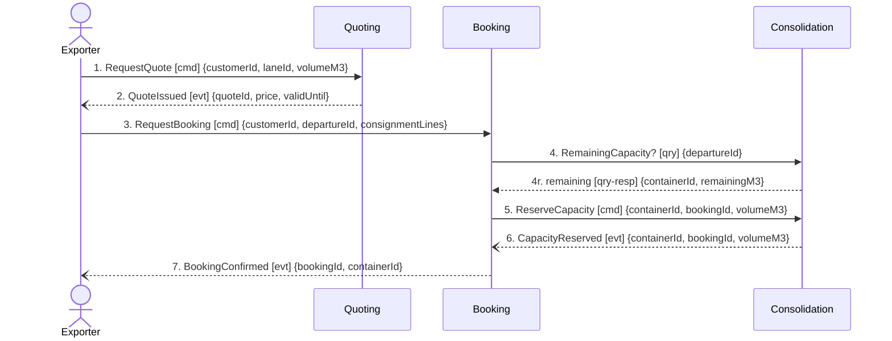

## Scenario

An exporter with a part load asks Nordic Freight what it costs to move it on a given lane, accepts
the quote, and books the shipment onto a departure. "Done" means the customer holds a confirmed
booking against a specific container, and the volume they committed is reserved on that container's
load so nobody else can take the same slot. This is the commercial heart of the lifecycle: it is
where the forwarding margin and the Guaranteed Consolidation premium are committed.

## Flow

| # | From | Message | Type | Contents | To |
|---|---|---|---|---|---|
| 1 | Exporter | `RequestQuote` † | command | customerId, laneId, volumeM3 | Quoting |
| 2 | Quoting | `QuoteIssued` | event | quoteId, price, validUntil | Exporter (no context consumes it) |
| 3 | Exporter | `RequestBooking` † | command | customerId, departureId, consignmentLines | Booking |
| 4 | Booking | `RemainingCapacity?` | query (with response) | departureId → containerId, remainingM3 | Consolidation |
| 5 | Booking | `ReserveCapacity` † | command | containerId, bookingId, volumeM3 | Consolidation |
| 6 | Consolidation | `CapacityReserved` | event | containerId, bookingId, volumeM3 | Booking |
| 7 | Booking | `BookingConfirmed` | event | bookingId, containerId | Exporter, Routing (flow 0002) |

**Provenance.** Events 2, 6, 7 are confirmed in `discovery/timeline.md` (#2, #4, #5). Message 4 is
modelled: `booking/model.yaml` records the relationship to Consolidation as *"synchronous
remaining-capacity check before reserving"*. Messages marked † are the actor-side commands implied
by a confirmed event plus its stated initiator; they are not separately confirmed and are listed in
Open questions.

**Temporal.** Message 3 must fall **within** the quote's validity window — `quoting/model.yaml`
invariant *"a quote cannot be accepted after its validity window"*. Nothing in the model says what
happens when it expires mid-booking; that is a deadline without an expiry rule.

**Counts.** 7 messages · 3 contexts · 1 query crossing a boundary · longest synchronous chain 2 hops
(Exporter → Booking → Consolidation).

## Findings

| # | Smell | Evidence (messages) | What it suggests | Proposed change |
|---|---|---|---|---|
| F-A1 | Check-then-act across a boundary | 4 then 5: Booking asks Consolidation for remaining capacity, then commands it to reserve. The invariant *"a container's committed volume must never exceed its capacity"* is owned by `consolidation/model.yaml`, but the decision to proceed is taken in Booking between the two messages | The gap between 4 and 5 is a race: a second booking can consume the same remaining volume. This is discovery hotspot #1 (*"two shipments were committed to the same container slot in March; nobody agrees where the check should have happened"*) — located, with two message numbers on it | Collapse 4 and 5 into a single `ReserveCapacity` command that Consolidation accepts or rejects. Name the rejection as domain vocabulary (`CapacityRejected`), not an error code — Booking then has a modelled path for "departure full". Record the no-overbooking invariant as Consolidation's alone |
| F-A2 | Synchronous query crossing a boundary | 4 (count of boundary-crossing queries: 1, threshold is 0) | Booking cannot confirm anything while Consolidation is down; the paid Guaranteed Consolidation path inherits Consolidation's availability. `consolidation/model.yaml` notes load planning *"still happens partly on a whiteboard"* — a context with manual steps in the loop is a poor synchronous dependency | Subsumed by F-A1. If the business wants Booking to show live remaining capacity to the customer before committing, that is a read model Consolidation publishes, not a query on the commit path |
| F-A3 | Distributed invariant via Shared Kernel | 3 and 5 both carry consignment volume; `ConsignmentLine` is declared **Shared Kernel — both write it** on the context map, and appears with different attributes in `booking/model.yaml` (volumeM3, weightKg, hazardClass) and `consolidation/model.yaml` (volumeM3, stackable) | `volumeM3` — the exact quantity the no-overbooking rule constrains — is held and written on both sides of the boundary. A rule cannot be enforced over state two contexts each write | One owner for committed volume. Consolidation owns `ContainerLoad.committedM3` and the `ConsignmentLine` volume it constrains; Booking's copy becomes a customer-facing declaration passed in message 5, not a jointly written record |
| F-A4 | Broken link between agreed price and committed booking | 2 issues `{quoteId, price, validUntil}`; message 3 has no modelled way to carry it — `booking/model.yaml` `Booking` entity is `{bookingId, customerId, departureId, status}`, with no `quoteId` and no price, and no message runs Quoting → Booking despite the map's `Booking --> Quoting` (downstream) edge | The price the customer agreed never enters the system of record for what they committed to. This is the upstream half of F-C1: Invoicing later has nothing to bill from | Either Booking references the accepted quote (`quoteId` on the Booking aggregate, carried in message 3) or Quoting emits `QuoteAccepted` that Booking consumes. Pick one and put it on the map — today the edge exists in the diagram with no message behind it |

## Open questions

- Are `RequestQuote`, `RequestBooking` and `ReserveCapacity` the names the business uses for these
  commands? Only the resulting events were confirmed in discovery — a depot planner or the
  commercial director can confirm the command vocabulary.
- What happens when a quote expires between messages 2 and 3, or between 3 and 7? Commercial
  director.
- Does anything consume `QuoteRequested` (timeline #1)? It appears in `quoting/model.yaml` but has
  no consumer in any other context — planner / engineers.
- When Consolidation cannot fit the volume, what does the customer see today? Depot planners.
