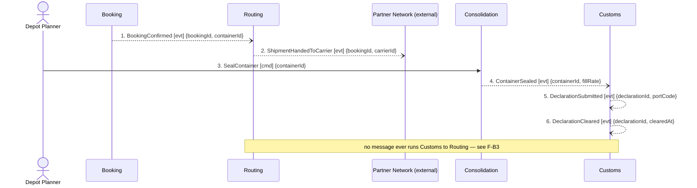

## Scenario

A confirmed booking becomes physical movement: the shipment is handed to the partner carrier that
holds the standing contract for the lane, the depot planner seals the container once the load is
complete, and Customs submits and clears the declaration for the sealed container. "Done" means the
container is on its way with a cleared declaration behind it.

The two halves of this scenario — the carrier handover and the customs clearance — are drawn in one
flow **on purpose**. The business rule *"a shipment cannot be handed to a carrier before its
declaration is submitted"* (`customs/model.yaml`, confirmed by the customs clerk) spans them. Drawn
apart, each half looks fine. Drawn together, the ordering violation is visible (F-B3).

## Flow

| # | From | Message | Type | Contents | To |
|---|---|---|---|---|---|
| 1 | Booking | `BookingConfirmed` | event | bookingId, containerId | Routing (sole consumer) |
| 2 | Routing | `ShipmentHandedToCarrier` | event | bookingId, carrierId | Partner Network (external) |
| 3 | Depot Planner | `SealContainer` † | command | containerId | Consolidation |
| 4 | Consolidation | `ContainerSealed` | event | containerId, fillRate | Customs |
| 5 | Customs | `DeclarationSubmitted` | event | declarationId, portCode | — (no modelled consumer) |
| 6 | Customs | `DeclarationCleared` | event | declarationId, clearedAt | Invoicing (flow 0003) |

**Provenance.** Events 1, 2, 4, 5, 6 are confirmed in `discovery/timeline.md` (#5, #6, #7, #8, #9).
Message 3 † is the planner-side command implied by confirmed event #7 and by
`consolidation/model.yaml`'s note that planners resolve the load by hand; the command name is not
confirmed.

**Temporal.** The customs invariant is an ordering constraint — declaration submitted **before**
handover — not an interval. Nothing in the model states how long clearance may take or what happens
to a sealed container waiting on it. Hotspot #3 (*"nobody knows who is responsible when a partner
carrier refuses a sealed container"*) sits in exactly that unmodelled gap.

**Counts.** 6 messages · 4 contexts + 1 external · 0 queries crossing a boundary · longest
synchronous chain 1 hop. Two independent chains (1–2 and 3–6) that never meet.

## Findings

| # | Smell | Evidence (messages) | What it suggests | Proposed change |
|---|---|---|---|---|
| F-B1 | Pass-through | 1 → 2: Routing receives `BookingConfirmed` and emits a structurally equivalent `ShipmentHandedToCarrier`, adding only the `carrierId` that the standing lane contract already determines. `routing/model.yaml` states it outright: `aggregates: []`, *"it owns no rule of its own"*, 3 tables | A boundary drawn around a hop, not a business capability. The context makes no decision and holds no invariant, so it can only add latency, a deploy unit and an owner queue | Two options for the business to choose between: **(a)** delete the hop — the partner-network adapter subscribes to `BookingConfirmed` directly and carrier selection is a lookup on the lane contract; **(b)** if carrier selection is about to become a real decision (refusals, cost, capacity — hotspot #3), give Routing that decision explicitly and model the rule it enforces. What is not tenable is the current state, where it is neither |
| F-B2 | Event used as a disguised command | 1: `BookingConfirmed` has exactly one consumer, and if Routing fails to handle it the shipment never moves. Booking depends on Routing, but nothing on the map says so | The coupling of a command with the deniability of an event | If option (a) in F-B1 is taken this disappears. If Routing survives as a context, the message from Booking is a command (`HandToCarrier`) and the dependency should be visible |
| F-B3 | Distributed invariant, currently enforced by nobody | 2 occurs on receipt of 1; `DeclarationSubmitted` is 5. The handover therefore precedes the declaration in every run of this scenario. `customs/model.yaml` owns the rule but lists relationships only to Consolidation (downstream) and Invoicing (upstream) — there is no modelled path from Customs to Routing at all | The confirmed rule *"a shipment cannot be handed to a carrier before its declaration is submitted"* is written in the model and enforced by no message. Either the real process has a manual step nobody modelled, or the rule is being broken routinely and the exposure is regulatory, not technical. This is the most serious finding in the three flows | Two-part: **(1)** ask the customs clerk what actually gates the handover today — if it is a human check, model it as a participant. **(2)** In the model, the handover must be triggered by a customs fact, not by `BookingConfirmed`: whoever performs the handover consumes `DeclarationSubmitted` (or a `ShipmentReleasedForCarrier` fact owned by Customs) and the Routing/Customs edge goes on the context map |
| F-B4 | Two chains wearing one scenario name | 1–2 and 3–6 share no message and no data | Ordinarily this is the signal to split the flow. Here the split is what hides F-B3: the correlation between the booking (`bookingId`) and the declaration (`declarationId`) exists nowhere in messages 1–6 — no message carries both | Keep them in one flow until F-B3 is resolved. Whatever gates the handover must correlate booking and declaration; `ShipmentRef` is already a shared value object across Booking, Consolidation, Customs and Invoicing and is the obvious correlator — but no message currently carries it |
| F-B5 | Event with no modelled consumer | 5: `DeclarationSubmitted` is confirmed by the customs clerk but consumed by nothing in any `model.yaml` | Either a fact recorded for audit only, or the missing trigger F-B3 needs | Resolve with F-B3 — the most likely answer is that this event is the gate, and the design has simply never connected it |

## Open questions

- What stops a shipment reaching the carrier before its declaration is submitted today — a system
  check, a planner's habit, or nothing? Customs clerk, depot planners. This decides whether F-B3 is
  a modelling gap or a live compliance exposure.
- Is `SealContainer` the command planners use, and who issues it — the depot planner or the
  optimiser? Depot planners.
- When a partner carrier refuses a sealed container (hotspot #3), which context learns about it and
  what message carries the refusal? Nobody in the discovery session could answer; needs the
  commercial director plus a depot planner. **No message is drawn for it here — the gap is the
  finding.**
- Does anything correlate `bookingId` and `declarationId` today? Engineers.
