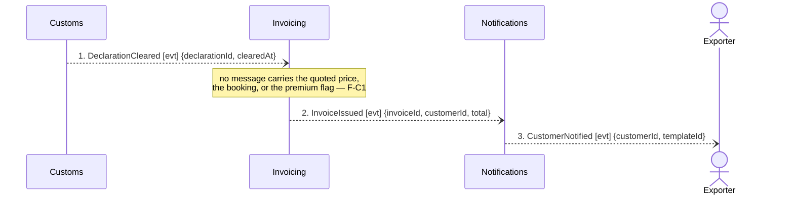

## Scenario

The declaration clears, and Nordic Freight bills the customer for the shipment — the forwarding
margin plus, where the customer bought it, the 18% Guaranteed Consolidation premium (charged
whether or not the container ended up full, per the finance analyst). "Done" means the customer has
an invoice and knows about it.

This flow is **three messages long**, below the five-message floor. That is not a drafting problem:
the revenue half of the lifecycle has almost nothing modelled between contexts, while the Invoicing
implementation behind it carries 34 tables and 5 aggregates. The thinness is the finding (F-C3).

## Flow

| # | From | Message | Type | Contents | To |
|---|---|---|---|---|---|
| 1 | Customs | `DeclarationCleared` | event | declarationId, clearedAt | Invoicing |
| 2 | Invoicing | `InvoiceIssued` | event | invoiceId, customerId, total | Notifications |
| 3 | Notifications | `CustomerNotified` | event | customerId, templateId | Exporter |

**Provenance.** Messages 1 and 2 are confirmed (`discovery/timeline.md` #9, #10). Message 3 is a
**candidate** event — the timeline marks it *"inferred from the notification templates, nobody
confirmed when it fires"*. It is drawn because it is in the model, not because it is confirmed.

**Temporal.** Unresolved, and it matters. *"Invoice within 24 hours of clearance"*, *"invoice after
clearance"* and *"invoice all cleared shipments every month"* are three different businesses with
three different designs. Nothing in `docs/domain/` says which one Nordic Freight runs; the message-1
→ message-2 arrow assumes **after**, on no evidence. Finance analyst can settle it.

**Counts.** 3 messages (below the 5 floor) · 3 contexts · 0 queries · longest synchronous chain 0
hops — everything here is event-driven.

## Findings

| # | Smell | Evidence (messages) | What it suggests | Proposed change |
|---|---|---|---|---|
| F-C1 | Missing message — the invoice has no priced input | Between 1 and 2 Invoicing must produce a `total`. `invoicing/model.yaml` lists relationships only to Customs (downstream) and Notifications (upstream); message 1 carries `{declarationId, clearedAt}`. No message anywhere in the model carries the quoted price, the booking, or the Guaranteed Consolidation premium flag into Invoicing | The premium is the +18% the business is paid for (`business-model.md`, pricing page) and nothing in the modelled flow tells Invoicing whether it applies. With F-A4, the chain price → booking → invoice is broken at both ends | **No message is invented here.** Either the model is missing a `BookingConfirmed`/`QuoteAccepted` subscription in Invoicing, or the real system reads a database Invoicing shares with Booking — which would be undeclared coupling the context map does not show. Ask the engineers which, then hand the answer to `domain-decompose` |
| F-C2 | Correlation gap on the only inbound message | 1 carries `declarationId` and `clearedAt` and nothing else, yet `invoicing/model.yaml`'s invariant is *"an invoice line must reference a cleared declaration"* — and an invoice line is billed to a customer and a shipment, neither of which appears in the payload | Invoicing cannot tie a cleared declaration to the thing it bills. `ShipmentRef` is already listed on the context map as shared across Booking, Consolidation, Customs and Invoicing, and `customs/model.yaml`'s `Declaration` entity holds `shipmentRef` — it is simply not in the event | Add `shipmentRef` to the `DeclarationCleared` payload. Small change, and it is the correlator F-B4 also needs. Payload change belongs to `domain-decompose` |
| F-C3 | Flow below the 5-message floor while the implementation is the largest in the system | 3 messages across 3 contexts, against `invoicing/model.yaml` mass of 34 tables / 311 attributes / 5 aggregates | Either the billing lifecycle really is this simple between contexts and the mass is internal (VAT variation, per `invoicing/model.yaml` notes), or the modelled flow is a fraction of what the system does — credit notes, dunning and payment allocation are aggregates with no message in any flow | Do not treat as a boundary defect yet. Trace one more scenario against the same contexts — a credit note or a dunning cycle — before concluding anything about the Invoicing boundary. Recorded here so the next reader does not read this flow as proof the boundary is clean |
| F-C4 | Unconfirmed event in the flow | 3: `CustomerNotified` is marked *candidate* in the discovery timeline | The last message the customer actually experiences is the one nobody in the room could describe | Hand to `domain-discover`: when does a notification fire, on which facts, and does the customer get anything before the invoice? Do not promote to confirmed here |

## Open questions

- Which temporal rule governs invoicing — within an interval after clearance, on clearance, or on a
  billing cycle? Finance analyst.
- How does Invoicing learn the price and whether the Guaranteed Consolidation premium applies?
  Engineers first (is it a shared database?), then the commercial director.
- Do credit notes, dunning and payment allocation exchange messages with any other context, or are
  they entirely internal to Invoicing? Finance analyst, engineers.
- Hotspot #2 lands on message 2: "consignment" means *a billable line* in `invoicing/model.yaml` and
  *the goods a customer hands over as one unit* in `booking/model.yaml`. Which meaning does an
  invoice line carry, and is one billable line always one physical consignment? Finance analyst plus
  a depot planner.
