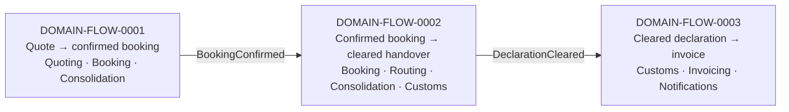

## Why the lifecycle is three flows, not one

The request was one end-to-end flow, quote through to invoice. Laid out message by message, that
scenario needs **15 distinct domain messages across 7 bounded contexts and 2 external systems**.
Both numbers are past the point where a flow can do its job: the working limit is 9 messages, and a
scenario touching more than 4 contexts is usually one capability fragmented across too many owners.

That overflow is a result, not a formatting problem. Reading which of the three usual causes applies
here:

- **Two-or-more scenarios wearing one name — yes.** The lifecycle splits cleanly at two business
  seams: *commitment* (the customer agrees a price and a slot), *movement and clearance* (the
  physical container and its declaration), *settlement* (the money). Different actors, different
  rooms, different failure modes. The split is not an arbitrary chunking to fit the diagram — it
  falls on business boundaries, which is the good case.
- **Too many contexts on the path — partly.** 7 contexts for one shipment is high, but each of the
  three sub-flows touches 3–4, which is within range. The fragmentation is concentrated in one
  place: `Routing`, a context that adds a hop and no decision (F-B1).
- **Chatty pairs — one.** Booking ↔ Consolidation exchange 4 of the 15 messages, and 3 of those 4
  sit in a single check-then-act sequence (F-A1). Below the 5-message chatty threshold, so not a
  merge candidate on this evidence — but the reason they talk is the finding.

A single 15-message picture would have shown all of this and let a reader see none of it. The
lifecycle spine at flow granularity is below; the messages are in the three flow files.

The two seams between flows are both events, both confirmed in discovery. That is the healthiest
structural fact in this model: the lifecycle's own joints are event-driven, and neither seam is a
query.

## The flows

| id | Use case | Contexts | Msgs | Why this one |
|---|---|---|---|---|
| [DOMAIN-FLOW-0001](DOMAIN-FLOW-0001-quote-to-confirmed-booking.md) | Quote to confirmed booking | Quoting, Booking, Consolidation | 7 | **Commercial weight** — where the forwarding margin and the Guaranteed Consolidation premium are committed. Also where discovery hotspot #1 (March double-commit) lives |
| [DOMAIN-FLOW-0002](DOMAIN-FLOW-0002-confirmed-booking-to-cleared-handover.md) | Confirmed booking to cleared carrier handover | Booking, Routing, Consolidation, Customs (+ Partner Network) | 6 | **Most boundary crossings** — 4 contexts and an external partner. Carries the confirmed rule that a shipment cannot be handed over before its declaration is submitted |
| [DOMAIN-FLOW-0003](DOMAIN-FLOW-0003-cleared-declaration-to-invoice.md) | Cleared declaration to invoice and notification | Customs, Invoicing, Notifications | 3 | **Known pain** — the "consignment" language clash (hotspot #2) lands here, and Invoicing is the largest model in the system |

**Use cases deliberately not traced:** re-quoting an expired quote (single context, teaches nothing),
credit note / dunning cycles (worth tracing next — see F-C3), and partner-carrier refusal of a sealed
container (hotspot #3 — cannot be traced because nobody knows what happens, so it is an open question
rather than a flow).

## Counting checks

| Check | Threshold | 0001 | 0002 | 0003 | End-to-end |
|---|---|---|---|---|---|
| messages | > 9 | 7 | 6 | 3 ⚠ below floor | **15 ⚠** |
| distinct contexts | > 4 | 3 | 4 | 3 | **7 ⚠** |
| queries crossing a boundary | > 0 | **1 ⚠** | 0 | 0 | 1 |
| messages between busiest pair | ≥ 5 | 4 (Booking↔Consolidation) | 2 | 1 | 4 |
| flows a single context appears in | all | — | — | — | max 2 of 3 — **no god context** |
| longest synchronous chain | > 2 hops | 2 | 1 | 0 | 2 |

Two structural positives worth recording so nobody re-litigates them: **no context appears in all
three flows**, so there is no coordinator god context; and **14 of the 15 messages are events or
commands** — exactly one query crosses a boundary in the entire lifecycle, and it is the one flagged
in F-A1.

## Consolidated findings

| # | Flow | Smell | Evidence | Proposed change | Hand to | Status |
|---|---|---|---|---|---|---|
| F-B3 | 0002 | Distributed invariant enforced by nobody | Handover (msg 2) fires on `BookingConfirmed` (msg 1); `DeclarationSubmitted` is msg 5. `customs/model.yaml` owns the rule but has no relationship to Routing | Gate the handover on a Customs fact, not on `BookingConfirmed`; put the Customs → Routing edge on the map | `domain-decompose` (after the clerk answers) | proposed |
| F-A1 | 0001 | Check-then-act across a boundary | msgs 4 then 5; no-overbooking invariant owned by Consolidation, decision taken in Booking between them; = hotspot #1 | Collapse into one `ReserveCapacity` command Consolidation accepts or rejects; name `CapacityRejected` as domain vocabulary | `domain-decompose` | proposed |
| F-B1 | 0002 | Pass-through | msg 1 → msg 2, structurally equivalent; `routing/model.yaml`: `aggregates: []`, *"owns no rule of its own"* | Delete the hop, **or** give Routing a real carrier-selection decision. Not both-and-neither | `domain-decompose` | proposed |
| F-C1 | 0003 | Missing message — invoice has no priced input | Invoicing relates only to Customs and Notifications; msg 1 carries `{declarationId, clearedAt}`; no message carries price or the 18% premium flag | Find out how Invoicing gets price today (shared database?), then model it | engineers → `domain-decompose` | open question |
| F-A4 | 0001 | Broken link between agreed price and booking | msg 2 issues `{quoteId, price, validUntil}`; `Booking` entity has no `quoteId`; the map's Booking → Quoting edge carries no message | Booking references the accepted quote, or Quoting emits `QuoteAccepted` | `domain-decompose` | proposed |
| F-A3 | 0001 | Distributed invariant via Shared Kernel | `ConsignmentLine` written by both Booking and Consolidation with different attributes; `volumeM3` on both sides is what the no-overbooking rule constrains | One owner for committed volume | `domain-decompose` | proposed |
| F-C2 | 0003 | Correlation gap | msg 1 payload lacks `shipmentRef`, though `Declaration` holds it and Invoicing's invariant needs it | Add `shipmentRef` to `DeclarationCleared` | `domain-decompose` | proposed |
| F-A2 | 0001 | Synchronous query crossing a boundary | msg 4 — the only one in the lifecycle; Consolidation has manual whiteboard steps | Subsumed by F-A1; a live capacity display is a read model, not a commit-path query | `domain-decompose` | proposed |
| F-B2 | 0002 | Event as disguised command | msg 1 has exactly one consumer and the scenario fails without it | Resolves with F-B1(a); otherwise make it a command | `domain-decompose` | proposed |
| F-B4 | 0002 | Two chains never joining | msgs 1–2 and 3–6 share no message and no correlating id | Whatever gates the handover must correlate booking and declaration — `ShipmentRef` is the candidate | `domain-decompose` | proposed |
| F-B5 | 0002 | Event with no modelled consumer | msg 5 `DeclarationSubmitted` | Likely the missing gate in F-B3 | `domain-decompose` | proposed |
| F-C3 | 0003 | Flow below the 5-message floor vs. the largest model in the system | 3 messages against 34 tables / 5 aggregates | Trace a credit-note or dunning scenario before judging the Invoicing boundary | next connect round | proposed |
| F-C4 | 0003 | Unconfirmed event drawn in a flow | msg 3 `CustomerNotified`, marked *candidate* in discovery | Confirm when a notification fires and on which facts | `domain-discover` | open question |

Ranked by what it would cost to be wrong: F-B3 first (a regulatory rule the model says is owned and
that no message enforces), then F-A1 (a race that has already shipped once, in March).

## What was not done here

No boundary was redrawn and no `model.yaml` was edited. Every row above is a proposal with message
numbers attached, for `domain-decompose` (update mode) to merge or decline — it owns the
reconciliation rules, the stable ids and the human edits in that model. F-C4 goes to
`domain-discover` instead: an inferred event does not become a confirmed one because a flow needed it.

Three findings (F-B3, F-C1, and the hotspot-#3 refusal path) are blocked on questions only people can
answer. They are recorded as questions with a named owner rather than resolved by drawing a plausible
message — a flow built on an invented message validates the design against fiction.
