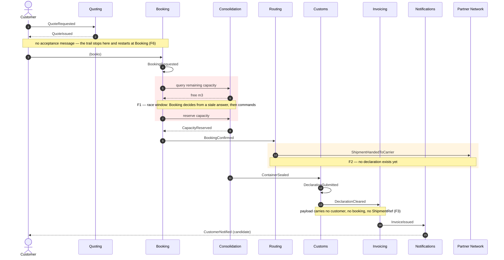
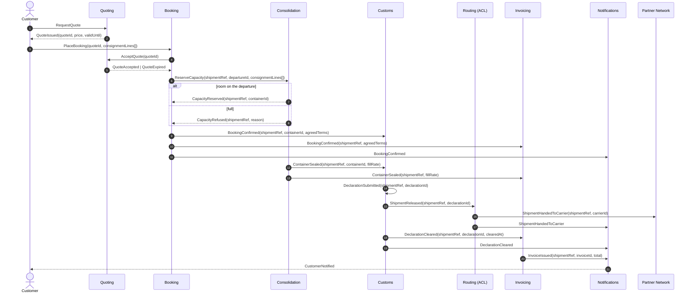

## Scope

One shipment, end to end: a customer asks for a price and Nordic Freight ends up issuing an
invoice for the move. Seven bounded contexts plus two external parties (the customer, the partner
carrier network) take part.

This document traces the **messages** that cross context boundaries — not the internal steps. A
message is one of three kinds, and the distinction is the whole point of the exercise:

| Kind | Shape | Handlers | Can be refused? |
|---|---|---|---|
| **Command** | imperative — `ReserveCapacity` | exactly one | yes — the handler owns the rule |
| **Event** | past-tense fact — `CapacityReserved` | zero or many | no — it already happened |
| **Query** | question — `remainingCapacity(departure)` | one | n/a — changes nothing, and is **stale the moment it returns** |

Sources: `docs/domain/context-map.md`, `docs/domain/discovery/timeline.md`, the seven
`docs/domain/<context>/model.yaml` files. Where the repo does not define a message that the flow
demonstrably needs, the row below is marked **inferred** and that gap is itself a finding.

Diagrams are Mermaid to match `context-map.md`, the only other diagram in this repo.

---

## The flow as it is documented today

| # | Message | Kind | From → To | Payload | Fires when |
|---|---|---|---|---|---|
| 1 | `QuoteRequested` | event | Customer → **Quoting** | `customerId, laneId, volumeM3` | customer asks for a price |
| 2 | `QuoteIssued` | event | **Quoting** → Customer | `quoteId, price, validUntil` | rate found for the lane |
| — | *(quote acceptance)* | — | Customer → **Booking** | — | **no message exists** — see F6 |
| 3 | `BookingRequested` | event | **Booking** → itself | `bookingId, departureId, volumeM3` | customer commits |
| 4 | *remaining-capacity check* | **query** | **Booking** → **Consolidation** | *inferred* — `departureId` in, free m³ out | before reserving. `booking/model.yaml`: *"synchronous remaining-capacity check before reserving"* |
| 5 | *reserve capacity* | **command** | **Booking** → **Consolidation** | *inferred* — `bookingId, containerId?, volumeM3` | if step 4 said there was room |
| 6 | `CapacityReserved` | event | **Consolidation** → **Booking** | `containerId, bookingId, volumeM3` | reservation taken |
| 7 | `BookingConfirmed` | event | **Booking** → **Routing** | `bookingId, containerId` | invariant *"confirmed only once capacity reserved"* satisfied |
| 8 | `ShipmentHandedToCarrier` | event | **Routing** → Partner Network | `bookingId, carrierId` | carrier picked from the lane's standing contract |
| 9 | `ContainerSealed` | event | **Consolidation** → **Customs** | `containerId, fillRate` | depot closes the container |
| 10 | `DeclarationSubmitted` | event | **Customs** → authority | `declarationId, portCode` | declaration filed |
| 11 | `DeclarationCleared` | event | **Customs** → **Invoicing** | `declarationId, clearedAt` | authority clears it |
| 12 | `InvoiceIssued` | event | **Invoicing** → **Notifications** | `invoiceId, customerId, total` | invoice raised |
| 13 | `CustomerNotified` | event *(candidate)* | **Notifications** → Customer | `customerId, templateId` | unconfirmed — nobody could say |

### Shape of the flow

- **13 messages needed, 11 modelled.** Every one of the 11 is an **event**. The repo defines no
  commands and no queries anywhere. The two missing messages (steps 4 and 5) are the only two that
  cross a boundary to *ask for a decision* — and they carry the hardest invariant in the business.
  Nothing forced them to be designed, so they were built as query-then-mutate.
- **Two chains, not one.** Booking → Routing → carrier (steps 7–8) and Consolidation → Customs →
  Invoicing (steps 9–11) run in parallel after confirmation, and **never rejoin**. Nothing
  correlates the shipment that went on a truck with the declaration that got cleared and the
  invoice that got raised.
- **The billing chain is a straight line with one input.** Invoicing hears from Customs and nobody
  else. It never hears from Booking (what was sold) or Consolidation (what was delivered).

---

## Where the flow breaks

Ranked by what it costs.

### F1 — The no-overbooking invariant is enforced outside the context that owns it — **critical**

`Consolidation` owns *"a container's committed volume must never exceed its capacity"*
(`consolidation/model.yaml`, confirmed by a planner). But the decision *"is there room?"* is taken
in `Booking`, from the return value of a query (step 4), and only then does Booking tell
Consolidation to reserve (step 5).

Between the answer and the command, the answer is a guess. Two bookings that both read *"3 m³
free"* both proceed, and Consolidation is handed two reservations it has already been told to
accept. That is hotspot #1 in `discovery/timeline.md` — *"two shipments committed to the same
container slot in March; nobody agrees where the check should have happened"* — and this flow says
exactly where: nowhere. The check happens in a context that cannot enforce its outcome.

The business cost is not a data glitch. An overbooked container bumps a shipment, and a bumped
shipment breaks the **Guaranteed Consolidation** promise — the +18% premium product named in
`business-model.md` as the one thing customers pay extra for.

**Fix.** Delete the query. Booking sends one command, `ReserveCapacity(bookingId, departureId,
consignmentLines[])`, and Consolidation answers `CapacityReserved` or `CapacityRefused(reason)`.
The decision and the invariant end up in the same place, and the race has nowhere to live.

*Trade-off:* Booking loses the ability to show *"only 2 m³ left on this departure"* in the UI
before committing. If that display matters, keep a read-model projection for it — but label it
advisory and never branch on it. **Recommended:** command-only; add the projection later if sales
actually asks.

### F2 — The documented event order violates a confirmed invariant — **critical**

`customs/model.yaml`: *"a shipment cannot be handed to a carrier before its declaration is
submitted"* (confirmed by the customs clerk).

The confirmed timeline puts `ShipmentHandedToCarrier` at #6 and `DeclarationSubmitted` at #8. The
message flow makes it worse: Customs is downstream of **Consolidation** and is triggered by
`ContainerSealed` (#7), so the declaration *cannot* exist before sealing, which is already after
the hand-off. As drawn, the invariant is unsatisfiable — nothing in the flow could ever hold it.

Either the timeline is wrong, or Routing hands over shipments illegally today. Both readings are
serious and they need different fixes, so this is the first question to put to the customs clerk
and a depot planner together.

**Fix.** Routing must not act on `BookingConfirmed`. It should wait on `DeclarationSubmitted` (or
on a `ShipmentReleased` fact that Customs emits once filing is done), which also gives Routing its
first real precondition to check.

### F3 — No message carries the shipment's identity — **high**

`context-map.md` lists `ShipmentRef` as a value object shared by Booking, Consolidation, Customs
and Invoicing. **No message in the flow carries it.** The chain of identifiers is:

`bookingId` → `containerId` → `declarationId` → `invoiceId`

with each hop dropping the previous one. `DeclarationCleared(declarationId, clearedAt)` is the only
thing Invoicing ever receives, and Invoicing's own invariant is *"an invoice line must reference a
cleared declaration"* — which it can technically satisfy while having no idea which customer,
which booking, or which price the line belongs to. The gap is being filled today by shared
database reads, which is why `ShipmentRef` looks like a shared building block instead of a payload
field.

**Fix.** Put `shipmentRef` in every payload from `BookingRequested` onward. It is the correlation
key for the whole lifecycle; it should be the first field of every message, not a shared type.

### F4 — The premium never reaches the invoice — **high**

The revenue model has two components: forwarding margin, and the **Guaranteed Consolidation**
premium at +18% of the forwarding fee, *"charged whether or not the container ends up full"*
(finance analyst, `discovery/timeline.md`).

Trace where Invoicing could learn that a booking bought the premium: it can't. Invoicing's only
inbound message is `DeclarationCleared`. The product tier is chosen at quote or booking time —
`QuoteIssued(quoteId, price, validUntil)` and `BookingConfirmed(bookingId, containerId)` both drop
it. `ContainerSealed` carries `fillRate`, the one number that shows whether the promise was kept,
and it goes to Customs, not to Invoicing.

So the differentiating product's revenue is reconstructed somewhere off-model — and no message
carries the evidence for a refund dispute either.

**Fix.** Subscribe Invoicing to `BookingConfirmed` (for the priced terms) and to `ContainerSealed`
(for the delivered fill rate). Add the agreed terms to the confirmation payload.

### F5 — Routing is a pass-through, not a bounded context — **medium**

`routing/model.yaml` is explicit: no aggregates, transaction-script, *"it owns no rule of its
own"*. In flow terms it consumes `BookingConfirmed` and emits `ShipmentHandedToCarrier` with the
carrier looked up from a standing contract. A context that makes no decision is not a boundary —
it is an outbound adapter that has been given a name, a schema and 3 tables.

Two ways out, and they are genuinely different bets:

- **(a) Collapse it.** Make it Booking's anti-corruption layer to the partner network. Fewest
  concepts, one less deployable, honest about today's reality.
- **(b) Give it the decision it is missing.** Hotspot #3 — *"nobody knows who is responsible when a
  partner carrier refuses a sealed container"* — is exactly the rule with no home. Carrier
  selection, refusal handling, and re-routing are a real capability if Nordic Freight intends to
  arbitrage carriers rather than follow standing contracts.

**Recommended: (a) now, (b) when the business says carrier choice is a lever.** `business-model.md`
currently rates routing *cost-reduction / no differentiation* — *"the partner network is the asset,
not the routing step"* — so today the evidence points at (a). But do not collapse it before F2 is
answered: if Routing is supposed to gate on the declaration, that gate has to survive the merge.

### F6 — Quote acceptance is missing, so the quote-validity rule cannot be enforced — **medium**

Quoting's invariant is *"a quote cannot be accepted after its validity window"*, but no acceptance
message exists and `BookingRequested` does not carry `quoteId`. Nothing in the flow ever compares
`now` to `validUntil`. The rule is written down and unreachable.

**Fix.** `BookingRequested` carries `quoteId`; Booking asks Quoting to honour it
(`AcceptQuote(quoteId)` → `QuoteAccepted` / `QuoteExpired`) before reserving capacity. Same shape
as F1 — the context that owns the rule makes the call.

### F7 — The shared kernel is doing a message's job — **medium**

`ConsignmentLine` is marked **Shared Kernel**, written by both Booking and Consolidation, with
different attributes on each side (`weightKg, hazardClass` vs `stackable`). The reason is visible
in the flow: `BookingRequested` carries only an aggregate `volumeM3`, so Consolidation cannot plan
a stack from the message and must reach into Booking's data instead.

Worse, the word means two different things at the two ends of the flow — Booking's *"goods a
customer hands over as one unit"* vs Invoicing's *"a billable line on an invoice"*. That is
hotspot #2, and it means the Customs→Invoicing seam needs a translation, not a shared type.

**Fix.** Carry the lines in the `ReserveCapacity` payload and let each side keep its own shape —
Booking's *consignment line* (what was handed over) and Invoicing's *charge line* (what is
billable) are different concepts and should stop sharing a name. This retires the shared kernel as
a by-product of fixing F1.

### F8 — The customer only hears from us at invoice time — **low**

Notifications subscribes to Invoicing alone. Nothing notifies the customer at `BookingConfirmed`,
`ShipmentHandedToCarrier` or `DeclarationCleared` — the three moments a shipper actually wants.
`CustomerNotified` is also the one event nobody could confirm; it was inferred from templates that
exist. Likely the templates fire from somewhere off-model.

**Fix.** Notifications subscribes to lifecycle events directly. It is a generic bought adapter —
adding subscriptions costs close to nothing.

---

## Target flow

Same seven contexts, F1–F8 applied.

What changed:

| Change | Fixes |
|---|---|
| The capacity query is gone; `ReserveCapacity` is a command Consolidation may refuse | F1 |
| Routing waits on `ShipmentReleased`, never on `BookingConfirmed` | F2 |
| `shipmentRef` is the first field of every message from booking onward | F3 |
| Invoicing subscribes to `BookingConfirmed` (terms) and `ContainerSealed` (fill rate) | F4 |
| Routing is an ACL over the partner network — or earns a boundary by owning refusals | F5 |
| `AcceptQuote` puts the validity rule in Quoting, where it is written | F6 |
| Consignment lines travel in the payload; each side keeps its own shape | F7 |
| Notifications subscribes to lifecycle events, not just invoices | F8 |

---

## Open questions

1. **F2 is a fork in the road.** Is the confirmed timeline wrong, or does Routing hand over
   shipments before the declaration is filed today? Ask the customs clerk and a depot planner in
   the same room. Nothing downstream should be designed until this is settled.
2. **Where does the Guaranteed Consolidation premium get onto an invoice today?** Someone is doing
   it, and it is not in this model (F4).
3. **What happens when a carrier refuses a sealed container?** Hotspot #3 has no message, no
   handler and no owner. It decides whether Routing is a context or an adapter (F5).
4. **When does `CustomerNotified` actually fire?** Still the one unconfirmed event in the repo.
