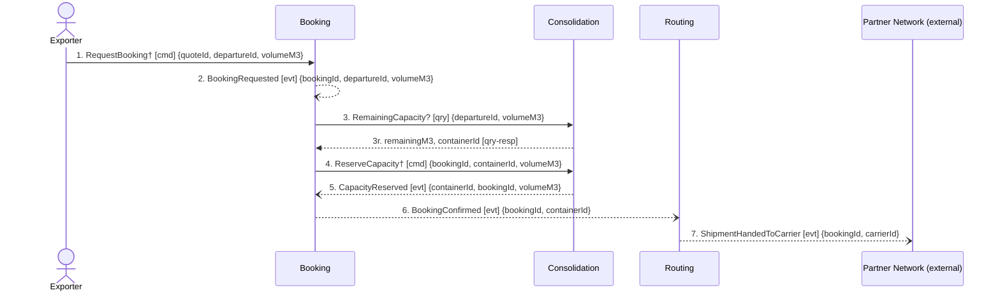

## Scenario

An exporter holds a quote for a lane and asks to move 6 m³ on a named departure. "Done" means the
booking is confirmed against a specific container and the shipment is on its way to a partner
carrier. This is the design's own story — the path the model was drawn around.

## Flow

| # | From | Message | Type | Contents | To | When |
|---|---|---|---|---|---|---|
| 1 | Exporter | `RequestBooking`† | command | quoteId, departureId, volumeM3 | Booking | **within** the quote's `validUntil` (quoting invariant) |
| 2 | Booking | `BookingRequested` | event | bookingId, departureId, volumeM3 | *(no consumer in model)* | — |
| 3 | Booking | `RemainingCapacity?` | query | departureId, volumeM3 **→** remainingM3, containerId | Consolidation | — |
| 4 | Booking | `ReserveCapacity`† | command | bookingId, containerId, volumeM3 | Consolidation | — |
| 5 | Consolidation | `CapacityReserved` | event | containerId, bookingId, volumeM3 | Booking | — |
| 6 | Booking | `BookingConfirmed` | event | bookingId, containerId | Routing | — |
| 7 | Routing | `ShipmentHandedToCarrier` | event | bookingId, carrierId | Partner Network | — |

† Command name is **not** in `docs/domain/`. The model names events only; the interaction at 3–4 is
recorded in `booking/model.yaml` (`to: Consolidation … "synchronous remaining-capacity check before
reserving"`) but its commands are unnamed. Names here are placeholders for `2-discover` to confirm —
see Open questions.

Counts: 7 messages · 4 contexts + 1 external · 1 boundary-crossing query · longest synchronous
chain 2 hops · Booking appears in 6 of 7 messages.

## Findings

| # | Smell | Evidence (messages) | What it suggests | Proposed change |
|---|---|---|---|---|
| F1 | Check-then-act across a boundary | 3 then 4: Booking asks Consolidation for remaining capacity, then commands a reservation on the same data. Nothing holds the capacity in between | The gap between 3 and 4 is a race; this is discovery hotspot #1 (two shipments on one slot, March) turned into two message numbers | Collapse 3+4 into one `ReserveCapacity` command Consolidation accepts or rejects; the rejection is a domain fact, not an error code (see F5) |
| F2 | Distributed invariant — container capacity | The rule *"committed volume must never exceed capacity"* is `consolidation/model.yaml`'s, but message 3 is Booking performing the check | The invariant is enforceable only inside the ContainerLoad aggregate. Split across 3–4 it is unenforceable under concurrency | Record the invariant as Consolidation's alone; Booking must not read capacity to decide |
| F3 | Distributed invariant — quote validity | Message 1 carries `quoteId` into Booking. Quoting owns *"a quote cannot be accepted after its validity window"*, yet **no message in the model checks it** | Either Booking re-derives validity from data it does not own, or nobody checks it | Have Quoting emit acceptance (`QuoteAccepted`) or carry `validUntil` on `QuoteIssued` and let Booking hold a copy; decide which, do not leave it unmodelled |
| F4 | Ordering contradiction across contexts | Message 7 fires off `BookingConfirmed` (6). Customs' invariant is *"a shipment cannot be handed to a carrier before its declaration is submitted"*, and `DeclarationSubmitted` is timeline #8 — **after** handover at #6 | The happy path as modelled violates a stated core-domain rule. Customs is not on this flow at all | Either Routing waits on a Customs fact, or the invariant is Routing's and Customs cannot own it. Needs the customs clerk |
| F5 | Missing rejection | No message on this flow can carry "no" — Booking has only `BookingRequested`/`BookingConfirmed` | The model is happy-path-only; see DOMAIN-FLOW-0003 | Name the refusal (`CapacityRefused`, `BookingRejected`) in `3-decompose` |
| F6 | Shared-kernel write visible in the payloads | 3, 4 and 5 all carry `volumeM3`; `ConsignmentLine` is a **Shared Kernel both contexts write** (context-map.md) with different attributes in each model | Two writers on one entity plus a cross-boundary check is the same defect twice | Pick one owner for `ConsignmentLine` — Booking's line (weightKg, hazardClass) and Consolidation's (stackable) look like two different things sharing a name |
| F7 | Pass-through (moderate confidence) | Message 7 is Routing's only act; `routing/model.yaml` says *"It owns no rule of its own"* | A hop, not a boundary — unless carrier selection under the standing contract is a real decision | Do not merge yet: DOMAIN-FLOW-0003 shows Routing is also where hotspot #3 (carrier refuses a sealed container) would land. Decide after that gap is filled |

## Open questions

- What are the real command names between Booking and Consolidation? The model records only events —
  every command on this flow is a placeholder. → depot planners, via `2-discover`.
- Does anything consume `BookingRequested` (message 2)? If nothing does, it is a log line, not a
  domain event. → engineers.
- Is a booking allowed after the quote expires, and at what price? → commercial director.
- What holds capacity between 3 and 4 today — the whiteboard in Gothenburg? → senior planners.
