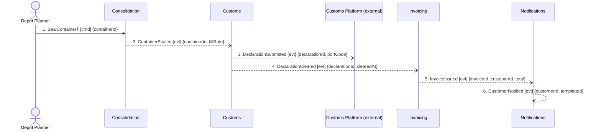

## Scenario

The booking from DOMAIN-FLOW-0001 bought **Guaranteed Consolidation** (+18% of the forwarding fee,
promising a departure slot even on a partly-filled container). The container leaves, the declaration
clears, and the customer is invoiced for forwarding **and** the premium. "Done" means the money is
on an invoice. This is the scenario the business is paid for.

## Flow

| # | From | Message | Type | Contents | To | When |
|---|---|---|---|---|---|---|
| 1 | Depot Planner | `SealContainer`† | command | containerId | Consolidation | — |
| 2 | Consolidation | `ContainerSealed` | event | containerId, fillRate | Customs | — |
| 3 | Customs | `DeclarationSubmitted` | event | declarationId, portCode | external platform | — |
| 4 | Customs | `DeclarationCleared` | event | declarationId, clearedAt | Invoicing | **after** clearance from the external platform — interval unmodelled (Q1) |
| 5 | Invoicing | `InvoiceIssued` | event | invoiceId, customerId, total | Notifications | trigger unstated — *within*, *after* or *every*? (Q2) |
| 6 | Notifications | `CustomerNotified` | event | customerId, templateId | Exporter | — |

† Name not in the model (events only). `CustomerNotified` is marked **candidate** in
`discovery/timeline.md` — nobody confirmed when it fires; it is drawn here only because Invoicing is
upstream of Notifications in the model.

Counts: 6 messages · 4 contexts + 1 external · 0 queries · all events after message 1.

## Findings

| # | Smell | Evidence (messages) | What it suggests | Proposed change |
|---|---|---|---|---|
| F8 | **The revenue never reaches the invoice** | The premium is a Booking-time commitment; Invoicing's only inbound relationship is Customs (`invoicing/model.yaml`), and messages 2–4 carry `containerId`, `declarationId`, `portCode`, `clearedAt` — **no `bookingId`, no `customerId` until message 5, no premium flag anywhere** | The flow the business is paid for cannot be completed with the messages in the model. Invoicing must be inventing `customerId` and `total` from data no message gave it | Booking must publish what is billable (a fact carrying bookingId + the premium), and Invoicing must consume it. This is a missing relationship, not a missing field |
| F9 | Correlation lost at every hop | 2 → 3 → 4 hand over three different identifiers with no overlap. `ShipmentRef` is listed as shared across Booking/Consolidation/Customs/Invoicing (context-map.md) yet appears on **no message** | The shared value object is doing the correlation invisibly, off the flow — i.e. by shared database or by hand | Put `shipmentRef` on messages 2 and 4, or accept it is a Shared Kernel and say so |
| F10 | Distributed invariant — billability | Invoicing's rule *"an invoice line must reference a cleared declaration"* is satisfied by message 4, but the finance analyst stated *"the premium is charged whether or not the container ends up full"* | Two different billability rules, in two contexts, on the same invoice: customs clearance gates the line, but the premium is owed regardless | Ask finance whether an uncleared shipment still bills the premium. If yes, the premium is not an invoice line gated by Customs |
| F11 | Event with exactly one consumer that must act | 4 `DeclarationCleared` is the *only* trigger for billing; if Invoicing does not handle it, revenue stops | An event carrying a command's obligation. Legitimate, but the dependency is invisible on the map | Either accept and draw Customs → Invoicing as a real dependency, or make billing trigger on a Booking-side fact (see F8) |
| F12 | Unconfirmed event on a paid path | 6 `CustomerNotified` is timeline #11, marked *candidate* | The last step of the money path rests on an inference | → `2-discover`: confirm with whoever owns the templates. Do not promote it |

**What is clean here:** messages 2–5 are four events across four contexts with **zero queries** and no
cycles. Consolidation → Customs → Invoicing is evidence the split works on the post-departure side —
the coupling in this model is concentrated upstream, in Booking/Consolidation (DOMAIN-FLOW-0001).

## Open questions

- **Q1** — how long after submission does a declaration clear, and what happens if it never does? The
  external platforms are unmodelled (`customs/model.yaml`: *"we integrate with neither"*). → customs clerk.
- **Q2** — is an invoice raised **after** each clearance, or **every** billing cycle? Different systems.
  → finance analyst.
- Where does the +18% premium live in the model today? It is in the business model and nowhere in
  `docs/domain/`. → commercial director.
