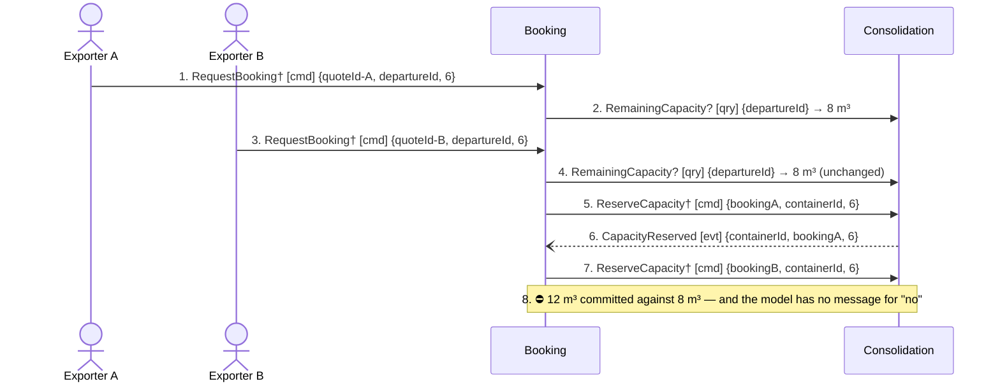

## Scenario

A departure has 8 m³ left. Two exporters ask for 6 m³ each, seconds apart. Exactly one can be
honoured. "Done" means one booking is confirmed and the other customer is told *no* — with the
Guaranteed Consolidation promise intact for whoever holds a slot. This is discovery hotspot #1
("two shipments were committed to the same container slot in March; nobody agrees where the check
should have happened") replayed against the model as drawn.

## Flow

| # | From | Message | Type | Contents | To | When |
|---|---|---|---|---|---|---|
| 1 | Exporter A | `RequestBooking`† | command | quoteId-A, departureId, 6 m³ | Booking | — |
| 2 | Booking | `RemainingCapacity?` | query | departureId **→** remainingM3 = 8, containerId | Consolidation | — |
| 3 | Exporter B | `RequestBooking`† | command | quoteId-B, departureId, 6 m³ | Booking | **within** the window between 2 and 5 — the race window, whose length nobody has stated |
| 4 | Booking | `RemainingCapacity?` | query | departureId **→** remainingM3 = **8**, containerId | Consolidation | — |
| 5 | Booking | `ReserveCapacity`† | command | bookingA, containerId, 6 m³ | Consolidation | — |
| 6 | Consolidation | `CapacityReserved` | event | containerId, bookingA, 6 m³ | Booking | — |
| 7 | Booking | `ReserveCapacity`† | command | bookingB, containerId, 6 m³ | Consolidation | — |
| 8 | — | **no message exists** | — | — | — | — |

† Command names are placeholders — see DOMAIN-FLOW-0001. Message 4 returns 8 m³ because nothing in
the model holds capacity between the query and the command; there is no `CapacityHeld`, no
expiry, and no reservation with a lifetime.

Counts: 7 modelled messages + 1 stated absence · 2 contexts · **2 boundary-crossing queries** ·
Booking appears in every message.

## Findings

| # | Smell | Evidence (messages) | What it suggests | Proposed change |
|---|---|---|---|---|
| F13 | Check-then-act race, demonstrated | 2 and 4 both answer 8 m³; 5 and 7 both commit 6 m³ against it | The March double-commit is not an operator mistake — it is the drawn boundary behaving as drawn. Every booking is a check-then-act pair and the window is unbounded | Delete the query. One `ReserveCapacity` command; Consolidation answers `CapacityReserved` **or** `CapacityRefused` |
| F14 | Distributed invariant, broken in-flow | Consolidation's *"committed volume must never exceed capacity"* is violated at 7 while both contexts individually behaved correctly | The rule spans a boundary, so no aggregate can enforce it. Under concurrency it is not a rule, it is a hope | Invariant enforced inside `ContainerLoad` on the write path, one command per transaction |
| F15 | **No failure path exists anywhere in the model** | Message 8: 11 events in `discovery/timeline.md`, all success-shaped. No rejection, refusal, cancellation, bump or credit note trigger in any `model.yaml` | The design has never been asked what happens when the answer is no — and this is the paid promise (Guaranteed Consolidation) failing | `3-decompose` to add, with the business: `CapacityRefused` (Consolidation), `BookingRejected` (Booking), and a bump/compensation fact for the container-overcommitted case |
| F16 | Named compensation missing | The planner's rule says an overbooked container means *"a shipment is bumped and the Guaranteed Consolidation promise is broken"* — the bump appears in no model | If the business accepts eventual consistency here, the compensating action is part of the domain and must be named. Unnamed, it is an unhandled bug that already shipped once | Name the compensation and its owner; decide whether the premium is refunded (nothing in `invoicing/model.yaml` can issue that — `CreditNote` exists but no message reaches it) |
| F17 | Two queries, one decision | 2 and 4 are the only boundary-crossing queries in the whole flow set; both exist to inform a decision Booking should not be making | The capacity data is on the correct side already — it is the *decision* that is on the wrong side | Move the decision to Consolidation (same change as F13); nothing needs to move contexts |

## Open questions

- How long may a slot be held between quote and confirmation? A hold with no expiry is a leak; no
  hold at all is this flow. → commercial director + senior planners.
- Who tells Exporter B? Notifications is reachable only from Invoicing in the model, so today the
  rejection path has no route to the customer. → depot planners.
- Hotspot #3 (a partner carrier refuses a sealed container) has no messages at all and could not be
  drawn — same absence as F15, one context further along. → whoever owns carrier relations.
