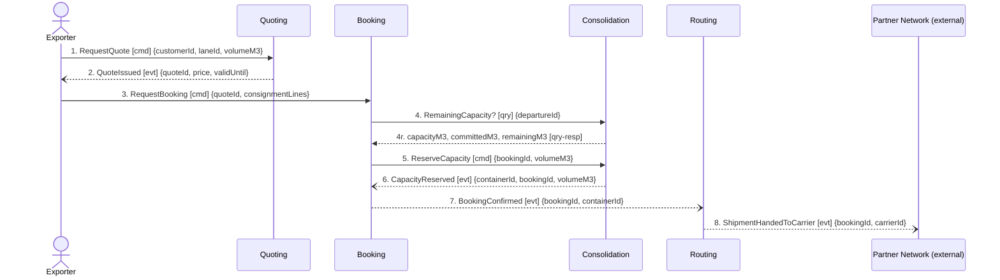

## Scenario

An exporter with a part load asks for a price on a lane, accepts it, and commits the consignment to
a departure. *Done* means the booking is confirmed against a named container and the shipment is
with the partner carrier. This is the main booking scenario and the design's own story.

**Provenance.** Messages 2, 6, 7, 8 are confirmed events from `discovery/timeline.md`. Messages 1,
3, 5 are the actor/context commands behind confirmed events `QuoteRequested`, `BookingRequested`,
`CapacityReserved`. Message 4 is stated verbatim in `booking/model.yaml` — *"synchronous
remaining-capacity check before reserving"*. Nothing else was added. No customer took part in
discovery, so the exporter's steps are proxy.

## Flow

| # | From | Message | Type | Contents | To | When |
|---|---|---|---|---|---|---|
| 1 | Exporter | `RequestQuote` | command | customerId, laneId, volumeM3 | Quoting | — |
| 2 | Quoting | `QuoteIssued` | event | quoteId, price, validUntil | Exporter | — |
| 3 | Exporter | `RequestBooking` | command | quoteId, consignmentLines | Booking | must land **within** the quote's `validUntil` window (Quoting invariant) |
| 4 | Booking | `RemainingCapacity?` | query | departureId **→** capacityM3, committedM3, remainingM3 | Consolidation | — |
| 5 | Booking | `ReserveCapacity` | command | bookingId, volumeM3 | Consolidation | — |
| 6 | Consolidation | `CapacityReserved` | event | containerId, bookingId, volumeM3 | Booking | — |
| 7 | Booking | `BookingConfirmed` | event | bookingId, containerId | Routing | — |
| 8 | Routing | `ShipmentHandedToCarrier` | event | bookingId, carrierId | Partner Network | — |

8 messages, 4 contexts, 1 boundary-crossing query, longest synchronous chain 1 hop. Within the
5-to-9 rule; neither refuting condition fires on this flow. `QuoteRequested` and `BookingRequested`
are raised inside Quoting and Booking by messages 1 and 3 — they cross no boundary here, so they are
not drawn.

## Findings

| # | Smell | Evidence (messages) | What it suggests | Proposed change |
|---|---|---|---|---|
| F1 | Check-then-act across a boundary | 4 then 5: Booking asks Consolidation for remaining capacity, then commands the reservation on the answer. The boundary is crossed twice on the same data | the gap between 4 and 5 is a race — a second booking can pass its own message 4 and reserve the same cubic metres before message 5 lands. This *is* hotspot 1 (two shipments on one container slot, March), now located on two message numbers | collapse 4+5 into one `ReserveCapacity` command that Consolidation accepts or rejects → `3-decompose` |
| F2 | Distributed invariant | 4–6: the rule *"committed volume must never exceed capacity"* is `consolidation/model.yaml`'s invariant over `capacityM3`/`committedM3`, but the decision to commit is taken in Booking on the message-4 answer. Booking's own invariant (*"may only be confirmed once its capacity has been reserved"*) is the other half | one rule, two enforcers, no transaction between them. Under concurrency it is not enforceable, and the failure is silent — a container is over-committed and a shipment is bumped, which breaks the Guaranteed Consolidation promise the premium is sold on | the invariant belongs to the `ContainerLoad` aggregate alone; Booking should hold no capacity rule → `3-decompose` |
| F3 | Missing rejection | 5 has no negative outcome. No refusal, rejection or bump event exists in any `model.yaml` or in the timeline | the design has one path. The compensating action for an over-commit is unnamed, which per Vernon is not eventual consistency but an unhandled bug | name the refusal and the compensation with the planners → `2-discover` (see FLOW-0003) |
| F4 | Ordering invariant unenforceable — **violated by this flow** | 7 → 8: Routing hands to the carrier on `BookingConfirmed`. `customs/model.yaml` invariant: *"a shipment cannot be handed to a carrier before its declaration is submitted"*, yet `routing/model.yaml` relationships are Booking + PartnerNetwork only — no Customs edge, and none on the context map. The confirmed timeline agrees the wrong way round: `ShipmentHandedToCarrier` is #6, `DeclarationSubmitted` is #8 | the happy path breaks a confirmed regulatory rule, and nothing in the model can stop it. Either Routing must wait on Customs, or the rule as stated is not the rule | add the Customs→Routing relationship, or relocate the invariant → `3-decompose`, after the clerk confirms which |
| F5 | Shared Kernel arriving through a payload | 3 and 5 carry `ConsignmentLine`, which the context map records as **Shared Kernel — both write it**. The two definitions differ: Booking's has `hazardClass`, `weightKg`; Consolidation's has `stackable` | one name, two models, two writers. Every change to either side is a coordinated release across two teams | split the type; give each context its own, and reduce message 5's contents to what the reservation decision needs → `3-decompose` |

## Open questions

- Who enforces *"a quote cannot be accepted after its validity window"* at message 3? The invariant
  is Quoting's, the acceptance happens in Booking, and no message carries the check. — Quoting owner
- Does the reservation in message 5 target a specific container, or does Consolidation choose it?
  `CapacityReserved` returns a `containerId` the command never sent. — depot planners
- Is there a stated tolerance on the race in F1 — minutes, or must it be impossible? No temporal
  rule was confirmed in discovery, so the `When` column is empty except where the quote window
  applies. — depot planners
