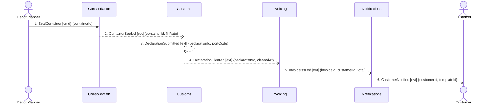

## Scenario

A planner seals a container that is not full. The Guaranteed Consolidation premium — +18% of the
forwarding fee, the revenue stream the business model is built on — is charged anyway, because the
customer bought a departure slot rather than a full container. *Done* means the customer holds an
invoice that includes the premium. This is the path with money on it.

**Provenance.** Messages 2–6 are events from `discovery/timeline.md`. Message 1 is the planner
command behind confirmed event `ContainerSealed`. Message 6 is marked *candidate* in discovery —
nobody confirmed when `CustomerNotified` fires. Nothing else was added.

## Flow

| # | From | Message | Type | Contents | To | When |
|---|---|---|---|---|---|---|
| 1 | Depot Planner | `SealContainer` | command | containerId | Consolidation | — |
| 2 | Consolidation | `ContainerSealed` | event | containerId, fillRate | Customs | — |
| 3 | Customs | `DeclarationSubmitted` | event | declarationId, portCode | *(broadcast — no consumer in the model)* | — |
| 4 | Customs | `DeclarationCleared` | event | declarationId, clearedAt | Invoicing | — |
| 5 | Invoicing | `InvoiceIssued` | event | invoiceId, customerId, total | Notifications | — |
| 6 | Notifications | `CustomerNotified` | event | customerId, templateId | Customer | unconfirmed — see G3 |

6 messages, 4 contexts, **zero queries crossing a boundary**, longest synchronous chain 0 hops.
Event-driven end to end. As a *shape* this is the clean flow of the catalogue — the problems below
are all about what the messages carry, not how they couple.

## Findings

| # | Smell | Evidence (messages) | What it suggests | Proposed change |
|---|---|---|---|---|
| G1 | The revenue rule has no message | 2–5 carry `fillRate`, `declarationId`, `clearedAt`, `total`. None carries the premium, the quote or a price. `invoicing/model.yaml` relationships are Customs (downstream) and Notifications (upstream) — nothing reaches Invoicing from Quoting or Booking | *"the premium is charged whether or not the container ends up full"* is a confirmed finance rule that this decomposition cannot execute: Invoicing has no way to learn a Guaranteed Consolidation premium was sold. The company's differentiating revenue stream crosses no boundary | give Invoicing an upstream from Booking or Quoting, or let an existing message carry the sold premium → `3-decompose`, after finance says which context prices it |
| G2 | Ubiquitous-language collision inside one flow | `Consignment` = *"the goods a customer hands over as one unit"* (`booking/model.yaml`) and *"a billable line on an invoice"* (`invoicing/model.yaml`). Both meanings sit on the path 2→5 | hotspot 2, still unresolved. Two contexts on the same flow use one word for two things, and the seam between them is exactly where an invoice line is derived from physical goods | rename one side and declare the survivor Published Language at the Customs→Invoicing seam → `3-decompose` |
| G3 | Unconfirmed event doing load-bearing work | 6 is the only message Notifications has, and discovery marks it *candidate — nobody confirmed when it fires*. `notifications/model.yaml` has one relationship, to Invoicing | the customer is notified when an **invoice** is issued and at no other point — not on booking confirmation, not on clearance. Either that is the business rule or the flow is missing messages; the model cannot say | confirm the trigger with people → `2-discover`. Do not promote it here |
| G4 | Payload too thin for the receiving invariant | 4 carries `{declarationId, clearedAt}`. `invoicing/model.yaml` invariant: *"an invoice line must reference a cleared declaration"* — but nothing in message 4 identifies the shipment or booking, though the `Declaration` entity itself holds `shipmentRef` | Invoicing cannot join a cleared declaration to a billable line from this event alone. The gap is filled either by an undrawn synchronous query back into Customs — a runtime dependency this flow would then have — or by a wider payload | add `shipmentRef` to the `DeclarationCleared` payload, or draw the query and price its coupling → `3-decompose` |
| G5 | Event with no consumer | 3 is emitted by Customs and consumed by nobody in any `model.yaml`; the context map shows only Consolidation→Customs→Invoicing | either `DeclarationSubmitted` is genuinely internal to Customs — in which case it is not a boundary message — or it is the message Routing needs in FLOW-0001 F4 and the edge is missing | resolve together with F4 → `3-decompose` |

## Open questions

- Which context prices the Guaranteed Consolidation premium — Quoting (it is a % of the forwarding
  fee, and Quoting owns `price`) or Invoicing (it owns `SurchargeSchedule`)? Nothing on disk says.
  — commercial director + finance analyst
- Is the invoice issued per shipment, per container, or per period? No temporal rule was confirmed
  anywhere in discovery, so the `When` column is empty throughout — *within*, *after* and *every*
  are three different billing systems here. — finance analyst
- When a container seals below the promised fill, is anything owed back to the customer? The
  premium promises a slot, not a fill — but no credit or adjustment message exists, despite
  Invoicing owning a `CreditNote` aggregate that never appears in a flow. — finance analyst
