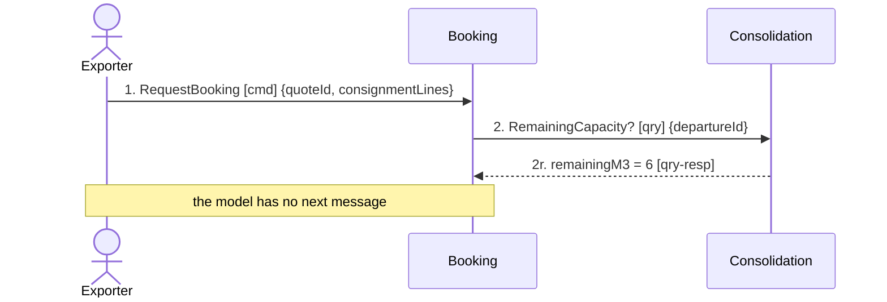

## Scenario

An exporter asks to put 14 m³ on a departure whose container has 6 m³ left. The business answer is
*no*, or *not on this departure*. *Done* means the customer knows where their goods stand and the
container is not over-committed. This is the failure path — the one the model was not built for.

**Provenance.** Every message below is drawn from the same sources as FLOW-0001. Nothing was added.
The flow stops at message 2 because that is where the model stops.

## Flow

| # | From | Message | Type | Contents | To | When |
|---|---|---|---|---|---|---|
| 1 | Exporter | `RequestBooking` | command | quoteId, consignmentLines | Booking | must land **within** the quote's `validUntil` window |
| 2 | Booking | `RemainingCapacity?` | query | departureId **→** capacityM3, committedM3, remainingM3 (= 6) | Consolidation | — |

**2 messages.** Below the 5-message floor — and here that is the result, not a badly chosen
scenario. The flow is short because after message 2 there is no message in any `model.yaml` or in
`discovery/timeline.md` that says *no*. Seven contexts, eleven events, zero refusals.

## Findings

| # | Smell | Evidence (messages) | What it suggests | Proposed change |
|---|---|---|---|---|
| H1 | No rejection vocabulary anywhere in the model | after 2, nothing. All seven `model.yaml` files together declare 11 domain events, none negative — no refusal, no rejection, no bump, no cancellation. The timeline's 11 events are all successes | the model is not a clean design with a happy path; it is a design where nobody asked what happens when the answer is no. Every context will grow its own ad-hoc error handling, and the customer-facing one will be invented by whoever writes Booking first | name the refusal with the planners, then add it to Consolidation's events → `2-discover`, then `3-decompose` |
| H2 | The race in F1 has no compensation | FLOW-0001 messages 4–5 permit two bookings to reserve the same cubic metres. The planner's confirmed rule says the consequence is that *"a shipment is bumped and the Guaranteed Consolidation promise is broken"* — yet no bump, re-accommodation or credit message exists | the business has already told us the compensating action exists and happens; the model does not contain it. An unnamed compensation is not eventual consistency, it is an unhandled bug — and it fires on the premium the company sells | model the bump path once the refusal is named → `2-discover` first |
| H3 | The refusal may not be Booking's to make | 2 returns capacity data to Booking so Booking can decide. Consolidation owns the capacity invariant and, per its own notes, the four senior planners *"resolve conflicts by hand"* when a stack is infeasible | the *no* is a domain decision with an owner — Consolidation, sometimes a human planner — not an error code Booking returns. If FLOW-0001 F1 is applied, this rejection becomes Consolidation's reply to `ReserveCapacity` and this flow gets its missing messages for free | same change as F1: one command, accepted or rejected by the owner → `3-decompose` |

## Open questions

Each of these is a message the model needs and does not have. Names are **candidates for
confirmation, not model entries** — `2-discover` owns them.

- What does Booking tell the exporter when capacity is short — a flat refusal, an offer of the next
  departure, or a waitlist? The business model sells *"a departure slot even on a partly-filled
  container"*, so a refusal may itself breach the premium. — depot planners + commercial director
- When a container is over-committed, who chooses which shipment is bumped, and what is the
  customer owed? — depot planners + finance analyst
- Hotspot 3 — *"nobody knows who is responsible when a partner carrier refuses a sealed
  container"* — is the same absence in a different scenario, and could not be traced for the same
  reason: Routing has no message for a refusal and no relationship to any context that could
  re-plan. It is recorded here rather than drawn, because drawing it would mean inventing the
  messages. — depot planners
- Does a quote that expires between messages 1 and 2 produce a refusal, or a re-quote? — Quoting
  owner
