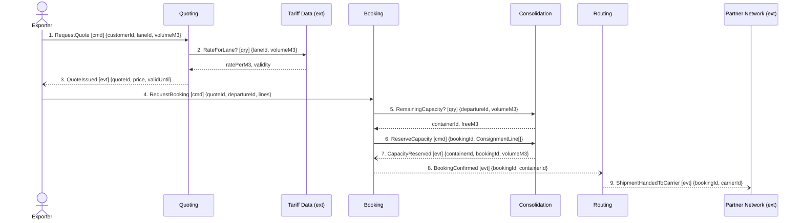

## Scenario

An exporter with a part load asks for a price on a lane, accepts it inside the quote's validity
window, and books space on a departure. "Done" means the booking is confirmed against a named
container and the shipment is with the partner carrier. This is the design's own story — the path
every shipment takes before anything else happens to it.

## Flow

| # | From | Message | Type | Contents | To | When |
|---|---|---|---|---|---|---|
| 1 | Exporter | `RequestQuote` | command | customerId, laneId, volumeM3 | Quoting | — |
| 2 | Quoting | `RateForLane?` † | query | laneId, volumeM3 **→** ratePerM3, validity | Tariff Data (ext) | — |
| 3 | Quoting | `QuoteIssued` | event | quoteId, price, validUntil | (broadcast) | — |
| 4 | Exporter | `RequestBooking` | command | quoteId, departureId, consignment lines | Booking | **within** the quote's `validUntil` |
| 5 | Booking | `RemainingCapacity?` | query | departureId, volumeM3 **→** containerId, freeM3 | Consolidation | — |
| 6 | Booking | `ReserveCapacity` | command | bookingId, containerId, `ConsignmentLine[]` | Consolidation | — |
| 7 | Consolidation | `CapacityReserved` | event | containerId, bookingId, volumeM3 | (broadcast) | — |
| 8 | Booking | `BookingConfirmed` | event | bookingId, containerId | (broadcast) | — |
| 9 | Routing | `ShipmentHandedToCarrier` | event | bookingId, carrierId | Partner Network (ext) | — |

† not in `docs/domain/` — the context map records `Quoting → Tariff Data` but nobody said whether
the lookup is a per-quote query or a replicated rate table. See Open questions.

9 messages, 4 contexts, 2 externals, 2 boundary-crossing queries. At the ceiling of the 5-to-9 rule
but not over it.

## Findings

| # | Smell | Evidence (messages) | What it suggests | Proposed change |
|---|---|---|---|---|
| F1 | Check-then-act across a boundary | 5 asks Consolidation whether space exists, 6 commands it to take that space | the gap between 5 and 6 is a race — this is discovery hotspot 1 (two shipments on one slot in March), now located | collapse 5+6 into one `ReserveCapacity` that Consolidation accepts or rejects; the rejection is a domain message, not an error code |
| F2 | Distributed invariant | 5, 6, 7 vs Booking's *"a booking may only be confirmed once its capacity has been reserved"* and Consolidation's *"committed volume must never exceed capacity"* | one capacity rule, two owners: Consolidation holds the data, Booking performs the check | give the rule end-to-end to Consolidation; Booking learns the outcome, does not compute it |
| F3 | Pass-through | 8 in, 9 out — Routing changes no state and decides nothing (`aggregates: []`, *"it owns no rule of its own"*, carrier fixed by the standing lane contract) | a boundary drawn round a step, not a capability | fold Routing into Booking as an outbound adapter to Partner Network — unless carrier selection is about to become a real decision (multi-carrier, bidding), in which case say so on the map |
| F4 | Invariant nobody can enforce | 9 hands the shipment to the carrier; `DeclarationSubmitted` is timeline event #8, after `ShipmentHandedToCarrier` at #6 — and Routing has no relationship to Customs at all | Customs' invariant *"a shipment cannot be handed to a carrier before its declaration is submitted"* is contradicted by the confirmed timeline and unreachable by the context that would break it | either the timeline order is wrong or the rule needs a message; both need Customs and the planners in the same room |
| F5 | Shared Kernel arriving by payload | 6 carries `ConsignmentLine`, which Booking and Consolidation both write, with different attributes (`weightKg, hazardClass` vs `stackable`) | two contexts writing one entity under one name that already means two things | name the translation: one owner, one published shape, the other side keeps its own line type |

## Open questions

- Is the tariff lookup (2) a synchronous call per quote or a rate table we replicate? — Quoting engineers; the two choices differ by a runtime dependency on an external system.
- What does Consolidation answer at 6 when there is no space? Nothing in the model says. — depot planners.
- Who is accountable for the ordering in F4 — Routing waiting, or Customs declaring earlier? — customs clerk + depot planners.
