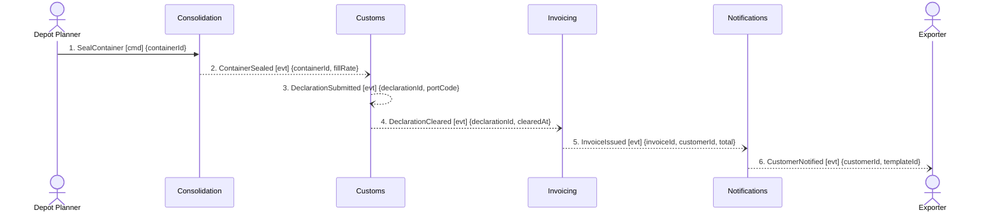

## Scenario

A planner seals a container carrying a Guaranteed Consolidation shipment — the +18% premium the
business is actually paid for, charged whether or not the container ends up full. The declaration
goes to the port, clears, and the customer is invoiced. "Done" means the customer holds an invoice
whose lines include the premium. This is the scenario with money on it.

## Flow

| # | From | Message | Type | Contents | To | When |
|---|---|---|---|---|---|---|
| 1 | Depot Planner | `SealContainer` | command | containerId | Consolidation | — |
| 2 | Consolidation | `ContainerSealed` | event | containerId, fillRate | (broadcast) | — |
| 3 | Customs | `DeclarationSubmitted` | event | declarationId, portCode | (broadcast) | — |
| 4 | Customs | `DeclarationCleared` | event | declarationId, clearedAt | (broadcast) | — |
| 5 | Invoicing | `InvoiceIssued` | event | invoiceId, customerId, total | (broadcast) | — |
| 6 | Notifications | `CustomerNotified` ‡ | event | customerId, templateId | Exporter | — |

‡ marked *candidate* in `docs/domain/discovery/timeline.md` — inferred from the notification
templates; nobody confirmed when it fires.

6 messages, 4 contexts, no boundary-crossing queries, entirely event-driven. On shape alone this
is the clean flow. On contents it is not — every finding below is about a payload, not an arrow.

## Findings

| # | Smell | Evidence (messages) | What it suggests | Proposed change |
|---|---|---|---|---|
| F6 | Message cannot support the next decision | 2 carries `{containerId, fillRate}`; 3 needs `Declaration{shipmentRef, portCode}` — and Customs has no relationship to Booking, the only context that mints `ShipmentRef` | the event chain in the context map is a notification chain, not a data flow; Customs gets a nudge, not the goods | either `ContainerSealed` publishes the consignment refs it sealed, or Customs subscribes to Booking and the map gains that relationship |
| F7 | Message cannot support the next decision | 4 carries `{declarationId, clearedAt}`; 5 emits `{customerId, total}` — no message in this flow or 0001 carries a customer or a price into Invoicing, and Invoicing has no relationship to Quoting or Booking | the largest system we run (34 tables, 311 attributes) is fed by two fields | name the path by which the agreed price reaches Invoicing; today it is off-model, which usually means it is a database read |
| F8 | The paid-for capability has no message | Guaranteed Consolidation (+18%, the differentiating revenue stream in `business-model.md`) appears in none of the seven `model.yaml` files and none of the 11 discovered events; Invoicing has a `SurchargeSchedule` aggregate that nothing in the flow tells | the premium is sold in Booking and charged in Invoicing with nothing modelled in between — and per the finance analyst it is charged *regardless of* the `fillRate` that message 2 carries | hand to `2-discover`: what fact is emitted when a customer buys the premium, and who emits it? Do not invent `PremiumCharged` — nobody has said it exists |
| F9 | One word, two models, no translation | 5 builds `InvoiceLine` from what Booking calls `ConsignmentLine`; `Consignment` = *"goods handed over as one unit"* in Booking, *"a billable line on an invoice"* in Invoicing (discovery hotspot 2) | a translation happens across a boundary that the context map does not draw at all | to `3-decompose`: name the relationship and its translation, or accept two words and rename one |
| F10 | Pass-through — accepted | 5 in, 6 out; Notifications decides nothing (`aggregates: []`, bought adapter) | this is the legitimate case: a generic subdomain wrapping a bought provider is a boundary worth keeping | keep, and record the rationale so the next reviewer does not re-open it. Confirm when `CustomerNotified` fires (‡) |

## Open questions

- What fact marks the sale of the Guaranteed Consolidation premium, and which context owns it? — commercial director + finance analyst.
- Is there a deadline on invoicing after clearance — *within* n days, *after* n days, or a nightly run *every* 24h? Nothing in the model says, and the three are three different systems. — finance analyst.
- Does Invoicing read Booking's database today? If so, F7 is already a coupling, just an invisible one. — Invoicing engineers.
