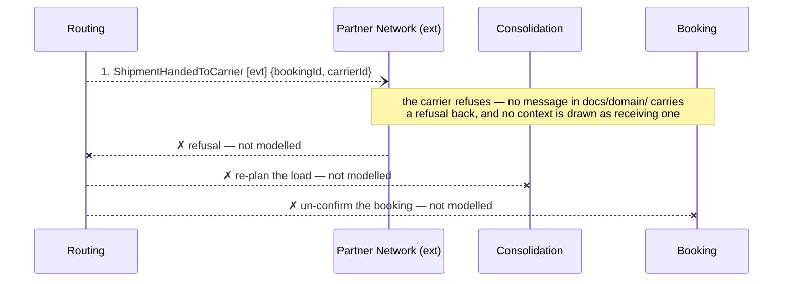

## Scenario

A container is sealed, declared and handed to a partner carrier, and the carrier refuses it at the
quay. Discovery hotspot 3: *"nobody knows who is responsible when a partner carrier refuses a
sealed container."* "Done" would mean the shipment is re-planned or the customer told, and the
premium honoured or credited. The flow below stops long before that.

## Flow

| # | From | Message | Type | Contents | To | When |
|---|---|---|---|---|---|---|
| 1 | Routing | `ShipmentHandedToCarrier` | event | bookingId, carrierId | Partner Network (ext) | — |
| — | Partner Network | *(refusal)* | — | — | — | **no message exists** |

**This flow cannot be drawn.** One message exists; everything after it is absent from the model.
`Routing → Partner Network` is the only arrow at that boundary and it points one way, so nothing
in `docs/domain/` can even receive a refusal, let alone decide what follows. Under 5 messages is
normally a sign the scenario crosses too few boundaries; here it is a sign the model runs out.

## The census behind the finding

The business stated three prohibitions. None of them has a message that says no.

| Stated rule | Source | Message when it is violated |
|---|---|---|
| A quote cannot be accepted after its validity window | `quoting/model.yaml` | none |
| A container's committed volume must never exceed its capacity | `consolidation/model.yaml`, planner | none |
| A shipment cannot be handed to a carrier before its declaration is submitted | `customs/model.yaml`, customs clerk | none |

Across seven contexts, 11 domain events are modelled and **0** describe a negative outcome — no
rejection, no cancellation, no expiry, no reversal, no credit note event (Invoicing carries a
`CreditNote` aggregate that no message reaches).

## Findings

| # | Smell | Evidence (messages) | What it suggests | Proposed change |
|---|---|---|---|---|
| F11 | Happy-path-only model | 11 events, 0 negative outcomes; three stated prohibitions with no refusal message; message 1 is the last thing anyone modelled | the design has never been asked what happens when the answer is no — which is also why F1's race in flow 0001 has no visible consequence | to `2-discover`: run a session on refusals. Name the facts there, with people in the room; they are not ours to infer |
| F12 | Unowned failure | hotspot 3 is open, and message 1 is the only boundary crossing at the point of failure | responsibility for a refused container is undecided in the business, not just unmodelled — one is a discovery question, the other a boundary question, and this is both | after `2-discover` confirms the events, hand the ownership question to `3-decompose`. Note that if Routing stays a pass-through (F3) it cannot be the owner |

## Open questions

- When a carrier refuses, who acts first — the depot planner or the account manager? — depot planners; this decides which context owns the event.
- Is the Guaranteed Consolidation premium refunded, credited or kept when the shipment is bumped? — commercial director + finance analyst. Invoicing's `CreditNote` aggregate suggests someone already answered this in code.
- Is there a deadline on re-planning a refused container — *within* the departure window, or *after* it lapses? — depot planners.
