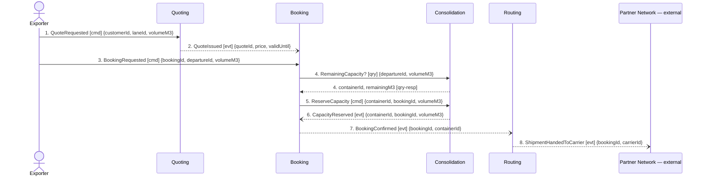

## Scenario

An exporter with a part load asks what a lane costs, accepts the price, and books a departure. Done
means: the booking is confirmed against a real container slot and the shipment is with the partner
carrier. This is the design's own story — the happy path — and it is the first half of the
quote-to-invoice lifecycle.

## Flow

| # | From | Message | Type | Contents | To | When |
|---|---|---|---|---|---|---|
| 1 | Exporter | `QuoteRequested` | command | customerId, laneId, volumeM3 | Quoting | — |
| 2 | Quoting | `QuoteIssued` | event | quoteId, price, validUntil | Booking, Exporter | — |
| 3 | Exporter | `BookingRequested` | command | bookingId, departureId, volumeM3 | Booking | **within** `validUntil` — a quote cannot be accepted after its validity window |
| 4 | Booking | `RemainingCapacity?` | query | departureId, volumeM3 **→** containerId, remainingM3 | Consolidation | — |
| 5 | Booking | `ReserveCapacity` | command | containerId, bookingId, volumeM3 | Consolidation | — |
| 6 | Consolidation | `CapacityReserved` | event | containerId, bookingId, volumeM3 | Booking | — |
| 7 | Booking | `BookingConfirmed` | event | bookingId, containerId | Routing | — |
| 8 | Routing | `ShipmentHandedToCarrier` | event | bookingId, carrierId | Partner Network | **after** `DeclarationSubmitted` per the Customs invariant — but the discovered timeline places the hand-off at #6 and submission at #8. See finding F5. |

**Provenance.** Messages 1, 2, 3, 6, 7, 8 are discovered events from `discovery/timeline.md`
(confirmed by a planner). Messages 4 and 5 are not discovered events — they are the
`"synchronous remaining-capacity check before reserving"` declared in `booking/model.yaml`
relationships, split into the query and the command that phrase implies. The type of message 4 is
the whole point of drawing it: it is the only boundary-crossing query in the lifecycle.

## Findings

| # | Smell | Evidence (messages) | What it suggests | Proposed change |
|---|---|---|---|---|
| F1 | Check-then-act across a boundary | 4–5: Booking asks Consolidation whether the slot is free, then commands the reservation, with the boundary crossed in between | the gap between 4 and 5 is a race; another booking can consume the slot. This is discovery hotspot #1 — "two shipments committed to the same container slot in March; nobody agrees where the check should have happened" — now located on two message numbers | collapse 4 and 5 into one `ReserveCapacity` command that Consolidation accepts or **rejects**. The rejection is domain, not an error code, and no rejection message exists anywhere in the model today (F9) |
| F2 | Distributed invariant | 4–6: `ContainerLoad` owns *"committed volume must never exceed capacity"* (`consolidation/model.yaml`) but Booking performs the check and owns *"a booking may only be confirmed once its capacity has been reserved"* | one rule, two enforcers. Under concurrency it is unenforceable, and the failure is exactly the March incident. The Guaranteed Consolidation premium is sold on this rule holding | the capacity rule belongs to the `ContainerLoad` aggregate end-to-end; Booking should hold no capacity logic, only the outcome of 5 |
| F3 | Pass-through | 7–8: Routing receives `BookingConfirmed` and emits `ShipmentHandedToCarrier` with no decision and no state | `routing/model.yaml` says it itself: `aggregates: []`, *"It owns no rule of its own."* A boundary drawn around a hop, not a capability. Confirmed again in FLOW-0003 where Routing cannot handle a refusal because it holds nothing | delete the hop — let Booking hand to the Partner Network directly — **or** justify Routing by moving lane/carrier contract selection into it as a real rule. Do not leave it as a forwarder |
| F4 | Shared entity crossing no message | `ConsignmentLine` is written by both Booking and Consolidation (context-map: **Shared Kernel**), with divergent attributes — `weightKg, hazardClass` in Booking, `stackable` in Consolidation — yet it appears in the contents of **no message in this flow** | the two contexts are coupled through storage rather than through a contract, so the coupling is invisible on every diagram. The attribute divergence means they do not agree what the entity is | either the volume Booking needs must travel as message contents (5 already carries `volumeM3` — check whether that is sufficient) and the shared write goes away, or the Shared Kernel is deliberate and must be named on the map with an owner |

**Counts.** 8 messages (within 5–9). 4 distinct contexts (at the >4 threshold, not over). 1 query
crossing a boundary — F1. Longest synchronous chain: 1 hop. Busiest pair Booking↔Consolidation at
3 messages — below the 5-message chatty threshold, so no merge is indicated on this evidence.

## Open questions

- What happens when the requested volume does not fit? No message exists for it — ask the depot planners.
- Does `QuoteIssued` actually reach Booking, or does the exporter re-key the quote? Nothing in
  `quoting/model.yaml` names a consumer — ask the planners.
- Does the quoted `price` bind the invoice? See FLOW-0002 F6 — ask the finance analyst.
