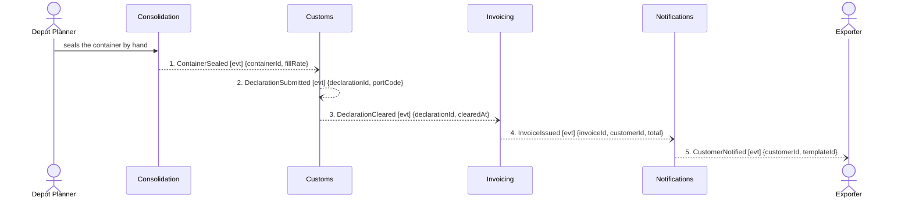

## Scenario

A Gothenburg planner seals a container that carries a Guaranteed Consolidation booking. Customs
declares it, the port clears it, and the customer is invoiced — forwarding margin plus the +18%
premium, which is charged whether or not the container ends up full. Done means the money is
claimed. This is the second half of the quote-to-invoice lifecycle and the path the business is
actually paid for.

## Flow

| # | From | Message | Type | Contents | To | When |
|---|---|---|---|---|---|---|
| 1 | Consolidation | `ContainerSealed` | event | containerId, fillRate | Customs | triggered by the planner sealing by hand — `consolidation/model.yaml` notes load planning is still partly a whiteboard |
| 2 | Customs | `DeclarationSubmitted` | event | declarationId, portCode | *(no consumer modelled)* | — |
| 3 | Customs | `DeclarationCleared` | event | declarationId, clearedAt | Invoicing | — |
| 4 | Invoicing | `InvoiceIssued` | event | invoiceId, customerId, total | Notifications | — |
| 5 | Notifications | `CustomerNotified` | event | customerId, templateId | Exporter | — |

**Provenance.** All five are discovered events from `discovery/timeline.md`. Four were confirmed by
a customs clerk or the finance analyst; **`CustomerNotified` (5) is marked *candidate*** — inferred
from the notification templates, and nobody confirmed when it fires. It is drawn here because the
lifecycle ends there, but it carries less weight than the other four.

## Findings

| # | Smell | Evidence (messages) | What it suggests | Proposed change |
|---|---|---|---|---|
| F5 | Distributed invariant, and an ordering contradiction | Customs owns *"a shipment cannot be handed to a carrier before its declaration is submitted"* (`customs/model.yaml`), but the hand-off is FLOW-0001 message 8, sent by **Routing**, which never receives message 2 and has no path to Customs on the context map. The discovered timeline puts the hand-off at #6 and submission at #8 — the confirmed order **violates** the confirmed rule | either the rule is not enforced anywhere and the business has been living with it, or the timeline is wrong. One of two confirmed facts must give | escalate to `2-discover`: ask the customs clerk and a planner which is true, in the same room. Do not resolve it by picking the more convenient one. If the rule is real, Customs must own the gate — a query from Routing would fix ordering at the cost of the lifecycle's second boundary-crossing query |
| F6 | Missing message — the money path carries no money | Invoicing's only inbound message is 3, `DeclarationCleared {declarationId, clearedAt}`. Message 4 emits `total`. No message anywhere in the lifecycle carries `price` (Quoting), the +18% premium flag, or `fillRate` to Invoicing — message 1 carries `fillRate` to Customs, not to Invoicing | the invoice total has no modelled input. Either Invoicing recomputes rates from data it holds — in which case pricing is duplicated across Quoting and Invoicing — or a message is missing from the model | **not proposed as a boundary change — there is not enough evidence.** Hand to `2-discover`: ask the finance analyst which context owns price at invoice time, and how the premium reaches the invoice. Naming a `PriceAgreed` event here would be inventing one |
| F7 | Pass-through, with a nuance | 4–5: Notifications receives `InvoiceIssued`, emits `CustomerNotified`, decides nothing. `notifications/model.yaml`: `aggregates: []`, *"thin adapter over a bought email/SMS provider"* | structurally identical to Routing (F3) but **not the same call**. Notifications is a `generic` subdomain wrapping a bought product; a thin anti-corruption adapter around a vendor is a legitimate boundary, and the pass-through shape is the point. Routing is classified `supporting` and has no vendor behind it | keep Notifications, and say on the context map *why* it is a hop. Contrast with F3, which should not survive |
| F8 | Clean on the axis you would expect trouble | 3–4: Invoicing is by far the largest context — 34 tables, 311 attributes, 5 aggregates, one entity at 128 attributes — yet it contributes **1 of the 13 lifecycle messages** and receives 1 | the mass is internal (VAT variation across nine ports, per its own notes), not connective. Size is a maintainability question for `3-decompose`, **not** a coupling problem this flow can support | none. Recorded so the next reviewer does not re-litigate Invoicing's size from the message flow — the flow is evidence the boundary holds |

**Counts.** 5 messages (at the low edge of 5–9). 4 distinct contexts. **0 queries crossing a
boundary** — the whole back half of the lifecycle is event-driven, which is the strongest evidence
in this exercise that part of the split is working. Longest synchronous chain: 0.

## Open questions

- How long may clearance take, and is there a deadline after which the booking is void? No `When`
  rule was stated for 2→3 — ask the customs clerk.
- When exactly does `CustomerNotified` fire, and does an invoice always notify? Nobody confirmed
  it — ask whoever owns the notification templates.
- Finance and operations use "consignment" for two different things (hotspot #2): `booking` defines
  it as goods handed over as one unit, `invoicing` as a billable line. Which one does an invoice
  line count? Ask the finance analyst and a planner together.
