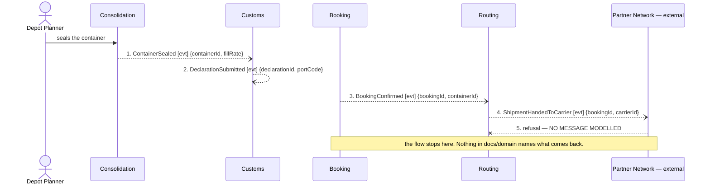

## Scenario

A container is sealed, declared and handed to a partner carrier, and the carrier refuses it. The
customer has paid a Guaranteed Consolidation premium for a departure slot that is now gone. Done
means: somebody owns the shipment again. Discovery hotspot #3, raised by a planner —
*"nobody knows who is responsible when a partner carrier refuses a sealed container."*

## Flow

| # | From | Message | Type | Contents | To | When |
|---|---|---|---|---|---|---|
| 1 | Consolidation | `ContainerSealed` | event | containerId, fillRate | Customs | — |
| 2 | Customs | `DeclarationSubmitted` | event | declarationId, portCode | *(no consumer modelled)* | — |
| 3 | Booking | `BookingConfirmed` | event | bookingId, containerId | Routing | — |
| 4 | Routing | `ShipmentHandedToCarrier` | event | bookingId, carrierId | Partner Network | — |
| 5 | Partner Network | **absent** | — | — | ? | — |
| 6 | ? | **absent** — capacity release | — | — | Consolidation | — |
| 7 | ? | **absent** — declaration withdrawal | — | — | Customs | — |

**Provenance.** 1–4 are discovered, confirmed events. Rows 5–7 are deliberately empty. No refusal,
rejection, cancellation or compensation message exists in any of the seven `model.yaml` files, and
inventing `ShipmentRefused` here would produce a diagram that validates the design against fiction.
The empty rows are the result.

**This flow has four real messages, below the 5–9 band.** That is not a scenario too small to
teach anything — it is the finding. The failure path is short because it was never modelled.

## Findings

| # | Smell | Evidence (messages) | What it suggests | Proposed change |
|---|---|---|---|---|
| F9 | No rejection message anywhere in the model | 5–7 are empty. Across 7 contexts and 11 discovered events, **every event is a past-tense success**: `QuoteIssued`, `CapacityReserved`, `BookingConfirmed`, `DeclarationCleared`, `InvoiceIssued`. Zero refusals. Three refusal points are reachable from the flows: capacity refused (FLOW-0001, between 4 and 5), declaration rejected (FLOW-0002, 2→3), carrier refuses (here, 5) | the model was built happy-path-first and nobody asked what happens when the answer is no. This is not a clean design; it is an unasked question | hand to `2-discover`, not to `3-decompose`. The three refusals must be confirmed with the planners, the customs clerk and the finance analyst before any of them becomes an event. `3-decompose` should not add them on this evidence |
| F10 | Ownership vacuum / unnamed compensation | after 4, no context receives anything. Two pieces of state are now wrong: Consolidation holds `committedM3` for a shipment that is not moving, and Customs holds a submitted declaration for it. Rows 6 and 7 are the compensations, and neither exists. Booking carries a `status` attribute that nothing in this flow ever updates | an unnamed compensation is not eventual consistency, it is an unhandled bug. The customer is owed a premium refund and no context knows | ask the business which context owns a shipment after hand-off, then give it the refusal. `Booking` is the candidate — it owns `status` and the customer relationship — but that is a decision for `3-decompose` with a confirmed answer, not an inference from this flow |
| F11 | Pass-through — Routing, second occurrence | 3–4 here, 7–8 in FLOW-0001. Routing is the only context in position to receive the refusal at 5, and it holds no aggregate, no state and no rule to act on it (`routing/model.yaml`: `aggregates: []`) | the failure path is what makes F3 decisive. A forwarder is survivable while everything succeeds; the moment something comes back, the hop has nowhere to put it | strengthens the F3 proposal to `3-decompose`. Either Routing gains real responsibility — carrier contracts, hand-off state, refusals — or it is deleted and Booking talks to the Partner Network |

**Counts.** 4 real messages, 3 absent. 4 distinct contexts. 0 queries. The interesting number is
**3 unmodelled messages in a scenario a planner raised as a known incident**.

## Open questions

- Who owns a shipment between hand-off and carrier acceptance? Nobody claimed it — ask the depot
  planners and whoever signs the partner contracts.
- Is the Guaranteed Consolidation premium refunded when the departure slot is lost? The finance
  analyst stated only that it is charged whether or not the container is full — the refusal case
  was not covered. Ask the finance analyst.
- Can a submitted declaration be withdrawn, and at what cost? Ask the customs clerk.
- Does the carrier refuse often enough to model, or is this a once-a-year manual recovery? Ask the
  planners — the answer decides whether F10 is a design change or a runbook.
