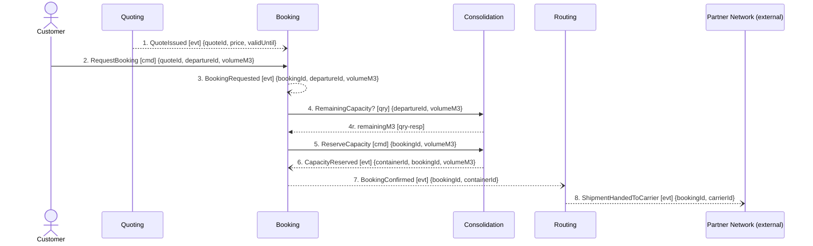

## Scenario

An exporter holds an issued quote and asks for a part-load shipment on a named departure. "Done"
means the booking is confirmed against a specific container, and the shipment is on its way to the
partner carrier that serves the lane. This is the design's own story — the happy path.

## Flow

| # | From | Message | Type | Contents | To | When |
|---|---|---|---|---|---|---|
| 1 | Quoting | `QuoteIssued` | event | quoteId, price, validUntil | Booking | — |
| 2 | Customer | `RequestBooking` † | command | quoteId, departureId, volumeM3 | Booking | **within** the quote's validity window (`validUntil`) |
| 3 | Booking | `BookingRequested` | event | bookingId, departureId, volumeM3 | *no consumer traced* | — |
| 4 | Booking | `RemainingCapacity?` | query | departureId, volumeM3 **→** remainingM3 | Consolidation | — |
| 5 | Booking | `ReserveCapacity` † | command | bookingId, departureId, volumeM3 | Consolidation | — |
| 6 | Consolidation | `CapacityReserved` | event | containerId, bookingId, volumeM3 | Booking | — |
| 7 | Booking | `BookingConfirmed` | event | bookingId, containerId | Routing | — |
| 8 | Routing | `ShipmentHandedToCarrier` | event | bookingId, carrierId | Partner Network | **after** `DeclarationSubmitted` — *rule stated by the customs clerk; no message on this flow carries it* |

† Provisional name. The model declares **no commands at all** — seven contexts, twelve events, zero
commands. Messages 2 and 5 are named after the events they produce; both need confirming with people
(`2-discover`) before anyone builds against them. Message 4 is not invented: `booking/model.yaml`
declares the relationship to Consolidation as *"synchronous remaining-capacity check before
reserving"*.

8 messages · 4 contexts · 1 query crossing a boundary · longest synchronous chain 2 hops.

## Findings

| # | Smell | Evidence (messages) | What it suggests | Proposed change |
|---|---|---|---|---|
| F1 | Check-then-act across a boundary | 4 then 5: Booking asks Consolidation for remaining capacity, then commands it to reserve; the boundary is crossed in between | The gap between 4 and 5 is a race — the answer at 4 can be false by the time 5 lands. This is hotspot #1 (two shipments on one slot, March) located to two message numbers | Collapse 4+5 into a single `ReserveCapacity` command that Consolidation accepts or rejects. The rejection is domain, not an error code — name it (`CapacityRefused`) and confirm the name with planners |
| F2 | Distributed invariant | 4–6 against `consolidation` invariant *"a container's committed volume must never exceed its capacity"* and `booking` invariant *"a booking may only be confirmed once its capacity has been reserved"* | The capacity rule is **checked** by Booking (4) but the state it constrains lives in Consolidation's `ContainerLoad`. Unenforceable under concurrency | The rule belongs to one aggregate: `ContainerLoad`. Booking should not read `committedM3` at all — it should ask for an outcome |
| F3 | Unenforceable ordering rule | 8, plus `routing/model.yaml` relationships (Booking, PartnerNetwork — **no Customs**) | The confirmed rule *"a shipment cannot be handed to a carrier before its declaration is submitted"* has no message anywhere on this path. Routing reacts to `BookingConfirmed` and hands over; Customs is not a participant | Either Routing consumes `DeclarationSubmitted` and waits for it, or the hand-over is commanded by the context that owns the rule. Decide with the customs clerk — this is a boundary question, not a sequencing bug |
| F4 | Event with no traced consumer | 3 | `BookingRequested` is confirmed by planners but nothing on this flow reacts to it. Either a consumer is missing from the model, or the event is internal to Booking | Ask discovery who acts on it; if nobody, drop the claim that it is a published domain event |
| F5 | Shared Kernel arriving by payload | 4, 5 carry `volumeM3` — the field of `ConsignmentLine`, which the context map marks **Shared Kernel, both write** | Booking's `ConsignmentLine` is {lineId, volumeM3, weightKg, hazardClass}; Consolidation's is {lineId, volumeM3, stackable}. Same name, two shapes, two writers | Resolving F1 removes the shared write path: if Consolidation owns the reservation, Booking sends volume and receives an outcome, and `ConsignmentLine` stops being shared |

## Open questions

- What is the customer-facing command actually called? Nobody has named a command in this domain — planners.
- Does Booking hold its own copy of `validUntil` (message 1) or ask Quoting at booking time? The quote-validity invariant is owned by Quoting but enforced at message 2 — Quoting product owner.
- Who reacts to `BookingRequested` (3)? — planners.
