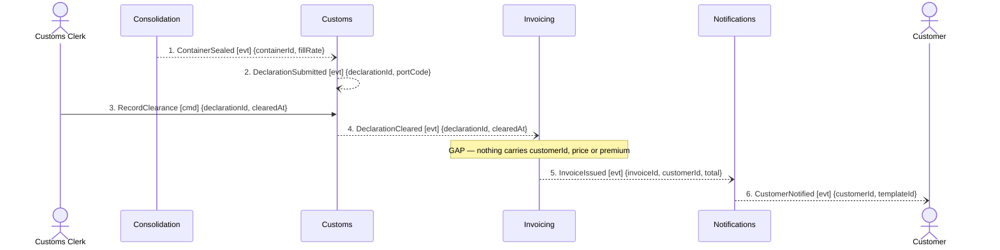

## Scenario

The container for a departure is sealed, the declaration clears at the port, and the customer is
billed — forwarding margin plus the **Guaranteed Consolidation** premium (+18%), which the finance
analyst says is charged *whether or not the container ends up full*. "Done" means an invoice has
issued and the customer knows. This is the path with the money on it.

## Flow

| # | From | Message | Type | Contents | To | When |
|---|---|---|---|---|---|---|
| 1 | Consolidation | `ContainerSealed` | event | containerId, fillRate | Customs | — |
| 2 | Customs | `DeclarationSubmitted` | event | declarationId, portCode | *no consumer traced* | — |
| 3 | Customs Clerk | `RecordClearance` † | command | declarationId, clearedAt | Customs | — |
| 4 | Customs | `DeclarationCleared` | event | declarationId, clearedAt | Invoicing | — |
| — | — | **missing message** | — | customerId, chargeable amount, premium flag | Invoicing | — |
| 5 | Invoicing | `InvoiceIssued` | event | invoiceId, customerId, total | Notifications | — |
| 6 | Notifications | `CustomerNotified` | event | customerId, templateId | Customer | *unknown — the event is `candidate`; nobody confirmed when it fires* |

† Provisional. `customs/model.yaml` notes *"two commercial customs platforms cover all nine ports;
we integrate with neither"*, so clearance reaches Customs through a person, not a system. The
message exists; its name does not. Confirm with the customs clerk.

6 traced messages · 4 contexts · 0 queries · one unnamed gap.

## Findings

| # | Smell | Evidence (messages) | What it suggests | Proposed change |
|---|---|---|---|---|
| F6 | The money never reaches the money context | 4 → 5: `DeclarationCleared` carries {declarationId, clearedAt}; `InvoiceIssued` carries {invoiceId, customerId, total}. No traced message delivers a customer, a price or the premium into Invoicing | Invoicing's only declared relationships are Customs (downstream) and Notifications (upstream). It is not connected to Booking or Quoting at all, yet it cannot invoice without what they hold. This is a **hole in the decomposition**, not a missing field | Model the fact that makes a shipment billable and give it an owner — most likely Booking publishes it at confirmation. Ask finance what the invoice is raised *against*: the booking, the declaration, or the sealed container |
| F7 | Trigger contradicts the business rule | 1, 4, 5 against the stated rule *"the premium is charged whether or not the container ends up full"* | The only path into Invoicing runs through sealing and clearance. If the premium is owed on a promise made at booking, billing it off `DeclarationCleared` means an unsealed or uncleared shipment is never billed for a promise already given | Decide whether billing is triggered by commitment (Booking) or by fulfilment (Customs). The rule as stated points at commitment; the model points at fulfilment |
| F8 | Event used as a disguised command | 4 | `DeclarationCleared` has exactly one consumer, which must act or no invoice ever issues. The sender depends on the receiver and nothing in the model says so | Either accept the dependency and make it a command, or (better, with F6) let Invoicing key off a billing fact it owns and treat clearance as a precondition it checks |
| F9 | Same word, two meanings, crossing the boundary | `booking/model.yaml` UL *"Consignment: the goods a customer hands over as one unit"* vs `invoicing/model.yaml` UL *"Consignment: a billable line on an invoice"*; `ShipmentRef` is shared across Booking, Consolidation, Customs, Invoicing | Hotspot #2, confirmed by the model itself. Any message closing the F6 gap will carry "consignment" across this boundary and mean two different things | Whatever message closes F6 must be a translated contract (Published Language / ACL at the Invoicing edge), not a shared type. Pick two distinct words first |

## Open questions

- What is Invoicing invoicing *against* — booking, declaration or container? — finance analyst.
- When does `CustomerNotified` fire, and after which events? Still a `candidate` from discovery — nobody has confirmed it. It is drawn here only because `notifications/model.yaml` declares Invoicing downstream.
- Is a credit note raised when a sealed container is refused (see DOMAIN-FLOW-0003 open questions)? Invoicing has a `CreditNote` aggregate and no event for it — finance analyst.
