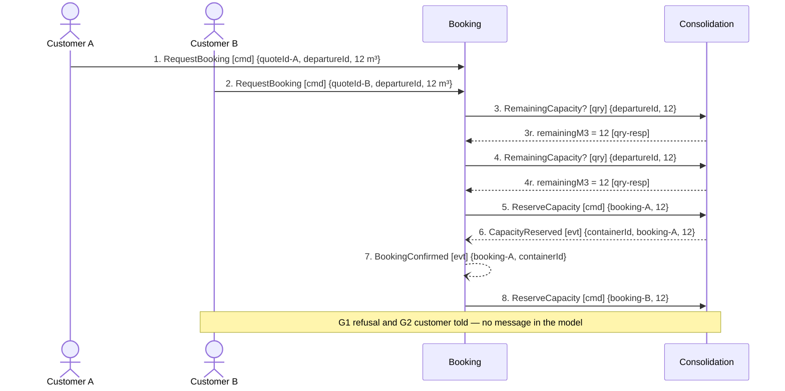

## Scenario

Two exporters ask for the same departure within seconds of each other. 12 m³ remain on the container
and each wants 12 m³. One booking must be confirmed and the other refused, and the refused customer
must be told. This is the March incident (hotspot #1: *"two shipments were committed to the same
container slot; nobody agrees where the check should have happened"*) replayed against the model as
drawn.

## Flow

| # | From | Message | Type | Contents | To | When |
|---|---|---|---|---|---|---|
| 1 | Customer A | `RequestBooking` † | command | quoteId, departureId, 12 m³ | Booking | — |
| 2 | Customer B | `RequestBooking` † | command | quoteId, departureId, 12 m³ | Booking | — |
| 3 | Booking | `RemainingCapacity?` | query | departureId, 12 **→** remainingM3 = 12 | Consolidation | — |
| 4 | Booking | `RemainingCapacity?` | query | departureId, 12 **→** remainingM3 = 12 | Consolidation | **before** message 5 commits anything — both callers are told yes |
| 5 | Booking | `ReserveCapacity` † | command | booking-A, 12 m³ | Consolidation | — |
| 6 | Consolidation | `CapacityReserved` | event | containerId, booking-A, 12 | Booking | — |
| 7 | Booking | `BookingConfirmed` | event | booking-A, containerId | Routing | — |
| 8 | Booking | `ReserveCapacity` † | command | booking-B, 12 m³ | Consolidation | — |

† Provisional names — see DOMAIN-FLOW-0001.

**Where the flow stops.** After message 8 the scenario has no vocabulary left. Two messages the
business obviously sends do not exist in the model, and they are recorded here as gaps rather than
drawn as messages, because inventing them would validate the design against fiction:

| gap | From | Would carry | To |
|---|---|---|---|
| G1 — refusal | Consolidation | bookingId, requestedM3, remainingM3 | Booking |
| G2 — the customer is never told | Booking | bookingId, reason | Customer B |

Nothing in `docs/domain/` refuses, rejects or cancels anything: across seven contexts and twelve
domain events there is not one negative outcome.

8 traced messages · 2 contexts · 2 queries crossing a boundary · 2 gaps.

## Findings

| # | Smell | Evidence (messages) | What it suggests | Proposed change |
|---|---|---|---|---|
| F10 | The race is reproducible on the model as drawn | 3, 4 both answer `remainingM3 = 12`; 5 commits A; 8 arrives at a container that no longer has room | Consolidation's invariant *"committed volume must never exceed capacity"* is violated at 8, or 8 fails in a way the model does not describe. Either way the March incident is not a coding slip — the boundary permits it | Same as F1: one `ReserveCapacity` command, decided inside `ContainerLoad`, no capacity read crossing the boundary |
| F11 | No refusal exists anywhere in the domain | gaps G1, G2 after message 8 — and the absence of any rejection event in all seven `model.yaml` files | The model was built happy-path-first. "The answer is no" has no vocabulary, so it will be built as an HTTP error and never reach the customer, the planner or Invoicing | Discover and name the negative outcomes with planners: capacity refused, booking rejected, quote expired at booking time. They are domain events, not error codes |
| F12 | The invariant is enforced on the wrong side | 3–4 (Booking reads capacity) vs `consolidation/model.yaml` (owns `capacityM3`, `committedM3`, and the rule) | The answer to hotspot #1's *"nobody agrees where the check should have happened"* is legible here: the check happens in Booking, the data and the rule live in Consolidation | Move the decision to Consolidation. Booking states a need; Consolidation answers yes or no. Hand to `3-decompose` (update mode) |

## Open questions

- When capacity is refused, does the business bump an existing booking, offer the next departure, or refuse outright? The *Guaranteed Consolidation* premium promises a slot — planners + commercial director.
- Manual override: `consolidation/model.yaml` says four senior planners resolve infeasible stacks by hand. Is that a modelled command or people editing rows? — planners.
- Hotspot #3 (*"nobody knows who is responsible when a partner carrier refuses a sealed container"*) could not be traced at all: no message in the model expresses a carrier refusal, and Routing owns no rule. It needs `2-discover` before it can be drawn.
