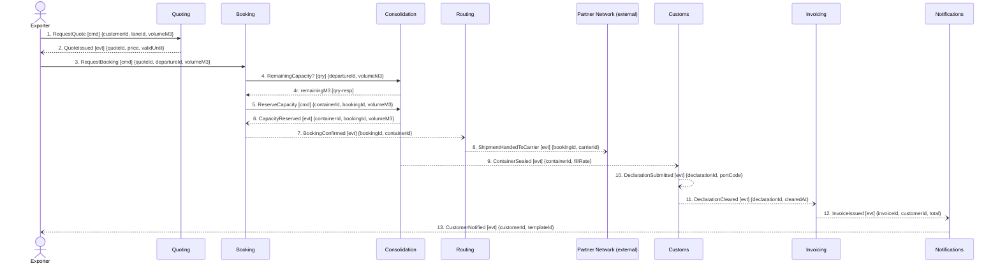

## Scenario

An exporter prices a part load, accepts the quote, and the shipment is booked, sealed into a
container, handed to a carrier, declared, cleared, invoiced and confirmed. "Done" is the customer
holding an invoice for a shipment that sailed. Traced as one scenario on request — see finding 1.

## Flow

| # | From | Message | Type | Contents | To | When |
|---|---|---|---|---|---|---|
| 1 | Exporter | `RequestQuote` | command | customerId, laneId, volumeM3 | Quoting | — |
| 2 | Quoting | `QuoteIssued` | event | quoteId, price, validUntil | Exporter | — |
| 3 | Exporter | `RequestBooking` | command | quoteId, departureId, volumeM3 | Booking | **within** the quote's `validUntil` window |
| 4 | Booking | `RemainingCapacity?` | query | departureId, volumeM3 **→** remainingM3 | Consolidation | — |
| 5 | Booking | `ReserveCapacity` | command | containerId, bookingId, volumeM3 | Consolidation | — |
| 6 | Consolidation | `CapacityReserved` | event | containerId, bookingId, volumeM3 | Booking | — |
| 7 | Booking | `BookingConfirmed` | event | bookingId, containerId | Routing | — |
| 8 | Routing | `ShipmentHandedToCarrier` | event | bookingId, carrierId | Partner Network | — |
| 9 | Consolidation | `ContainerSealed` | event | containerId, fillRate | Customs | — |
| 10 | Customs | `DeclarationSubmitted` | event | declarationId, portCode | (no consumer traced) | — |
| 11 | Customs | `DeclarationCleared` | event | declarationId, clearedAt | Invoicing | — |
| 12 | Invoicing | `InvoiceIssued` | event | invoiceId, customerId, total | Notifications | — |
| 13 | Notifications | `CustomerNotified` | event | customerId, templateId | Exporter | unknown — see open questions |

**Provenance.** Events 2, 6–13 are the confirmed events of `discovery/timeline.md`, in its order.
`QuoteRequested` and `BookingRequested` are drawn as the actor commands that record them (1, 3), not
as separate arrows. Message 4 is the query named in `booking/model.yaml` ("synchronous
remaining-capacity check before reserving"). Message 13 is the timeline's one **candidate** element —
nobody confirmed when it fires. Nothing else has been added.

## Findings

| # | Smell | Evidence (messages) | What it suggests | Proposed change |
|---|---|---|---|---|
| 1 | Overflow + too many contexts on the path | 13 messages, 7 contexts + 1 external (thresholds: >9, >4) | **more than 9 messages in one scenario ⇒ go back and re-cut.** Two scenarios wearing one name: 1–7 is commercial commitment, 8–13 is execution and settlement — the split falls on a real business boundary. But 7 contexts on one lifecycle is also a fragmented capability | hand to `3-decompose`: re-cut, and separately trace as "Sell & commit" (1–7) and "Ship & settle" (8–13), both inside 5–9 |
| 2 | Check-then-act across a boundary | 4 → 5: Booking asks Consolidation whether there is room, then commands the reservation | the capacity invariant is Consolidation's data and Consolidation's rule, but Booking performs the check. The gap between 4 and 5 is exactly the March double-booking (hotspot 1) | collapse 4+5 into one `ReserveCapacity` that Consolidation accepts or rejects; see FLOW-0003 |
| 3 | Distributed invariant, structurally unenforceable | 8 fires before 10, yet Customs' invariant says a shipment cannot be handed to a carrier before its declaration is submitted. `routing/model.yaml` has no Customs edge at all | the context that must not act never hears from the context that owns the rule — it cannot enforce it even in principle | give the handover trigger a Customs fact, or move the rule to a context that holds both facts. Confirm the true order with the customs clerk first |
| 4 | Pass-through | 7 → 8: Routing receives `BookingConfirmed`, emits `ShipmentHandedToCarrier`, changes nothing. Its own model says `aggregates: []` and "It owns no rule of its own" | a boundary drawn around a step, not a capability. Legitimate only as an anti-corruption adapter to the external Partner Network — but an adapter that decides nothing is a hop | either delete the hop, or model the carrier-selection decision and the refusal path that would make Routing a real context (see FLOW-0004) |
| 5 | Event used as a disguised command | 11 → 12: `DeclarationCleared` has exactly one consumer, and Invoicing's invariant means no invoice exists without it. Same shape at 12 → 13 | the sender depends on the receiver, and nothing on the map says so | either accept the dependency and make it a command, or record the consumer contract explicitly |
| 6 | Homonym crossing the boundary | 3, 5, 12 all carry consignment data; Booking defines a consignment as goods handed over, Invoicing as a billable line, and `ConsignmentLine` is a Shared Kernel both Booking and Consolidation write | hotspot 2, located: one term, two meanings, one shared entity | publish one meaning as Published Language, or rename per context |
| 7 | The model records no commands or queries | the whole model declares 11 events and zero commands/queries; the only query in this flow (4) was hiding in a relationship note | every coupling in findings 2–5 was invisible on the static context map | record commands and queries in `docs/domain/`, not only events |
| 8 | **Clean stretch** | 9–13: five events, no queries, each context deciding one thing it owns | the settlement half of the split is working. Record it so it is not re-litigated | none |

**Negative check — no god context.** Busiest context Booking: 4 of 13 messages. Busiest pair
(Booking ↔ Consolidation): 3, below the chatty threshold of 5. Longest synchronous chain: 1 hop.
Only the message count and the context count fire.

## Open questions

- Is the handover really before the declaration (timeline order) or is the Customs rule the truth? — customs clerk, planner
- `CustomerNotified` (13) is a candidate: what triggers it, and is it one notification or several? — hand back to `2-discover`
- Is `ContainerSealed` (9) time-driven (**every** departure cut-off) or triggered by the last reservation? Nothing states a temporal rule — planner
- Who is the actor at 1 and 3 — the exporter directly, or a sales desk? No customer took part in discovery — commercial director
- Does anything consume `DeclarationSubmitted` (10), or is it a fact nobody listens to? — customs clerk
