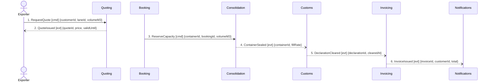

## Scenario

A customer buys the Guaranteed Consolidation premium (+18% of the forwarding fee) — a departure slot
even if the container sails part-filled. The shipment is quoted, reserved, sealed at 71% fill,
cleared and invoiced. "Done" is an invoice that charges the premium correctly. This is the scenario
the business is paid for, so this is the flow where coupling has a price.

## Flow

| # | From | Message | Type | Contents | To | When |
|---|---|---|---|---|---|---|
| 1 | Exporter | `RequestQuote` | command | customerId, laneId, volumeM3 | Quoting | — |
| 2 | Quoting | `QuoteIssued` | event | quoteId, **price**, validUntil | Exporter | — |
| 3 | Booking | `ReserveCapacity` | command | containerId, bookingId, volumeM3 | Consolidation | — |
| 4 | Consolidation | `ContainerSealed` | event | containerId, **fillRate** | Customs | — |
| 5 | Customs | `DeclarationCleared` | event | declarationId, clearedAt | Invoicing | — |
| 6 | Invoicing | `InvoiceIssued` | event | invoiceId, customerId, **total** | Notifications | — |

Six messages, four decision-making contexts — inside the 5–9 band. The revenue-bearing fields are
bolded on purpose: `price` enters at 2, `fillRate` at 4, `total` leaves at 6, and no message connects
them.

## Findings

| # | Smell | Evidence (messages) | What it suggests | Proposed change |
|---|---|---|---|---|
| 1 | Missing message on the revenue path | 2 carries `price`; 6 emits `total`; nothing between them crosses into Invoicing. Invoicing's only inbound edge is Customs, whose events carry `declarationId, portCode, clearedAt` — no money | the `total` on the company's invoices has no traced provenance in the model. Either a message exists that nobody wrote down, or the money moves outside the model entirely | hand to `2-discover`: ask finance which message tells Invoicing what to charge, then hand the named message to `3-decompose` |
| 2 | Business rule with no owner | "The premium is charged whether or not the container ends up full" (finance analyst) is an invariant of no context. Quoting has no premium concept; Invoicing has a `SurchargeSchedule` aggregate that emits nothing | the +18% that funds the differentiator is unrepresented on both the pricing side and the billing side | record the rule as an invariant of whichever context owns `SurchargeSchedule`, via `3-decompose` |
| 3 | Message delivering data to a context that cannot use it | 4: `fillRate` is sent to Customs, which has no rule about fill. The contexts that need it — Invoicing for the premium, and whoever tracks the 71%→80% goal — never receive it | the payload is following the pipeline, not the decision | route the fill fact to the decision that needs it, or drop it from 4 |
| 4 | Classification contradicts the money | Consolidation makes the decision at 3 and 4 and holds the capacity rule, yet is typed `supporting`; Invoicing is typed `core` while `business-model.md` records it as commodity — *"nobody has ever chosen us because of our invoices"* | the paid capability is the one the map calls supporting; the commodity is the one carrying 311 attributes and 5 aggregates | re-run the subdomain classification in `3-decompose` — the map notes it has not been revisited since March |
| 5 | Query-free flow | 0 queries cross a boundary here; the whole flow is events plus one command | the settlement path really is loosely coupled. The problem in this flow is missing data, not blocking calls | none |

## Open questions

- Which message carries the premium, and does Booking or Quoting know the customer bought it? — finance analyst, commercial director
- Is the premium invoiced per shipment or per departure? `InvoiceIssued` carries only a `total` — finance analyst
- Does a part-filled sailing cost anything to anyone? `business-model.md` records cost structure as unknown — whoever owns the P&L
