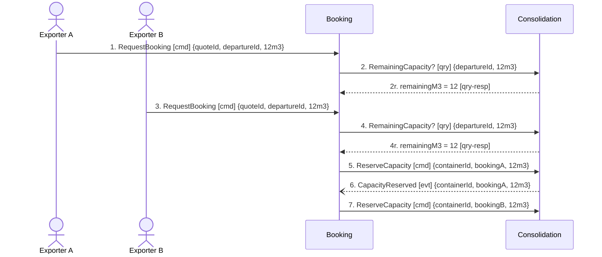

## Scenario

Two exporters book onto the same departure within the same few minutes, and the container has room
for only one of them. This is hotspot 1 — *"two shipments were committed to the same container slot
in March; nobody agrees where the check should have happened"* — traced message by message to find
out where it should have happened. "Done" would be one booking confirmed and one refused. The model
has no message for the second half of that sentence.

## Flow

| # | From | Message | Type | Contents | To | When |
|---|---|---|---|---|---|---|
| 1 | Exporter A | `RequestBooking` | command | quoteId, departureId, volumeM3 | Booking | **within** quote A's `validUntil` |
| 2 | Booking | `RemainingCapacity?` | query | departureId, volumeM3 **→** remainingM3 = 12 | Consolidation | — |
| 3 | Exporter B | `RequestBooking` | command | quoteId, departureId, volumeM3 | Booking | arrives **after** 2 and before 5 |
| 4 | Booking | `RemainingCapacity?` | query | departureId, volumeM3 **→** remainingM3 = 12 (unchanged) | Consolidation | — |
| 5 | Booking | `ReserveCapacity` | command | containerId, bookingA, volumeM3 | Consolidation | — |
| 6 | Consolidation | `CapacityReserved` | event | containerId, bookingA, volumeM3 | Booking | — |
| 7 | Booking | `ReserveCapacity` | command | containerId, bookingB, volumeM3 | Consolidation | — |

**The flow stops at 7 because the model stops there.** Message 7 breaches Consolidation's invariant
(*"a container's committed volume must never exceed its capacity"*), and there is no message in
`docs/domain/` for what happens next. Across all seven contexts the model declares 11 events and not
one of them is negative — no rejection, no expiry, no cancellation, no bump.

## Findings

| # | Smell | Evidence (messages) | What it suggests | Proposed change |
|---|---|---|---|---|
| 1 | Check-then-act across a boundary | 2 → 5 and 4 → 7: the query establishes free space, the command consumes it, and the boundary is crossed in between. Both queries answer 12 m³ because nothing has committed yet | the March incident, located and reproducible on paper. The gap between 4 and 7 is the race | collapse the query/command pair into one `ReserveCapacity` that Consolidation accepts or rejects. Booking then never needs to read capacity at all |
| 2 | Distributed invariant | Booking's invariant "a booking may only be confirmed once its capacity has been reserved" and Consolidation's "committed volume must never exceed capacity" are one rule with two owners; the check runs in Booking (2, 4), the data lives in Consolidation | whichever context asks first wins, and neither can enforce the rule under concurrency | the rule belongs to the `ContainerLoad` aggregate alone. Record it as Consolidation's, remove the check from Booking |
| 3 | The model has no refusal message | 11 confirmed events, zero negative. Nothing follows 7 | a design where nobody asked what happens when the answer is no. Also hotspot 1's real cause: with no rejection to send, Booking's only option was to ask first and hope | hand to `2-discover`: what does the business do when the slot is gone — refuse, bump, or upgrade? Then name the event. Do not invent it here |
| 4 | Named business promise, unnamed compensation | Guaranteed Consolidation promises "a departure slot even on a partly-filled container"; a bumped shipment breaks it, and no message models the bump | if the business accepts the occasional double-booking, the compensating action is part of the model and must be named | ask finance and planning for the compensation, then model it |
| 5 | A temporal rule nobody checks | 1 and 3 must fall **within** the quote's `validUntil`, per Quoting's invariant, but no message in any flow tests it and no expiry event exists | the rule is enforceable only if something reads the quote at booking time — nothing in the model does | confirm with the commercial director whether an expired quote is refused or silently re-priced |

## Open questions

- What actually happened in March after the double-booking — was a shipment bumped, or did a planner rebuild the stack by hand? — planner
- Does the whiteboard load-planning step in Gothenburg sit between 4 and 7 in real life? If so it is a participant this flow is missing — the four senior planners
- Is capacity reserved per container or per departure? Message 2 asks by `departureId`, message 5 commands by `containerId` — planner
