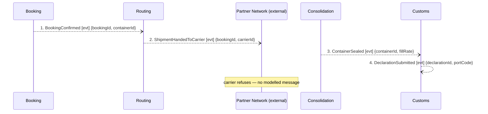

## Scenario

A container is sealed and handed to a partner carrier, and the carrier refuses it at the gate. This
is hotspot 3 — *"nobody knows who is responsible when a partner carrier refuses a sealed container"*
— and it was traced to find out whether the model knows either. Fourth flow, added for a hotspot the
team already argues about.

## Flow

| # | From | Message | Type | Contents | To | When |
|---|---|---|---|---|---|---|
| 1 | Booking | `BookingConfirmed` | event | bookingId, containerId | Routing | — |
| 2 | Routing | `ShipmentHandedToCarrier` | event | bookingId, carrierId | Partner Network | — |
| 3 | Consolidation | `ContainerSealed` | event | containerId, fillRate | Customs | — |
| 4 | Customs | `DeclarationSubmitted` | event | declarationId, portCode | (no consumer traced) | — |

**Four messages, below the 5-message floor — and that is the finding, not a layout problem.** The
scenario is not small; the model runs out. Nothing in `docs/domain/` describes an inbound message
from the Partner Network, so the refusal cannot be drawn without inventing it, and it has not been.

## Findings

| # | Smell | Evidence (messages) | What it suggests | Proposed change |
|---|---|---|---|---|
| 1 | Pass-through, confirmed across flows | 1 → 2 here and 7 → 8 in FLOW-0001: Routing receives a fact and emits a fact, holds `aggregates: []`, and its own rationale says "It owns no rule of its own". Its only decision — which carrier the standing contract selects — is not modelled as a message | a boundary drawn around a step. Routing appears in exactly two flows and decides nothing in either | either fold the handover into Booking, or make Routing a real anti-corruption layer that owns carrier selection **and** the refusal path. The second option is the one that would give this flow messages 5 onward |
| 2 | The external edge is one-way | `routing/model.yaml` relationships list Booking and PartnerNetwork only; no message anywhere in the model comes back from the Partner Network | the model treats a partner network — the company's key resource, 9 ports — as a sink. Hotspot 3 has no answer because the design has no place to put one | hand to `2-discover`: what does the carrier send back, and who receives it? |
| 3 | Distributed invariant, structurally unenforceable | 2 fires before 4, and Customs' invariant forbids handing a shipment to a carrier before its declaration is submitted. Routing has no Customs edge to learn from | the rule can be stated but not enforced. Either the confirmed timeline order is wrong or the rule is routinely broken — both are worth knowing | trigger the handover from a Customs fact, or give the rule to a context that sees both. Confirm the real order first |
| 4 | Compensation aggregates that emit nothing | Invoicing declares 5 aggregates — `Invoice`, `SurchargeSchedule`, `CreditNote`, `DunningCase`, `PaymentAllocation` — and 1 event. `CreditNote` is the obvious compensation for a refused container and no flow can reach it | four of five aggregates take part in no message at all. The undoing half of the business is modelled as data with no behaviour | ask finance which of the four emit facts, then hand the events to `3-decompose` |

## Open questions

- Who pays when a sealed container is refused — the customer, the carrier, or Nordic Freight? — planner, finance analyst
- Is a refused container re-planned as a new booking or re-handed to a different carrier? The answer decides whether Routing needs a decision or just a retry — planner
- Does anything consume `DeclarationSubmitted` (4)? It appears in the timeline and in no relationship — customs clerk
- Are the two commercial customs platforms participants in this flow? `customs/model.yaml` says "we integrate with neither" — customs clerk
