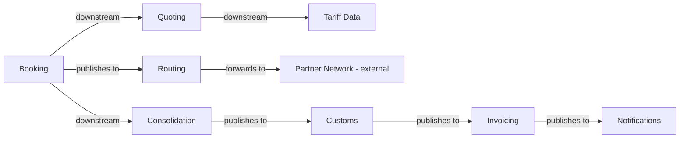

## Context map

## Sub-domain classification

| Bounded Context | Sub-domain type | Why |
|---|---|---|
| Quoting | core | first thing the customer sees |
| Booking | core | where the money is committed |
| Consolidation | supporting | back-office load planning |
| Routing | supporting | hands shipments to carriers |
| Customs | core | regulated, and mistakes are expensive |
| Invoicing | core | the largest and most business-critical system we run |
| Notifications | generic | commodity |

## Shared artifacts

| Artifact | Between | Sharing level | Cost |
|---|---|---|---|
| `ShipmentRef` value object | Booking, Consolidation, Customs, Invoicing | Building Blocks | ~0 — no business meaning |
| `ConsignmentLine` entity | Booking, Consolidation | **Shared Kernel** — both write it | Highest: every change needs mutual consent from both teams. The two sides already model it differently (`hazardClass` vs `stackable`), and hotspot 2 says finance and operations mean different things by "consignment" — evidence for duplicating per context, not sharing. Blocks any split that puts Booking and Consolidation on separate teams. |

## Declined context candidates

Per the capability-vs-context test: a bounded context must own a domain model with real business
invariants. A noun cluster with none is a capability of existing contexts.

| Candidate | Verdict | Invariants it would own | Escalation condition |
|---|---|---|---|
| Routing | **Declined — capability, not a context.** It is the dispatch step of Booking; keep it as a module inside Booking, or as an ACL adapter over the external Partner Network. | **None.** `routing/model.yaml` itself records `aggregates: []` and "It owns no rule of its own". The one rule that gates the handoff — "a shipment cannot be handed to a carrier before its declaration is submitted" — is a **Customs** invariant. Language does not shift at the boundary either: `bookingId`, `carrierId`, `shipmentRef` mean the same thing on both sides, so §2.2's polysemy test fails too. | Promote to a real context when carrier selection acquires rules of its own: multi-carrier bidding or lane-rate selection replacing the standing per-lane contract; carrier refusal / re-routing exception handling with penalties (hotspot 3 — nobody owns it today); or capacity contracts negotiated against carriers. |

Kept on disk (never deleted) — `docs/domain/routing/` remains as the record of the declined
candidate and of the `ShipmentHandedToCarrier` event, which Booking still emits into.

## Conflicts & reconciliation

| Concept | Source A says | Source B says | Chosen (authoritative) | Flag for human |
|---|---|---|---|---|
| Handoff vs. declaration ordering | `discovery/timeline.md` event order, planner-confirmed: `ShipmentHandedToCarrier` (6) fires **before** `DeclarationSubmitted` (8) | `discovery/timeline.md` rule, customs clerk: a shipment **cannot** be handed to a carrier before its declaration is submitted | **Unresolved — deliberately not blended.** Both are first-hand and they contradict. | Ask the customs clerk and the depot planners which is true. Whichever wins, the map has no `Customs → Routing` edge today and needs one. |
| Consolidation sub-domain type | this file (unchanged since March): `supporting`, "back-office load planning" | `business-model.md` (2026-05-18): revenue-generator, custom-built, **differentiating** — the Guaranteed Consolidation premium (+18%) is what customers pay for | `business-model.md` — newer and sourced | Confirm flip to `core` **before** any staffing decision; this is where the team should go. |
| Invoicing sub-domain type | this file: `core`, "largest and most business-critical system we run" | `business-model.md`: commodity, *"nobody has ever chosen us because of our invoices"* | `business-model.md` — 34 tables is mass, not differentiation | Confirm demotion to `supporting`/`generic`. |

## Event-flow continuity check

- **Orphan emit:** `ShipmentHandedToCarrier` has no consumer in any context model. An event nobody
  reads is not an integration seam — it is a log line.
- **Unwired invariant:** the customs-clerk rule implies Customs gates Routing, but no
  `Customs → Routing` edge exists on the map. Not added here — see Conflicts.
- **Unconsumed:** `ContainerSealed` (Consolidation) has no recorded Customs consumer, though the
  map draws `Consolidation → Customs`.
- `CustomerNotified` is still a *candidate* event in `discovery/timeline.md` — nobody confirmed
  when it fires.

## Notes

The classification above has not been revisited since the first modelling session in March.
This repo has no `INDEX.md` and no per-context `README.md`; neither was created here — assigning
`DOMAIN-NNNN` ids to seven contexts is a full re-decomposition, outside this boundary review.

## Changelog (2026-07-28)

- Added: "Declined context candidates" — Routing declined as a capability, with its escalation
  condition; "Conflicts & reconciliation"; "Event-flow continuity check".
- Updated: Shared artifacts — stated the cost of the `ConsignmentLine` Shared Kernel.
- Updated: `routing/model.yaml` — recorded the declined-candidate verdict in `notes`. Nothing
  removed; the folder stays.
- Preserved: all existing `subdomain_type` values, `status: draft`, `owner: TBD`. The two
  classification disagreements are flagged for a human, not flipped — that is a doc-owner act.
- Flagged: Routing is a candidate for **merge into Booking** (not deletion) once a human confirms.
