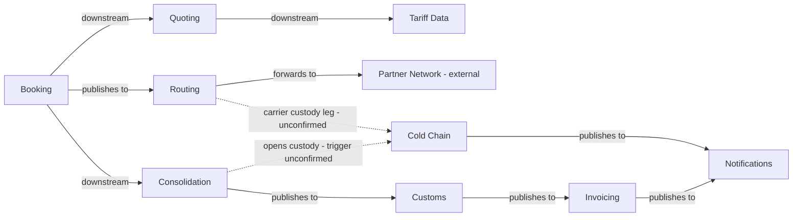

## Context map

Dotted edges are unconfirmed: the cold-chain brief says the range must hold "from depot to depot"
but never says which event opens or closes custody.

## Sub-domain classification

| Bounded Context | Sub-domain type | Why |
|---|---|---|
| Quoting | core | first thing the customer sees |
| Booking | core | where the money is committed |
| Consolidation | supporting | back-office load planning |
| Routing | supporting | hands shipments to carriers |
| Customs | core | regulated, and mistakes are expensive |
| Invoicing | core | the largest and most business-critical system we run |
| Notifications | generic | commodity |
| Cold Chain | supporting *(unconfirmed)* | new; it owns a real invariant (the range must hold depot to depot) so it is a context, not a capability — but nothing in `business-model.md` says temperature control differentiates us, and no customer has been asked. See open question 5 |

## Shared artifacts

| Artifact | Between | Sharing level |
|---|---|---|
| `ShipmentRef` value object | Booking, Consolidation, Customs, Invoicing, Cold Chain | Building Blocks |
| `ConsignmentLine` entity | Booking, Consolidation | **Shared Kernel** — both write it |

Cold Chain reads `ShipmentRef` and emits it in `TemperatureBreachRecorded`; it writes no shared
entity, so it adds no Shared Kernel coupling.

## Conflicts & reconciliation

| Concept | Source A says | Source B says | Chosen (authoritative) | Flag for human |
|---|---|---|---|---|
| `CustomerNotified` trigger | `discovery/timeline.md`: *candidate*, "nobody confirmed when it fires" | cold-chain brief: a breach must be told to the customer | brief — it gives the event its first confirmed trigger | confirm this is the same notification path, not a second one |
| `ShipmentRef` sharing level | this map: Building Blocks | `ddd-methodology.md` §2.4: a VO carrying business meaning is Published Language, not a technical base type | **unresolved — left as written** | a human wrote this row; re-label only with their consent |

## Open questions (cold chain, 2026-07-28)

1. **Where is the required temperature range agreed?** On the quote, the booking, or per container?
   `ColdChainCustody.requiredRange` currently has no stated source, so nothing upstream sets it.
2. **What opens and closes custody?** "Depot to depot" implies a span, but no event marks either
   end. `ContainerSealed` and `ShipmentHandedToCarrier` are candidates, both unconfirmed.
3. **Who measures, and how often?** Continuous telemetry and a manual reading at handover are very
   different models; the brief says neither, so no measurement concept is modelled.
4. **Who is liable for a breach in partner-carrier custody?** This sharpens discovery hotspot 3
   (nobody owns a refused sealed container) — now with money attached.
5. **Is cold chain core or supporting?** Classified supporting on the evidence available. It flips
   to **core** if it becomes a priced premium like Guaranteed Consolidation, or if breach liability
   is material enough that holding the range is how we win the business.
6. **Does a breach touch the invoice?** No credit-note or claim flow was described, so Invoicing is
   untouched.
7. **Do reefer containers change load planning?** Whether reefers can be mixed with dry cargo, or
   need separate capacity, was not stated — Consolidation is left as-is.

## Notes

The classification above has not been revisited since the first modelling session in March.

## Changelog (2026-07-28)

- **Added:** `ColdChain` context (`cold-chain/model.yaml`) — one aggregate, `ColdChainCustody`,
  with the `TemperatureBreach` entity, `TemperatureRange` VO, and `TemperatureBreachRecorded`
  event; three invariants, all quoted from the brief.
- **Updated:** Notifications — added the `ColdChain` relationship; context map, sub-domain table
  and shared-artifacts row extended with Cold Chain. Created the missing `INDEX.md` over the three
  existing governed docs.
- **Preserved:** every hand-written note verbatim — Consolidation's Gothenburg whiteboard note,
  Customs' "we integrate with neither", Invoicing's eleven-years note, Booking's synchronous
  capacity-check note, Routing's rationale, and the March classification note above. No status or
  owner was changed.
- **Flagged:** nothing was dropped. `ColdChain` has no `mass:` block (nothing built to measure);
  no per-context `README.md` was created, since no context in this repo has one — say the word and
  they get added for all eight, not just the new one.
