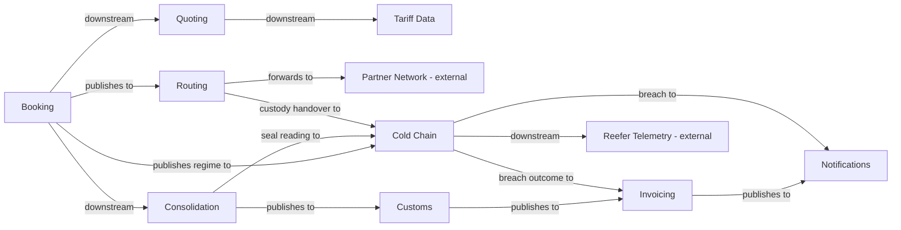

## Context map

## Sub-domain classification

| Bounded Context | Sub-domain type | Why |
|---|---|---|
| Quoting | core | first thing the customer sees |
| Booking | core | where the money is committed |
| Consolidation | supporting | back-office load planning |
| Routing | supporting | hands shipments to carriers |
| Customs | core | regulated, and mistakes are expensive |
| Invoicing | core | the largest and most business-critical system we run |
| Notifications | generic | commodity — **under review**, see below |
| Cold Chain | core | regulated cargo, and a breach is a claim against full cargo value |

## Shared artifacts

| Artifact | Between | Sharing level |
|---|---|---|
| `ShipmentRef` value object | Booking, Consolidation, Customs, Invoicing, Cold Chain | Building Blocks |
| `ConsignmentLine` entity | Booking, Consolidation | **Shared Kernel** — both write it |
| `TemperatureRegime` value object | Quoting, Booking, Consolidation, Cold Chain | Published Language — **Quoting agrees it, Booking freezes it, everyone else reads it and nobody else writes it** |

## Cold chain — what changed and what it costs

Added 2026-07-28 for the temperature-controlled freight contract. Six existing contexts touched, one
added. Three consequences that are not visible from the diagram:

1. **`ConsignmentLine` gains `temperatureRegime`, and it is Shared Kernel.** Booking and Consolidation
   both write it, so this field cannot ship from one side. Same release, both teams.
2. **Capacity stops being one-dimensional.** A reefer runs one temperature band per departure, so a
   container can be half empty and still unusable for the consignment in front of you. The existing
   invariant "committed volume must never exceed capacity" is still true and no longer sufficient.
   This works *against* the 71% → 80% fill-rate goal in `business-model.md` on reefer departures.
3. **Notifications is asked for something it does not do.** A breach notification is contractual and
   deadlined, and a breach case cannot close without an acknowledgement. The context is a bought
   fire-and-forget adapter classified `generic`. Three options and a recommendation are recorded in
   `notifications/model.yaml` under `classification_at_risk` — decide it rather than letting it drift.

Deliberately **not** changed: `customs/model.yaml`. Perishable and veterinary declarations may well
need the regime or the breach record, but no customs clerk has been asked and guessing would put
unsourced structure into a context that is already regulated. Open question, not a silent edit.

Mass figures in the model files predate cold chain and were not re-measured; `cold-chain/model.yaml`
carries an estimate, explicitly marked as one, and should not be ranked against the measured ones.

## Notes

The classification above has not been revisited since the first modelling session in March.

Cold chain forces part of that revisit whether we want it or not — Notifications (see above) and the
Cold Chain row itself, which is marked core on the Customs precedent (regulated, expensive mistakes)
rather than on differentiation. If the cold chain contract stays a single account it is a compliance
obligation, not a core capability. The rest of the table is still March's.
