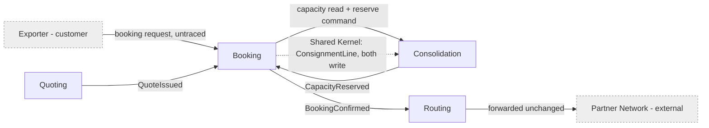

# Booking bounded context

> Bounded Context Canvas v5 — written by `domain-define`, 2026-07-27.
> **Note on provenance:** `domain-decompose` did not leave a first-pass `README.md` for this context
> (only `model.yaml`), so this is a first write rather than a delta-merge. `docs/domain/message-flows/`
> does not exist either, so the inbound/outbound sections below are reconstructed from
> `model.yaml` relationships, `context-map.md` and `discovery/timeline.md` — weaker evidence than
> traced flows. Every cell that is not evidenced says so.

## Right-sizing

Only `Booking` is canvassed here — it is the context the interface is about to be frozen on, and it
is labelled `core` in `context-map.md`, which earns the full canvas plus the interface critique.
`Consolidation`, `Quoting`, `Customs`, `Invoicing`, `Routing` and `Notifications` get nothing from
this run; they appear only as collaborators. Seven canvases would be ceremony.

## Purpose

Take a customer's decision to ship, turn it into a commitment Nordic Freight can be held to — a
named consignment on a named departure — and hold that commitment until it is either confirmed or
withdrawn. Key actors: small and mid-size exporters shipping part loads, and the depot planners
downstream who inherit whatever Booking commits to.

**Boundary test, failed once.** That purpose statement is the strongest one the evidence supports,
but it is thinner than the label `core` implies. `context-map.md` justifies `core` with *"where the
money is committed"*, and yet nothing about money — price, the Guaranteed Consolidation premium,
payment terms — appears anywhere in Booking's model or interface. Either the purpose is smaller
than the classification, or the interface is missing its most important message. See Open question 1.

## Strategic classification

| Facet | Value | Source |
|---|---|---|
| Domain type | `core` — **carried, not corroborated** | `context-map.md`, *"where the money is committed"*; the file itself notes the classification *"has not been revisited since the first modelling session in March"* |
| Business-model role | **unknown** | `business-model.md` has no row for Booking. Its capability table covers consolidation, quoting, customs, invoicing, notifications and routing — Booking is absent |
| Evolution | **unknown** | same gap |

Two of three facets are unfillable, and the third is stale and uncorroborated. This is not re-classified
here — that is `domain-strategize`'s call. It is recorded as a finding (Open question 4) and as a
risk to freezing the interface: a `core` context normally earns the widest, most stable public
contract, and there is currently no evidence Booking is one.

## Domain roles

| Role | Evidence | Consequence |
|---|---|---|
| **Draft context** | `Booking.status`; the pair `BookingRequested` → `BookingConfirmed`; the invariant *"a booking may only be confirmed once its capacity has been reserved"* (`model.yaml`) | Booking holds work-in-progress until someone else's answer makes it real |
| **Execution context** | it sequences request → reserve → confirm and refuses to confirm out of order (`model.yaml` invariant) | it enforces a workflow |
| **Capacity-decision proxy** — *unintended* | `model.yaml` relationship note: *"synchronous remaining-capacity check before reserving"* | Booking reads state whose invariant belongs to `Consolidation` (`ContainerLoad`), which is where the workflow stops being its own |

Two roles by design is normal. The third is the finding: a draft context that reaches into a
neighbour's aggregate to pre-decide the neighbour's rule is not playing a role, it is borrowing one.

## Inbound communication

| Collaborator | Collaborator type | Message | Type | Relationship |
|---|---|---|---|---|
| Customer channel | frontend / direct user interaction | **not traced** — something causes `BookingRequested` (`timeline.md` #3) but no inbound command is named in any artifact | command (presumed) | unknown |
| Quoting | bounded context | `QuoteIssued` (`timeline.md` #2) | event | unknown — `context-map.md` records only *downstream*; no context-mapping pattern is stated |
| Consolidation | bounded context | `CapacityReserved` (`timeline.md` #4, `consolidation/model.yaml`) | event | shared kernel on `ConsignmentLine` (`context-map.md`, *"both write it"*); the pattern for the rest of the relationship is unstated |

## Outbound communication

| Collaborator | Collaborator type | Message | Type | Relationship |
|---|---|---|---|---|
| Consolidation | bounded context | remaining-capacity read — **name not stated anywhere** (`booking/model.yaml`: *"synchronous remaining-capacity check before reserving"*) | query | shared kernel + customer/supplier in effect |
| Consolidation | bounded context | reserve-capacity command — **name not stated**; only its result event `CapacityReserved` is confirmed | command | as above |
| Routing | bounded context | `BookingConfirmed` `[bookingId, containerId]` (`booking/model.yaml`; `routing/model.yaml` *"Routing receives BookingConfirmed"*) | event | unknown; `routing/model.yaml` shows Routing forwards it onward to the external partner network |
| (no named consumer) | — | `BookingRequested` `[bookingId, departureId, volumeM3]` | event | published, consumer unrecorded |

Two of the four outbound messages have no agreed name. That alone is a reason not to freeze: the
interface cannot be frozen at a level of detail the repo has never written down.

### Swimlane — what Booking actually decides

```
customer request ──▶ [ decide: is the quote still valid? — NOT modelled; the validity rule
                        lives in Quoting ]
                 ──▶ BookingRequested

capacity answer  ──▶ [ decide: is there room? — NOT Booking's rule; the invariant lives in
                        Consolidation.ContainerLoad ]
                 ──▶ reserve-capacity command

CapacityReserved ──▶ [ decide: confirm — the one rule Booking owns, and it is a sequencing
                        rule with a single input ]
                 ──▶ BookingConfirmed
```

Three lanes; one decision, and that decision is *"did the other context say yes"*. Every lane with
no decision of its own is a pass-through. This is the swimlane of an orchestrator, not of a core
domain.

## Ubiquitous language

| Term | Meaning in THIS context | Differs elsewhere? |
|---|---|---|
| Booking | a customer's committed request to move a consignment on a given departure (`model.yaml`) | not defined elsewhere |
| Consignment | the goods a customer hands over as one unit (`model.yaml`) | **yes, and unresolved** — in Invoicing it is *"a billable line on an invoice"* (`invoicing/model.yaml`). Raised as hotspot 2 by the finance analyst, 2026-05-25: *"finance and operations use consignment differently"* |
| ConsignmentLine | `[lineId, volumeM3, weightKg, hazardClass]` | **yes, while sharing a name and a write path** — Consolidation's is `[lineId, volumeM3, stackable]`, and `context-map.md` marks it Shared Kernel with both contexts writing it |
| ShipmentRef | `[prefix, sequence]` | shared as a "Building Block" with Consolidation, Customs and Invoicing (`context-map.md`); who mints it is unstated |
| Departure | referenced as `departureId` | **owned by no context in the model** — Booking, Consolidation and the timeline all use it; no `model.yaml` defines it |

The `Consignment` collision is the justification for a boundary, and it is currently crossing that
boundary untranslated. The `ConsignmentLine` collision is worse: same name, two shapes, two writers.

## Business decisions

Only rules that someone stated, with attribution.

| Rule | Stated by / source | Owned by Booking? |
|---|---|---|
| A booking may only be confirmed once its capacity has been reserved | `booking/model.yaml` invariant. **Not restated by anyone in discovery** — no planner or analyst in the 2026-05-25 session confirmed it | yes, and it is the only one |

Rules that Booking's interface touches but does **not** own:

| Rule | Stated by | Owner |
|---|---|---|
| A container's committed volume must never exceed its capacity — an overbooked container means a shipment is bumped and the Guaranteed Consolidation promise is broken | planner, 2026-05-25 (`timeline.md`) | `Consolidation` (`ContainerLoad` invariant) — yet Booking reads the state that decides it |
| The premium is charged whether or not the container ends up full | finance analyst, 2026-05-25 | `Invoicing` charges it; **nobody stated where it is elected**. See Open question 1 |
| A shipment cannot be handed to a carrier before its declaration is submitted | customs clerk, 2026-05-25 | `Customs` / `Routing` |

Booking enforces exactly one stated rule, and that rule was never confirmed by a human. That is the
single most useful number on this canvas.

## Quality attributes

Quality-stormed against the incidents and hotspots in `discovery/timeline.md`. Numbers are attached
only where someone supplied them; `unknown` is recorded with who could supply it.

| Attribute | Requirement | Number | Source | Changes the model? |
|---|---|---|---|---|
| Correctness under concurrency | two bookings must never commit the same container slot | ≥1 breach known (March) | planner, hotspot 1, 2026-05-25: *"two shipments were committed to the same container slot in March; nobody agrees where the check should have happened"* | **yes** — this is an invariant, so it fixes an aggregate boundary, and it is currently split across two contexts |
| Availability | can a booking be accepted while `Consolidation` is unavailable? | unknown — commercial director could answer | nobody asked | **yes** — "no" keeps today's synchronous call; "yes, confirm later" makes Booking a genuine draft context and deletes the query |
| Latency | how long will a customer wait for a confirmation before abandoning? | unknown | **no customer has been in any session** (`business-model.md`: *"no customer took part"*; `timeline.md`: *"no customer present"*) | **yes** — it is the other input to the sync-vs-async decision above |
| Auditability | prove what was promised to a Guaranteed Consolidation customer and when | unknown — finance analyst / customs clerk | premium promises a departure slot (`business-model.md`, pricing page) | **yes if required** — the promise becomes domain history rather than a status field |
| Consistency | is a stale remaining-capacity read acceptable, and for how long? | today: effectively unbounded — the read and the reserve are separate calls | inferred from `booking/model.yaml` | **yes** — this is hotspot 1 restated as a quality |
| Volume & growth | bookings per day today and after two more ports open | unknown; ports 9 → 11 (medium-horizon goal) | investor one-pager via `business-model.md` | no — sizing |
| Change cadence | how often booking rules change | unknown | — | no |

Five of seven change the model, and four of those are `unknown` because the people who could answer
were never in the room. Freezing an interface on top of four unknowns that each move the model is
the risk this canvas exists to surface.

## Assumptions

Domain assumptions:

- *(inferred)* One inbound command from the customer channel creates a booking. No artifact names it.
- *(inferred)* Booking is the sole writer of `Booking.status`. Nothing states whether `Consolidation`
  or `Customs` can invalidate a confirmed booking — and hotspot 3 (a carrier refusing a sealed
  container) is precisely the case where someone would need to.
- *(inferred)* A booking references exactly one departure and is never moved to another. `departureId`
  is a plain attribute with no amendment or cancellation event anywhere in the model.
- *(inferred)* `Departure` is reference data owned outside the model — no context claims it.
- *(inferred)* `ShipmentRef` is minted once and never changes; four contexts share it as a building block.
- *(inferred)* `weightKg` and `hazardClass` are captured in Booking for `Customs` and `Consolidation`
  to consume. No rule in Booking reads either.

Scale and behaviour assumptions:

- *(inferred)* Booking volume is low enough that a synchronous call into `Consolidation` on every
  request is acceptable. Nobody supplied a number.
- *(inferred)* The read-then-reserve race is rare enough to have produced one known incident rather
  than many. The March incident is the only data point, and nobody counted the near-misses.

Classification assumption:

- *(stated but stale)* Booking is `core`. From `context-map.md`, unrevisited since March, with no
  supporting row in `business-model.md`.

## Verification metrics

| Metric | What it would tell us | Where it comes from |
|---|---|---|
| Share of pull requests touching both `booking/` and `consolidation/` | change coupling — if high, the Shared Kernel on `ConsignmentLine` is the real boundary and this one is drawn in the wrong place | git history / CI |
| Count of `ConsignmentLine` schema changes needing both teams to agree | the running cost of the shared kernel | tracker + git |
| Reserve rejections that follow a capacity read saying there was room | direct observation of the check-then-act race — if non-zero, hotspot 1 is a live defect, not a one-off | production logs on the `Consolidation` call |
| Bumped shipments per quarter on Guaranteed Consolidation bookings | whether the premium promise is actually being kept; baseline ≥1 (March) | incident log / planner |
| Ratio of outbound queries to outbound events on Booking's interface | how orchestration-heavy this context is; a query-dominant interface is a service, not a domain | API/gateway telemetry |
| Lead time for a change contained inside Booking vs one that spills into `Consolidation` or `Quoting` | whether the boundary buys autonomy | tracker |
| Number of contexts that need `departureId` semantics changed together | whether `Departure` needs an owner | git history |

Each of these has a named source and would change a decision if it moved. The first and third are
the ones worth instrumenting before the interface freezes, not after.

## Interface critique

The five questions, run over the interface as it stands.

### 1. Are the message names coherent with each other and with the description?

Partly. `BookingRequested` / `BookingConfirmed` are a coherent lifecycle pair in the context's own
language. Beyond that:

- Two of the four outbound messages **have no name at all** in any artifact — the capacity read and
  the reserve command exist only as a prose note in `model.yaml`. You cannot freeze what has not
  been named.
- The lifecycle is incomplete in a way the names expose: there is `BookingRequested` and
  `BookingConfirmed`, and nothing for rejected, amended, or cancelled. Hotspot 3 — a partner carrier
  refusing a sealed container — has no message to land on.
- `Consignment` means one thing here and another in `Invoicing`, and Booking's interface carries the
  term outward without translating it.

### 2. Is each message the right type?

**No, and this is the finding that should stop the freeze.** The pair *"query remaining capacity"*
then *"command reserve"* is check-then-act across a context boundary. The invariant it is checking —
*"a container's committed volume must never exceed its capacity"* — is `Consolidation`'s, declared
on its `ContainerLoad` aggregate. Splitting a read from the write that depends on it, across a
boundary, is the mechanism behind hotspot 1: two shipments in the same slot in March, with *"nobody
agreeing where the check should have happened"*. The canvas answers that question — the check
happens where the invariant lives.

It should be **one command** carrying everything the decision needs (`bookingId`, `departureId`,
`volumeM3`), which `Consolidation` accepts or rejects atomically. Booking then reacts to the answer.

Second type problem: with a synchronous accept/reject there are now two paths carrying the same fact
— the command's response and the `CapacityReserved` event. Pick one. If Booking must keep taking
bookings while `Consolidation` is down (Open question 5), keep the event and drop the synchronous
response; otherwise keep the response and let `CapacityReserved` be `Consolidation`'s own
notification to everyone else.

### 3. Is the interface too big?

No — roughly six messages for one responsibility is a small interface. The mismatch runs the other
way: **the internals are large and the decisions are few.** 9 tables, 54 attributes, a 22-attribute
entity, and exactly one owned rule which is a sequencing check with a single input. A context whose
mass is ten times its decision count is usually holding data on behalf of its neighbours. That is
worth understanding before the contract hardens, because the pressure will be to expose the data.

### 4. Is the context exposing its internals?

It is doing something worse — it is exposing **someone else's** internals, in both directions.

- `BookingConfirmed` has payload `[bookingId, containerId]`. `containerId` is the identity of
  `Consolidation`'s `ContainerLoad` root. Booking publishes it to `Routing`, which per its own
  `model.yaml` forwards the message onward to the external partner network unchanged. A
  `Consolidation` internal identifier therefore reaches a third party through Booking's public event.
  `Routing` needs a lane and a carrier; there is no evidence it needs a container id.
- `ConsignmentLine` is a **Shared Kernel that both contexts write** (`context-map.md`), and the two
  contexts model it differently — `[lineId, volumeM3, weightKg, hazardClass]` here versus
  `[lineId, volumeM3, stackable]` in `Consolidation`. Same name, two shapes, two writers. This is
  not an exposed internal so much as an absent boundary: neither side can change the entity alone.

### 5. Do any messages belong elsewhere?

- The **remaining-capacity query belongs nowhere.** It should not move to another context; it should
  cease to exist, absorbed into the reserve command (see question 2).
- **The missing message is the important one.** Nordic Freight's stated revenue stream is the
  Guaranteed Consolidation premium — +18% of the forwarding fee for a promised departure slot
  (`business-model.md`, pricing page). No context models it. It is charged by `Invoicing` (finance
  analyst) and honoured by `Consolidation`, and the moment a customer elects it is the moment they
  commit — which is Booking. A context justified as *"where the money is committed"* whose interface
  carries no message about the thing customers pay a premium for has either the wrong justification
  or an incomplete interface. Resolve this **before** the freeze; adding a premium flag to
  `BookingRequested` afterwards is a breaking change to every consumer.
- `weightKg` and `hazardClass` are read by no Booking rule and look like data captured for `Customs`
  and `Consolidation`. Not necessarily wrong — Booking is where the customer is — but the ownership
  should be a decision rather than an accident.

### Move experiments

The canvas is not tested until something has been moved.

| # | Experiment | Cost | Outcome |
|---|---|---|---|
| A | Move the capacity decision wholly into `Consolidation`: delete the query, send one `ReserveCapacity` command that is accepted or rejected | Booking can no longer show *"is there room?"* before the customer commits; the customer journey becomes request → accept/reject | **Adopt.** Removes the race in hotspot 1, puts the invariant in one place, removes a message. The only cost is a UX change nobody has validated with a customer anyway |
| B | Break the `ConsignmentLine` shared kernel: Booking owns the customer-declared line; `Consolidation` derives its own planning line from the reserve command | data that looks duplicated, plus a translation step | **Adopt.** Two writers become one writer each; the shapes already differ, so the "sharing" is nominal. This is the change that makes the boundary real |
| C | Strip `containerId` from `BookingConfirmed`; let `Routing` join on `Consolidation`'s existing `ContainerSealed` event | `Routing` needs a correlation it does not have today | **Adopt if `Routing` truly needs the container.** Verify first — `routing/model.yaml` gives no evidence it does, in which case just delete the field |
| D | Move the whole confirmation lifecycle into `Consolidation` and reduce Booking to a front-end | `Consolidation` inherits the customer relationship and the commercial vocabulary it has no language for; `customerId` exists only in Booking | **Rejected** — but instructive. What survives the move is exactly the customer commitment, which argues that the premium election belongs here (see question 5), not that the context should disappear |

## Open questions

1. Where is the Guaranteed Consolidation premium elected, and which context owns the promise? Only
   its charging was stated (finance analyst). **Blocks the freeze.**
2. Who owns `Departure`? Three contexts carry `departureId`; no model defines it.
3. Who mints `ShipmentRef`, and can it ever change after a booking is confirmed?
4. Is Booking really `core`? `context-map.md` says so from March and has not been revisited;
   `business-model.md` has no row for Booking and places the differentiation on load consolidation.
   For `domain-strategize`, not for this canvas.
5. Can a booking be accepted while `Consolidation` is unavailable? Decides synchronous versus
   asynchronous confirmation, and therefore the model.
6. Does `Consignment` need translating at Booking's boundary with `Invoicing`? Hotspot 2, raised by
   the finance analyst, still open.
7. When a partner carrier refuses a sealed container (hotspot 3), does that reopen a confirmed
   booking? There is no message for it and nobody owns the outcome.
8. What does a customer actually experience, and how long will they wait? **No customer has attended
   any session** — stated in both `business-model.md` and `timeline.md`.
9. Nobody confirmed Booking's only invariant during discovery. Who owns it?

Nine open questions on a context labelled `core`, three of which (1, 5, 8) change the interface
itself. This design is not ready to freeze.

## System context



## Proposed deltas to `model.yaml`

`domain-decompose` owns `booking/model.yaml`; these are proposals, not edits.

| # | Delta | Why |
|---|---|---|
| 1 | Replace the relationship note *"synchronous remaining-capacity check before reserving"* with a single named `ReserveCapacity` command, accepted or rejected by `Consolidation` | Interface critique Q2; move experiment A |
| 2 | Remove `containerId` from the `BookingConfirmed` payload, or record the evidence that `Routing` needs it | Q4; move experiment C |
| 3 | Split `ConsignmentLine`: Booking keeps the customer-declared line; `Consolidation` derives its own | Q4; move experiment B; `context-map.md` Shared Kernel row |
| 4 | Add the missing lifecycle messages — rejected, amended, cancelled — or state that a booking is immutable once confirmed | Q1; hotspot 3 |
| 5 | Model the Guaranteed Consolidation election, or record which context does | Q5; `business-model.md` revenue stream |
| 6 | Record the source of the invariant *"a booking may only be confirmed once its capacity has been reserved"* | No human confirmed it in discovery |

## Findings for other skills

- **`domain-strategize`** — Booking is classified `core` on a March judgement with no row in
  `business-model.md`. Two facets of its strategic classification are unfillable.
- **`domain-decompose`** — the `ConsignmentLine` Shared Kernel with two writers and two shapes; and
  the ownerless `Departure` concept.
- **`domain-discover`** — no customer has attended any session, which is why four model-changing
  quality attributes are `unknown`; and `Consignment` (hotspot 2) is still unresolved.
- **`domain-connect`** — message flows have never been traced, which is why two messages on this
  interface have no name.
