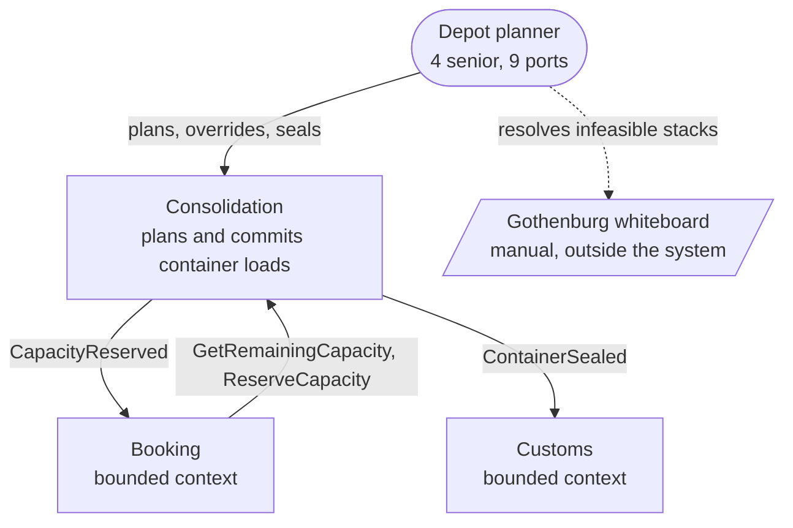

# Consolidation bounded context

> Right-sizing: **full canvas**. This is the capability behind the Guaranteed Consolidation premium
> (`business-model.md`, commercial director 2026-05-18), so it gets every section plus the interface
> critique. Note that `context-map.md` labels it `supporting` — see *Strategic classification*.
>
> Provenance of this file: created by `domain-define` on 2026-07-27. No first-pass README existed;
> content is derived from `consolidation/model.yaml`, `context-map.md`, `business-model.md` and
> `discovery/timeline.md`. Nothing here overwrites a human edit.

## Purpose

Decide which consignments travel in which container on which departure, so that customers who paid
for Guaranteed Consolidation get the departure slot they were promised and containers leave as full
as possible.

Key actors: the four senior depot planners who plan loads across the nine ports, and — indirectly —
the exporters who bought the premium.

## Strategic classification

| Facet | Value | Source |
|---|---|---|
| Domain type | **contested**: `supporting` per `context-map.md`; the evidence in `business-model.md` describes a core capability | `context-map.md` (March session, "not revisited"); `business-model.md` capability table |
| Business-model role | revenue generator (forwarding margin + the +18% Guaranteed Consolidation premium) | `business-model.md`, pricing page |
| Evolution | custom built | `business-model.md` capability table |

`core-domain-chart.md` does not exist in this repo, so there is no `domain-strategize` output to
carry. The two upstream artifacts that do exist disagree:

- `context-map.md`: *Consolidation — supporting — "back-office load planning"*.
- `business-model.md`: *load consolidation / container fill optimisation — revenue-generator,
  custom-built, differentiation **yes** — "the premium customers pay for; a new entrant would need
  both the depot network and the planning know-how"*.

**This canvas does not resolve that.** Per the Define step's rules, classification is carried, not
re-derived. The disagreement is recorded as a finding for `domain-strategize` (below) and it is the
reason this context was right-sized as if it were core: the cost of a full canvas on a supporting
context is a wasted afternoon, the cost of a stub on the revenue differentiator is a contract nobody
examined.

## Domain roles

Two, and that is the first finding of this canvas:

- **Execution context** — it enforces the workflow and holds the invariant: capacity is reserved,
  a container is committed, the container is sealed. This half is a commitment ledger.
- **Analysis context** — it proposes how to fill a container (the optimiser referenced in
  `model.yaml` notes). This half is advisory: *"the four senior planners resolve conflicts by hand
  when the optimiser proposes an infeasible stack."*

The two halves change at different rates — an optimisation heuristic changes far more often than
the rule that a container cannot be overbooked. This does not require a new boundary; it argues for
the optimiser sitting behind a port inside this context (see the perturbation experiments).

## Inbound communication

| Collaborator | Collaborator type | Message | Type | Relationship | Evidence |
|---|---|---|---|---|---|
| Booking | bounded context | `GetRemainingCapacity` | query | shared kernel (`ConsignmentLine`) + customer/supplier | `context-map.md` shared artifacts; `booking/model.yaml` note *"synchronous remaining-capacity check before reserving"*. Message name is **derived** — no flow document names it |
| Booking | bounded context | `ReserveCapacity` | command | customer/supplier (**proposed**) | same note ("before reserving"); `CapacityReserved` in `discovery/timeline.md` #4 is its confirmed outcome |
| Depot planner | direct user interaction | manual load adjustment / override | command | — | `model.yaml` notes: whiteboard planning in Gothenburg, conflicts resolved by hand. No message name exists because there is no system action today |

`docs/domain/message-flows/` does not exist. Two of the three rows above are reconstructed from
model notes rather than from a traced flow, so the *names and payloads are the weakest content on
this canvas*. Running `domain-connect` to trace the Booking↔Consolidation flow is the cheapest way
to firm them up.

## Outbound communication

| Collaborator | Collaborator type | Message | Type | Relationship | Evidence |
|---|---|---|---|---|---|
| Booking | bounded context | `CapacityReserved` (containerId, bookingId, volumeM3) | event | customer/supplier | `model.yaml`; timeline #4, planner-confirmed |
| Customs | bounded context | `ContainerSealed` (containerId, fillRate) | event | published language (**proposed**) | `model.yaml`; timeline #7, planner-confirmed |

### Swimlane view

| In | Decision made here | Out |
|---|---|---|
| `GetRemainingCapacity` (Booking) | none — reads internal state | remaining capacity |
| `ReserveCapacity` (Booking) | **does this consignment fit, and is the slot committed?** | `CapacityReserved` |
| planner override | **which consignments make up this load** | (no message today) |
| planner seals container | **this load is final** | `ContainerSealed` |

The first lane makes a decision of exactly zero and hands a caller the state it needs to make
Consolidation's own decision for it. That is the shape of hotspot #1.

## Ubiquitous language

| Term | Meaning in THIS context | Differs elsewhere? |
|---|---|---|
| Container load | The set of consignments committed to one physical container on one departure | Not used elsewhere |
| Fill rate | Committed volume ÷ container capacity | Not used elsewhere; it appears in the `ContainerSealed` payload, which exports it to Customs |
| Consignment / `ConsignmentLine` | A physical stack of pallets with a volume and a stackability flag | **Yes** — Booking: *"the goods a customer hands over as one unit"*; Invoicing: *"a billable line on an invoice"*. Hotspot #2 (finance analyst, 2026-05-25) is exactly this clash — and `ConsignmentLine` is nevertheless a **Shared Kernel that both Booking and Consolidation write** (`context-map.md`) |
| Capacity | Volume in m³ available on a container for a departure | Booking speaks of capacity but stores weight and hazard class it never passes on |

## Business decisions

Only rules with an attributed source. Everything else is under *Assumptions*.

- **A container's committed volume must never exceed its capacity.** An overbooked container means a
  shipment is bumped and the Guaranteed Consolidation promise is broken. — *planner, 2026-05-25
  (`discovery/timeline.md`)*. Also present as the `model.yaml` invariant.
- **The premium is charged whether or not the container ends up full.** — *finance analyst,
  2026-05-25*. Stated as an Invoicing rule; it constrains Consolidation because it means a reserved
  slot is revenue already earned, not a provisional plan.

Nothing else in the repo states a rule this context enforces. In particular, no one stated what
happens to a reserved slot on cancellation, or whether a sealed load can be re-planned.

## Quality attributes

| Attribute | Requirement | Number | Source | Changes the model? |
|---|---|---|---|---|
| Correctness under concurrency | Two bookings must never commit the same container slot | — | hotspot #1 (planner: it happened in March); rule stated 2026-05-25 | **yes** — this is the aggregate boundary; it also rules out check-then-act from outside |
| Availability | Booking cannot confirm a booking unless this context answers (`booking/model.yaml`: confirm only after capacity reserved) | unknown | **inferred** from the two models, not stated by anyone | **yes if confirmed** — a synchronous dependency on the revenue path; if the business wants booking to survive Consolidation being down, the commitment has to move or become asynchronous |
| Latency | A planner is on the phone while a fill is proposed | unknown | not asked; the depot planners could supply it | no — pre-compute / caching |
| Auditability | Prove which consignments were committed to a sealed container, and for how long | unknown | not asked; the customs clerk is the likely source, given declarations reference the sealed load | **potentially yes** — if history must be reconstructible, sealing history is domain state, not a log |
| Volume / growth | 9 ports today, +2 planned; average fill 71% → 80% target | 71% → 80% | `business-model.md` goals | no — but both are verification metrics |
| Change cadence | Unknown for the invariant; the optimiser heuristics change whenever planners disagree with them | unknown | inferred from the whiteboard note | no |

## Assumptions

Beliefs this design rests on. None of these was stated by a named person; all are **inferred** and
are here to be attacked.

1. **(domain, inferred)** A container is committed to exactly one departure and is never re-planned
   after sealing. Nothing in discovery says so; the model has no re-planning event.
2. **(domain, inferred)** Volume is the binding constraint on Nordic's lanes. `Booking` captures
   `weightKg` and `hazardClass` per consignment line; neither reaches Consolidation's model, which
   plans on `volumeM3` and `stackable`. Either weight and hazard genuinely do not constrain a stack,
   or the model is missing constraints. **This one is contested enough to also be an open question.**
3. **(domain, inferred)** A reserved slot is never released to make room for a fuller stack. The
   premium being charged regardless of fill (finance analyst) makes this likely but nobody said it.
4. **(behaviour, inferred)** The planners will keep resolving infeasible stacks by hand; the
   optimiser stays advisory. The whiteboard in Gothenburg is documented in `model.yaml`; that it
   *remains* the workflow is the assumption.
5. **(inherited, unattributed)** *"A booking may only be confirmed once its capacity has been
   reserved"* — carried from `booking/model.yaml`. It is an invariant in a model file with no source
   in discovery, so this canvas treats it as an assumption rather than a business decision.
6. **(scale, inferred)** Container and consignment volumes are small enough that a single planner
   session covers one departure; no statement about concurrent planners across nine ports exists.

## Verification metrics

How we would learn that this boundary is wrong.

| Metric | What it would tell us | Where it comes from |
|---|---|---|
| Change coupling: % of pull requests touching both `consolidation/` and `booking/` | The shared kernel (`ConsignmentLine`) and the check-then-act interface are one design, not two contexts. Sustained > ~30% says the boundary is in the wrong place | CI / VCS history |
| Ratio of `GetRemainingCapacity` calls to `ReserveCapacity` commands | A high query:command ratio means callers are making Consolidation's decision outside Consolidation | production API telemetry (needs the calls instrumented — not available today) |
| Double-commit incidents per quarter | The invariant is not actually held here. Baseline: 1 (March, hotspot #1) | incident tracker |
| Planner manual overrides per week | The model does not match the work — the optimiser is proposing loads planners reject | **not collectable today**: overrides happen on a whiteboard. Making this observable requires the override to become a system action first |
| Average fill rate at seal (`ContainerSealed.fillRate`) | Whether the capability is delivering the 71% → 80% goal it is funded for | production, from the sealed-container event |
| Bumped shipments per month on premium bookings | The Guaranteed Consolidation promise is being broken — the business consequence the invariant exists to prevent | operations / incident tracker |

## Open questions

1. Is Consolidation core or supporting? `context-map.md` says supporting; `business-model.md`
   describes the differentiator. Unresolved — owner: `domain-strategize`.
2. Do weight and hazard class constrain a load? Booking captures both, Consolidation ignores both,
   and nobody was asked. (Assumption #2.)
3. Where should the no-overbooking check happen? Hotspot #1: *"nobody agrees where the check should
   have happened."* Still not agreed.
4. What happens to a reserved slot when a customer cancels or fails to deliver? No event, no rule,
   no statement.
5. Can a sealed container be re-planned — and if the partner carrier refuses it (hotspot #3), whose
   decision is the re-plan: Consolidation, Routing or Booking?
6. Must the composition of a sealed container be reconstructible later, and for how long? Nobody
   asked the customs clerk.
7. Does "consignment" mean the same thing to a planner and to finance? Hotspot #2 says no, and the
   shared kernel assumes yes.

Seven open questions on the context the business charges a premium for. Four of them (2, 3, 4, 5)
would change the aggregate. **This design is not ready to build**; it is ready for one more
modelling session with a planner and the customs clerk in the room.

## Interface critique

1. **Coherent names?** Mostly. `GetRemainingCapacity` / `ReserveCapacity` / `CapacityReserved` speak
   capacity; the context's own language is *container load* and *fill rate*. The interface talks
   about a number, the context is about a plan.
2. **Right message types?** No. `GetRemainingCapacity` (query) followed by `ReserveCapacity`
   (command) is check-then-act across a boundary: the caller reads capacity, decides, then acts, and
   the window between the two is exactly the March double-commit. It should be **one command that
   this context accepts or rejects** — the rejection carries the reason. The query then disappears
   from the public interface.
3. **Too big?** No — two inbound, two outbound. If anything it is too small: there is no message for
   the planner override, which is the busiest real-world interaction.
4. **Exposing internals?** Yes, twice. `GetRemainingCapacity` exports `committedM3` vs `capacityM3`,
   which is the aggregate's internal arithmetic. And `ContainerSealed` carries `fillRate` — this
   context's own KPI — to Customs, which needs to know *which consignments are in the container*,
   not how well it was packed.
5. **Messages that belong elsewhere?** `ConsignmentLine` as a shared kernel with Booking is the
   biggest one: two contexts writing one entity while they define the underlying word differently
   (hotspot #2). Also, the stated rule *"a shipment cannot be handed to a carrier before its
   declaration is submitted"* is an invariant in Customs, but the handover is Routing's action — no
   context here enforces it.

### Perturbation experiments

| Experiment | Effect | Verdict |
|---|---|---|
| Move the capacity check into Booking (Booking owns remaining capacity) | Removes the cross-boundary round trip and one message. But the Guaranteed Consolidation invariant would live in a context that does not own containers, and every future caller becomes another writer of container state | **Rejected** — it optimises the call graph by giving away the invariant |
| Take `ConsignmentLine` out of the shared kernel: Consolidation keeps a `StackItem` (volume, stackable), Booking keeps its own consignment line | Costs a translation at the boundary. Buys: the name clash stops being a shared write, Booking's `weightKg` / `hazardClass` stop being silently dropped, and the two contexts can change independently | **Recommended** — finding for `domain-decompose` |
| Move fill optimisation behind a port inside Consolidation (no boundary change) | Separates the fast-changing advisory half from the slow-changing commitment ledger without adding a context | **Recommended** — internal, cheap, reversible |
| Move `fillRate` out of `ContainerSealed` | Customs loses nothing it uses; Consolidation stops publishing its own KPI as a contract | **Recommended** — replace with the consignment set Customs actually declares |

## Findings for other skills

| # | Finding | Owner |
|---|---|---|
| F1 | `context-map.md` (supporting) and `business-model.md` (differentiating, revenue-generating, custom-built) disagree about this context. `core-domain-chart.md` does not exist | `domain-strategize` |
| F2 | Check-then-act across the Booking→Consolidation boundary; collapse to a single accept/reject command | `domain-connect` |
| F3 | `ConsignmentLine` shared kernel spans a term that three contexts define differently | `domain-decompose` |
| F4 | `ContainerSealed` payload exposes an internal metric (`fillRate`) instead of the sealed load | `domain-decompose` (model.yaml owner) |
| F5 | No `docs/domain/message-flows/` — inbound message names here are reconstructed, not observed | `domain-connect` |
| F6 | No context enforces "declaration submitted before carrier handover"; the rule sits in Customs, the action in Routing | `domain-connect` |

## C4 system context

The dashed edge is the point: a significant part of this capability currently runs outside the
system, which is why the override metric above is not collectable yet.
