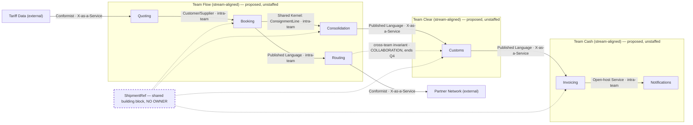

## Reality check

| Count | Value | Source |
|---|---|---|
| Bounded contexts | 7 | `docs/domain/context-map.md` |
| Engineers | **unknown** | nothing in the repo states headcount |
| Existing teams | **unknown** | no team, ownership or on-call data anywhere in `docs/` |
| What each team knows today | **unknown** | — |

**Every ownership row below is `proposed — unstaffed`.** Three questions block this document from
being a plan rather than a template:

1. How many engineers work on this system?
2. How many teams exist today, and which contexts does each touch?
3. What does each team already know — which of the seven contexts has someone who could take it on
   Monday?

Until those are answered, the team shapes below are arithmetic, not allocation.

### Model mass — the number that drives everything else

| Context | Tables | Attributes | Aggregates | Declared sub-domain | Business-model differentiation |
|---|---:|---:|---:|---|---|
| Invoicing | 34 | 311 | 5 | core | **no** — *"nobody has ever chosen us because of our invoices"* |
| Customs | 12 | 96 | 1 | core | no — two vendors already do it well |
| Quoting | 11 | 78 | 1 | core | partial — *"we are no faster"* |
| Booking | 9 | 54 | 1 | core | — (not classified) |
| Consolidation | 5 | 41 | 1 | supporting | **yes** — the +18% premium customers pay for |
| Routing | 3 | 17 | 0 | supporting | no |
| Notifications | 2 | 11 | 0 | generic | no |
| **Total** | **76** | **608** | **9** | | |

**Invoicing holds 45% of the tables and 51% of the attributes in the system, for the one capability
the business says nobody chose them for.** Consolidation — the capability with a price tag on it —
holds 7% of the tables. Any topology drawn on this model, at any headcount, spends about half the
engineering capacity on invoices. That is the finding this whole document exists to make visible;
Conway will deliver it faithfully if nobody intervenes.

### What is missing from the inputs

| Expected input | Present? | Consequence |
|---|---|---|
| `docs/domain/core-domain-chart.md` | **no** | placement is unknown; the ownership proposal is weaker than it looks, and the sub-domain labels below are the only signal — and they contradict `business-model.md` |
| `docs/domain/message-flows/` | **no** | interaction modes are **inferred** from `context-map.md` relationships and `discovery/timeline.md` event ordering, not read off real flows. Treat every mode below as a hypothesis to check against traffic |
| org shape | **no** | see above |

## Ownership

Primary shape: **three stream-aligned teams**, split on three fracture planes that already exist in
the material — business domain (the shipment stream), regulatory compliance (customs cadence, set by
nine ports' regulators), and cash/finance (a different vocabulary and a different persona).

| Context | Proposed team | Team type | Sub-domain type | Load contribution | Notes |
|---|---|---|---|---|---|
| Quoting | Flow | stream-aligned | core (declared) | 11 tbl / 78 attr / 1 agg | owns the ACL to the external Tariff Data feed |
| Booking | Flow | stream-aligned | core (declared) | 9 tbl / 54 attr / 1 agg | holds the money commitment |
| Consolidation | Flow | stream-aligned | supporting (declared) / **core (business model)** | 5 tbl / 41 attr / 1 agg | the no-overbooking invariant; kept with Booking on purpose — see Findings #4 |
| Routing | Flow | stream-aligned | supporting | 3 tbl / 17 attr / 0 agg | owns no rule of its own; a separate owner would buy a handoff for zero decision |
| Customs | Clear | stream-aligned | core (declared) | 12 tbl / 96 attr / 1 agg | regulatory change cadence, distinct persona (customs clerk) |
| Invoicing | Cash | stream-aligned | core (declared) / **generic (business model)** | 34 tbl / 311 attr / 5 agg | densest entity is 128 attributes |
| Notifications | Cash | stream-aligned | generic | 2 tbl / 11 attr / 0 agg | bought adapter; its only upstream is Invoicing |

All seven rows: **proposed — unstaffed.**

**No platform team is proposed.** The test is whether several stream-aligned teams are separately
solving the same non-domain problem, and the repo contains no deployment, environment, tooling or
on-call information at all — so the evidence for a platform is absent, not negative. Evidence that
would flip this: two or more teams maintaining their own pipelines, or extrinsic load reported as
the dominant complaint in the team conversation this document is input to. Notifications is a bought
adapter and a plausible future platform product, but 2 tables does not justify a team.

**No complicated-subsystem team is proposed.** The only candidate is container-fill optimisation.
It does not pass the test today: the optimiser proposes infeasible stacks and four senior planners
resolve them by hand, which is a knowledge problem, not a specialist-maths problem. It flips only if
fill optimisation becomes a real solver needing operations-research expertise a stream-aligned team
could not hire or train — at which point the handoff it creates has to be paid for deliberately.

### What the headcount answer changes

| Engineers | Shape that fits | What it costs |
|---:|---|---|
| ≥ 15 (18 comfortable) | the three teams above | none beyond staffing; Cash is still over budget (see load) |
| 10–14 | **two** teams: Flow (Quoting, Booking, Consolidation, Routing) and Settle (Customs, Invoicing, Notifications) | Settle carries 48 tbl / 418 attr / 6 agg — 2.2× Flow's attribute mass, all of it non-differentiating. Only viable if Invoicing is shrunk or Customs is bought |
| < 10 | **one** stream-aligned team on Quoting, Booking, Consolidation, Routing | Customs and Invoicing must be bought, not staffed. 55% of the model mass cannot be held by a single team, so this is not a topology choice — it is a strategy consequence to accept out loud |

## Team cognitive load

| Team | Contexts owned | Intrinsic (model mass) | Extrinsic | Verdict |
|---|---|---|---|---|
| **Flow** | Quoting, Booking, Consolidation, Routing | 28 tbl / 190 attr / 3 agg / 2 invariants; 2 external ACLs (Tariff Data, Partner Network) | unknown — no deploy/on-call data | **Fits on paper, and the paper is the wrong measure here.** Its differentiating asset (load planning) is not in the software: it lives on a whiteboard in the Gothenburg depot and in four senior planners. The team would own the context without owning the capability |
| **Clear** | Customs | 12 tbl / 96 attr / 1 agg; densest entity 34 attrs | regulatory tracking across 9 ports | **Fits** — the lightest domain load in the proposal. The open question is not whether a team can hold it, but whether it should exist at all (see ISH) |
| **Cash** | Invoicing, Notifications | 36 tbl / 322 attr / 5 agg; densest entity **128 attrs** | 11 years of accumulated schema | **Over budget.** 53% of the system's attributes for zero differentiation. A 128-attribute entity is a one-person-knows-it artifact by construction; expect bus factor 1 to appear here first |

**To add anything to a team, something has to come off.** Stated now so removal is a discussable
act later:

- **Flow** — nothing can be added until the load-planning know-how is in the software rather than in
  four heads. The first addition should displace Routing (3 tables, no rules), which is the cheapest
  thing to move or delete.
- **Clear** — has room for roughly one light context; Notifications is the only candidate that fits.
- **Cash** — cannot take anything. Three of Invoicing's five aggregates exist to model VAT
  variations across nine ports; a bought tax engine is the removal that makes this team viable.
  Until then, adding to Cash means something already there stops being maintained.

## Interaction modes

Inferred from `context-map.md` relationships and `discovery/timeline.md` ordering — there is no
`message-flows/` directory, so message counts and directions per scenario are unavailable. Cross-team
edges only; edges inside a team are not interaction modes.

| Team A | Team B | Mode | Why (flow evidence) | Ends when |
|---|---|---|---|---|
| Flow (Routing) | Clear (Customs) | **Collaboration** | the invariant *"a shipment cannot be handed to a carrier before its declaration is submitted"* is declared in Customs' model but enforced at Routing's handoff — an invariant spanning two teams | Routing consumes `DeclarationSubmitted` as an explicit precondition and the invariant is enforced on one side of the boundary. **Target: one quarter.** If it cannot be closed, the boundary is wrong — send to `domain-connect` |
| Clear (Customs) | Cash (Invoicing) | **X-as-a-Service** | one direction, one event (`DeclarationCleared`, timeline #9 → #10); invariant *"an invoice line must reference a cleared declaration"* sits wholly in Invoicing | steady state — this is the target for the pair |
| Flow (Consolidation) | Clear (Customs) | **X-as-a-Service** | one direction, one event (`ContainerSealed`, timeline #7 → #8) | steady state |
| Cash (Invoicing) | Cash (Notifications) | intra-team | `InvoiceIssued` → `CustomerNotified`; note #11 is a *candidate* event nobody confirmed | — |
| Flow, Clear, Cash | all three | **Collaboration (unscheduled today)** | `ShipmentRef` is a shared building block across Booking, Consolidation, Customs and Invoicing with **no named owner**; every change to it needs three teams to agree | a Published Language with a versioning owner exists. **Target: before the second team is staffed** |
| Flow | Partner Network (external) | **X-as-a-Service, Conformist underneath** | Routing forwards to carriers on standing contracts; hotspot #3 shows the team has no leverage when a carrier refuses a sealed container | never — name it and build the ACL |
| Flow | Tariff Data (external) | **X-as-a-Service, Conformist underneath** | Quoting is downstream of an external tariff feed | never — same |

There is no Facilitation edge because there is no enabling team, and no enabling team because the
capability gaps that would justify one (load-planning knowledge transfer) have not been confirmed
with the people who would receive the help.

## Sociotechnical map

Two labels per edge: the DDD pattern (what crosses) and the interaction mode (how the teams behave).

The `ConsignmentLine` Shared Kernel between Booking and Consolidation — both write it — is the most
expensive pattern on the map. Keeping both contexts inside Team Flow makes it an intra-team
agreement rather than a two-team consent protocol. That is the single strongest argument for this
grouping, and it is a reversible one.

`ShipmentRef` is drawn unowned on purpose. An orphan on a diagram gets an owner; an orphan in a table
does not.

## Independent Service Heuristics

| Candidate boundary | Yes / probably | Weakest answers |
|---|---|---|
| **Flow** — consolidation as a service ("full-container prices on part loads") | 6 yes, 2 probably, 2 no | **Cost tracking (no):** `business-model.md` records the cost structure as unknown and nobody in the room owns the P&L — the team could not tell whether the +18% premium is profitable. **Data (probably):** load planning still happens on a whiteboard in Gothenburg, so the input to the differentiating decision is not machine-consumable. **Dependencies (no):** Booking performs a synchronous remaining-capacity check against Consolidation, so producer and consumer need a coordinated release — the release-coordination anti-pattern applies, and it overrides the other answers |
| **Cash** — invoicing as a service | 6 yes, 1 probably, 3 no | **Teams (no):** 34 tables, 311 attributes, 5 aggregates and a 128-attribute entity is not bounded cognitive load. **Product decisions (no):** the roadmap is written by tax authorities — two of five aggregates arrived with the 2024 Finnish rules. **Revenue (no):** cost centre. And the **Wardley check inverts the result**: this scores well as a *service to buy*, not as a boundary to staff. Every yes here is an argument for procurement |
| **Clear** — customs declaration as a service | 6 yes, 2 probably, 2 no | **Product decisions (no):** regulators own the roadmap. **Revenue (no).** And again the Wardley check: `customs/model.yaml` states two commercial platforms already cover all nine ports and *"we integrate with neither"* — the market has commoditised this and the org is building it anyway |

Read across the three rows: the two boundaries that score cleanest as standalone services are the two
the business says are commodities. ISH here is not endorsing three teams — it is asking why two of
them would be staffed at all.

## Findings

| # | Finding | Evidence | Suggested move |
|---|---|---|---|
| 1 | **No org data exists.** Headcount, team inventory, skills and on-call are absent from the repo | searched all of `docs/`; `README.md` confirms it | answer the three questions in Reality check before this document is treated as a plan. Everything below is conditional on them |
| 2 | **Half the engineering capacity would go to a commodity.** Invoicing is 45% of tables and 51% of attributes, with `differentiation: no` | `invoicing/model.yaml`; `business-model.md` | this is inverse-Conway pressure: staffing this model as written institutionalises the imbalance. Shrink Invoicing (buy a tax engine for the three VAT aggregates) *before* drawing team boundaries, or accept the ratio explicitly |
| 3 | **The differentiator is labelled supporting.** Consolidation earns the +18% premium and is `subdomain_type: supporting` with 1 aggregate; Invoicing is `core` | `context-map.md` vs `business-model.md`; classification "has not been revisited since March" | not fixable here — **route to `domain-strategize`**. It matters organisationally because a context labelled supporting gets a back-office team, and Conway makes that stick. The topology above deliberately places Consolidation with the strongest expected staffing regardless of the label |
| 4 | **Splitting Booking from Consolidation would create a permanent collaboration edge** | `ConsignmentLine` is a Shared Kernel both contexts write; Booking does a synchronous remaining-capacity check against an invariant Consolidation owns; hotspot #1 — two shipments committed to one slot, nobody agrees where the check belongs | keep both in Team Flow. Separately, **route the check-then-act to `domain-connect`** — one team owning both hides the race, it does not fix it |
| 5 | **Routing is not a team boundary.** `transaction-script`, zero aggregates, owns no rule; it forwards `BookingConfirmed` unchanged | `routing/model.yaml` | do not give it a separate owner. A team boundary here buys a handoff for zero decision. Whether it should remain a context at all is a `domain-connect` question |
| 6 | **The carrier-refusal path has no owner today** | hotspot #3: nobody knows who is responsible when a partner carrier refuses a sealed container — spans Consolidation, Routing and Customs | under this proposal it lands in Team Flow, with a Conformist relationship to the Partner Network. Name it in the team's charter or it stays an incident nobody expects |
| 7 | **`ShipmentRef` is shared by four contexts across all three proposed teams with no owner** | `context-map.md` shared artifacts | assign a Published Language owner before the second team is staffed. Unowned shared building blocks are how three teams end up scheduling one change |
| 8 | **"Consignment" means two different things** — goods handed over as one unit (Booking) vs a billable line (Invoicing) | `booking/model.yaml`, `invoicing/model.yaml`, hotspot #2 | the vocabulary heuristic says this is a genuine boundary, which supports the Flow / Cash split. It also means any shared model between them will be argued about forever — translate at the edge |
| 9 | **The differentiating capability is not in the software.** Load planning runs on a whiteboard; four senior planners resolve infeasible stacks by hand | `consolidation/model.yaml` notes; `business-model.md` key resources | bus factor sits in the business, not in engineering. Before Team Flow is asked to own the premium, decide who is capturing that know-how — this is the one place an enabling team with an exit condition would earn its cost |
| 10 | **Both non-differentiating contexts are already commoditised in the market** | two customs platforms cover all nine ports and are not integrated; invoicing is a mature SaaS category | a buy decision on either one removes a whole team from the proposal. That is a cheaper answer to the headcount question than hiring |
| 11 | **Interaction modes are inferred, not measured** | no `message-flows/` directory | run `domain-connect` scenarios before committing to X-as-a-Service on the Consolidation → Customs and Customs → Invoicing edges. A pair that turns out to exchange six messages both ways is a different team decision |

## Open decisions

- **How many engineers, in how many teams, knowing what?** — engineering lead. Blocks everything above.
- **Is Consolidation core?** — commercial director with product; run `domain-strategize`. Determines which team gets the strongest staffing.
- **Buy or build Customs?** — commercial director, compliance owner, engineering lead. A buy removes Team Clear from this proposal entirely.
- **Shrink Invoicing by buying a tax engine for the VAT aggregates?** — finance owner and engineering lead. Note there is no P&L owner in the material, so the cost case currently has nobody to make it; that gap is itself a decision for the CFO.
- **Who owns `ShipmentRef` as a Published Language?** — the three team leads jointly, once teams exist.
- **Who owns the carrier-refusal path?** — operations lead (hotspot #3).
- **How are people allocated — assignment or self-selection?** — engineering lead with the teams.

### Who has not been consulted

No engineer outside the three who attended the May sessions. No customer, at any point — the value
propositions in `business-model.md` are the commercial director speaking as proxy. **No team has been
consulted about this topology at all**, because no team is known to exist in the repo. This document
is written to be argued with by the people it affects; nothing in it should reach an org chart before
they have.

**No named individuals appear in this proposal, by design.** It describes a shape. Who joins which
team involves consent and career context that no document holds.
