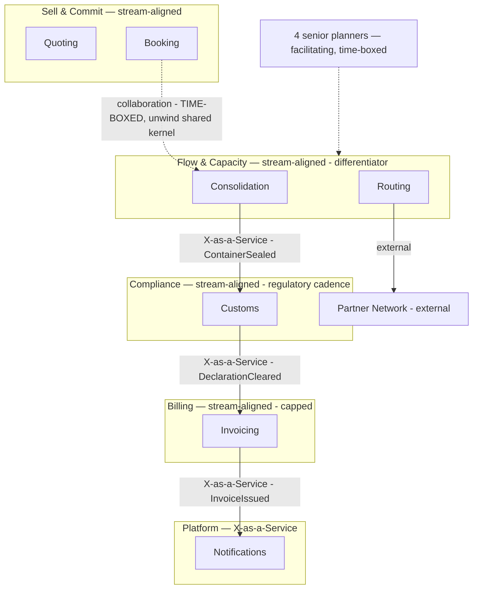

## Read this first — the evidence gap

There is **no headcount, team list, seniority mix, or current ownership record anywhere in this
repo**. Everything below is derived from the domain model alone (7 contexts, their mass figures,
their invariants, the confirmed event timeline, and the business model), so it is a *proposed*
topology, not a reorganisation plan. Before anyone moves a person, four inputs are needed:

| Missing input | Why it changes the answer | Who has it |
|---|---|---|
| Current engineer count and how they are grouped today | Decides whether this is 2, 3 or 5 teams (see *Sizing*) | Engineering manager |
| Seniority mix | Consolidation needs people who can hold an invariant under load; Billing needs people who can retire code | Engineering manager |
| Who is on call for what today | Ownership gaps show up in on-call, not org charts (see hotspot 3) | Ops |
| Cost/revenue per context | The business-model canvas records *"Cost structure — unknown, nobody owns the P&L"* | Whoever owns the P&L |

The one thing that does **not** depend on those inputs is the *shape* — which contexts belong
together, and where the seams between teams should fall. That is what this document commits to.

---

## The finding that drives the topology

Staffing in proportion to code mass would put the majority of engineering on the capability the
business says nobody buys, and a rump on the one customers pay a premium for.

| Context | Tables | Attributes | Share of all attributes | What the business model says about it |
|---|---:|---:|---:|---|
| Invoicing | 34 | 311 | **51%** | *"nobody has ever chosen us because of our invoices"* — commodity, no differentiation |
| Customs | 12 | 96 | 16% | required, no differentiation, *"two vendors already do it well"* |
| Quoting | 11 | 78 | 13% | partial — *"competitors quote in seconds too; we are no faster"* |
| Booking | 9 | 54 | 9% | where the money is committed |
| Consolidation | 5 | 41 | **7%** | **the differentiator** — the +18% Guaranteed Consolidation premium, the depot network, the planning know-how |
| Routing | 3 | 17 | 3% | *"the partner network is the asset, not the routing step"*; owns no rule of its own |
| Notifications | 2 | 11 | 2% | commodity, bought adapter |

Consolidation carries 7% of the system's attributes, one aggregate, and the only invariant the
company sells against (*"a container's committed volume must never exceed its capacity"* — break it
and the Guaranteed Consolidation promise breaks with it). The short-horizon goal in the business
model — fill rate 71% → 80% — lives entirely inside it. It is also the context still being run
partly on a whiteboard by four senior planners.

**Consequence for the topology:** team boundaries follow business differentiation, and *capacity
allocation is set deliberately against mass, not with it.* Consolidation gets the strongest team in
the company despite being the smallest codebase. Invoicing gets a deliberately capped team whose
mandate is to shrink, not to grow.

(The `subdomain_type` labels in `context-map.md` — 4 of 7 contexts marked `core`, Invoicing `core`,
Consolidation `supporting` — contradict the business model on every row that matters. They have not
been revisited since March. Do not use them to size teams.)

---

## Proposed teams

Five teams at full size. Four are stream-aligned, one is a thin platform. There is no
complicated-subsystem team: no context here is complicated in the algorithmic sense — Consolidation
comes closest, and it is better held by the stream-aligned team that lives with the outcome than
handed to a specialist group the depot planners cannot reach.

### 1. Flow & Capacity — stream-aligned (the differentiator team)

- **Owns:** Consolidation, Routing
- **Mass:** 8 tables, 58 attributes (9.5% of the system)
- **Outcome it is measured on:** average container fill 71% → 80%; zero broken Guaranteed
  Consolidation promises
- **Owns the invariant:** committed volume ≤ capacity — *exclusively*. No other team may write it.
- **Staff it first and staff it best.** Lowest mass, highest leverage. This is where the whiteboard
  becomes software and where the four senior planners' know-how gets codified.

**Why Routing sits here rather than with Booking.** Routing has no aggregates and no rules
(`transaction-script`, "owns no rule of its own") — it cannot carry a team. It has to attach
somewhere, and it belongs to the physical flow, not the commercial one: the hand-off to a carrier
happens *after* the container is sealed, and hotspot 3 records that **nobody knows who is
responsible when a partner carrier refuses a sealed container**. Sealing and hand-off in one team
closes that gap by construction. Attaching Routing to Booking instead would leave the seal→refusal
seam split across two teams — exactly the gap operations is already complaining about.

### 2. Sell & Commit — stream-aligned

- **Owns:** Quoting, Booking
- **Mass:** 20 tables, 132 attributes (22%)
- **Outcome:** quote-to-booking conversion, and time-to-quote
- One customer journey, one cadence, one team: a customer asks for a price and commits to a
  departure. Splitting Quoting from Booking would put a hand-off in the middle of a single
  conversation with the customer.

### 3. Compliance — stream-aligned, regulatory cadence

- **Owns:** Customs
- **Mass:** 12 tables, 96 attributes (16%)
- **Outcome:** declarations cleared on time across nine ports; zero hand-offs to a carrier before
  submission (the customs invariant)
- Separate from the flow teams because its change trigger is external — tax and customs rules
  across nine jurisdictions, on a regulator's calendar, not a product one. That is a genuine
  fracture plane, and it is why this team stays separate even though the capability is not
  differentiating.
- **Standing mandate:** the business model records that two commercial platforms already cover all
  nine ports and *"we integrate with neither."* This team's medium-term job is to evaluate buying
  and shrink itself, not to grow a twelve-table declaration engine.

### 4. Billing — stream-aligned, capped and shrinking

- **Owns:** Invoicing, and the Notifications adapter until a platform team exists
- **Mass:** 34 tables, 311 attributes (51% of the system)
- **Outcome:** invoice accuracy and days-sales-outstanding — *not* feature throughput
- **This is the deliberate under-staffing decision.** Eleven years of growth, five aggregates,
  three of which exist only to model VAT variation across nine ports. Its own notes say two
  aggregates arrived with the 2024 Finnish tax change. Half the system's attributes serve a
  capability the commercial director describes as never having won a customer.
- **Mandate: reduce.** Target a rating engine plus a ledger, with VAT variation as configuration
  rather than three aggregates. Evaluate a packaged billing product against that target. Do not
  fund proportional to mass — capping this team is what frees the people who go to Flow & Capacity.
- **Risk of this call:** billing defects are expensive and visible, and a capped team on a large
  legacy codebase raises defect risk before it lowers it. Mitigate by capping *feature* work while
  funding the reduction explicitly, not by simply removing people.

### 5. Platform — thin, X-as-a-Service

- **Owns:** Notifications (bought adapter), the `ShipmentRef` building block, event transport, and
  the partner-network integration surface
- **Mass:** 2 tables, 11 attributes (2%) plus shared infrastructure
- **Do not create this team below ~25 engineers.** Under that, its work is a rotating duty and
  Notifications hangs off Billing (both are commodity, both are downstream of `InvoiceIssued`).

### Enabling capability — a role, not a team

The four senior planners are the domain experts this topology depends on. Embed them with Flow &
Capacity in facilitating mode with an explicit end date, so their know-how ends up in the model
rather than in a whiteboard. Modelling and DDD coaching likewise runs as a rotating role until the
organisation is large enough that a permanent enabling team pays for itself.

---

## Topology map

## Interaction modes

| Between | Mode today | Target mode | Move |
|---|---|---|---|
| Sell & Commit ↔ Flow & Capacity | **Collaboration, unbounded** — `ConsignmentLine` is a shared kernel both teams write, and Booking does a synchronous remaining-capacity check then commands a reserve | **X-as-a-Service** | Consolidation exposes one `ReserveCapacity` operation that decides and answers. Booking stops reading capacity. Time-box the collaboration to one quarter; it is the only permitted collaboration in this topology |
| Flow & Capacity → Compliance | events | X-as-a-Service | `ContainerSealed`, published contract |
| Compliance → Billing | events | X-as-a-Service | `DeclarationCleared`; keep the two meanings of *consignment* translated at this seam, never unified |
| Billing → Platform | events | X-as-a-Service | `InvoiceIssued`; `CustomerNotified` is still unconfirmed in the discovery timeline — confirm before contracting on it |
| Senior planners → Flow & Capacity | ad hoc | Facilitating, time-boxed | End date and a codification goal, or it becomes permanent dependency |

Two seams deserve emphasis because the discovery hotspots already show them failing:

- **Hotspot 1** — two shipments committed to the same slot in March, *"nobody agrees where the check
  should have happened."* That is an ownership question, not a bug. A shared kernel written by two
  teams has no single owner for the invariant. One team owns it: Flow & Capacity.
- **Hotspot 2** — finance and operations use *consignment* differently (a billable line vs a
  physical stack of pallets). This is not a defect to reconcile; it is evidence that Billing and
  Flow & Capacity are correctly separate contexts. Translate at the boundary, keep both meanings.

---

## Sizing — what to do at each headcount

Team Topologies puts a stream-aligned team at roughly 5–9 people. Without a headcount this is the
decision table, ordered by what is known: **the split that survives every size is commercial flow
vs physical flow vs money.**

| Engineers | Teams | Grouping |
|---|---|---|
| Under ~10 | 2 | **Flow** (Consolidation, Routing, Booking) · **Commerce & Money** (Quoting, Customs, Invoicing, Notifications). Booking joins Flow at this size because the capacity seam is the expensive one and one team removes it |
| ~10–18 | 3 | **Sell & Commit** (Quoting, Booking) · **Flow & Capacity** (Consolidation, Routing) · **Money & Compliance** (Customs, Invoicing, Notifications) |
| ~18–25 | 4 | Split Compliance out of Money; Notifications stays with Billing |
| ~25+ | 5 | The full topology above, with the thin Platform team |

At every size, Flow & Capacity is formed first and protected. If there are not enough people for
Flow & Capacity to be a real team, that is the finding to escalate — it means the company is not
staffed to defend the thing it charges a premium for.

## Anti-patterns rejected

- **A team per bounded context (7 teams).** Routing (3 tables, no aggregates) and Notifications
  (2 tables, bought adapter) do not carry a team's worth of cognitive load, and one team per context
  freezes boundaries that the domain model itself says are wrong.
- **Staffing proportional to code mass.** Puts half of engineering on Invoicing. See the finding
  above.
- **A Consolidation "complicated subsystem" team.** It would separate the optimiser from the
  planners who correct it by hand, which is exactly the know-how that needs codifying.
- **A shared "core domain" team spanning Booking and Consolidation.** It preserves the shared
  kernel instead of retiring it, and leaves the invariant without a single owner.

## What would falsify this

- Consolidation turns out to be already fully automated and the whiteboard is legacy → its team can
  be smaller, and the differentiation sits in the depot network rather than in software.
- Invoicing has a contractual or regulatory commitment that forbids reduction → the cap becomes a
  freeze at current size instead of a shrink.
- Headcount is under ~8 → none of this is a topology question; it is one team with a priority order,
  and the priority order is the same: capacity first, money last.
