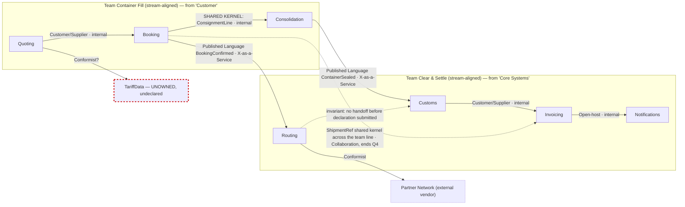

> This is a **proposal to be argued with**, not a reorg. It names team *shapes*, never people.
> Nobody on either team has been consulted yet — see *Open decisions*.

## Reality check

| Count | Value | Source |
|---|---|---|
| Engineers | 9 | stated by requester |
| Existing teams | 2 — "Core Systems" (5), "Customer" (4) | stated by requester |
| Bounded contexts | 7 (+ 1 undeclared: `TariffData`) | `docs/domain/context-map.md` |
| Contexts per engineer | 0.78 | arithmetic |

**The arithmetic rules out a team per context before anyone gets attached to the idea.** Nine
engineers supports **two teams**, which is what already exists. Seven contexts across two teams
means each team owns three or four, and the interesting question is not *how many teams* but *which
cut* and *what it costs*.

Model mass, which is what the teams actually have to hold:

| Context | Sub-domain type (repo) | Aggregates | Tables | Attributes | Share of system |
|---|---|---|---|---|---|
| Quoting | core | 1 | 11 | 78 | 13% |
| Booking | core | 1 | 9 | 54 | 9% |
| Consolidation | supporting | 1 | 5 | 41 | 7% |
| Routing | supporting | 0 | 3 | 17 | 3% |
| Customs | core | 1 | 12 | 96 | 16% |
| **Invoicing** | core | **5** | **34** | **311** | **51%** |
| Notifications | generic | 0 | 2 | 11 | 2% |
| **Total** | | **9** | **76** | **608** | |

One context — `Invoicing` — is half the cognitive load of the entire system. Every ownership option
below is really a question about who absorbs that.

### Known vs assumed

| Fact | Status |
|---|---|
| 9 engineers, 2 teams, current team names | stated by requester |
| Both teams commit to the invoicing codebase | **stated by requester — no evidence in the repo.** The repo contains no ownership, CODEOWNERS or commit data (this is deliberate in the fixture) |
| Model mass, invariants, relationships | measured from `docs/domain/*/model.yaml` |
| Differentiation and evolution stage | `docs/domain/business-model.md` — sourced from the commercial director, marked `proxy` for customer views |
| **What each team knows today** | **unknown.** This is the single biggest gap; it decides whether the one context move below is cheap or expensive |
| Extrinsic load — on-call, environments, deploy, ticket queues | **unknown.** Not in the repo, not stated. The load verdicts below are intrinsic-only and therefore optimistic |
| `docs/domain/core-domain-chart.md` | **absent.** Placement is inferred from `business-model.md` instead, so every "is this worth a long-lived team" judgement here is weaker than it should be |
| `docs/domain/message-flows/` | **absent.** Interaction modes below are read off `context-map.md` relationships, per-context `relationships:` and the discovery timeline — thinner evidence than real flows. Two of the three cross-team modes would be confirmed or refuted by running `domain-connect` first |

## Ownership

Proposed cut: **sell-and-fill** vs **clear-and-settle** — a phase fracture plane, not a layer one.

| Context | Proposed team | Team type | Sub-domain type | Load contribution | Notes |
|---|---|---|---|---|---|
| Quoting | Container Fill | stream-aligned | core (repo) / partial differentiation (business model) | 11 tables, 78 attrs, 1 agg | customer entry point; the two labels disagree — a `domain-strategize` question |
| Booking | Container Fill | stream-aligned | core | 9 tables, 54 attrs, 1 agg | commits the money; holds `ConsignmentLine` jointly with Consolidation |
| Consolidation | Container Fill | stream-aligned | labelled `supporting`, is the **actual differentiator** | 5 tables, 41 attrs, 1 agg | must sit with Booking — shared kernel + the no-overbooking invariant. Likely a **move** from today's owner |
| Routing | Clear & Settle | stream-aligned | supporting | 3 tables, 17 attrs, 0 agg | owns no rule of its own, but carries the "no handoff before declaration submitted" precondition |
| Customs | Clear & Settle | stream-aligned | core | 12 tables, 96 attrs, 1 agg | regulated; keeps Routing's invariant inside one team |
| Invoicing | Clear & Settle | stream-aligned | labelled `core`, business says **commodity** | 34 tables, 311 attrs, 5 aggs | **single owner — this is the change.** Container Fill stops committing here |
| Notifications | Clear & Settle | stream-aligned | generic | 2 tables, 11 attrs, 0 agg | bought adapter; near-zero intrinsic load. Watch for domain rules growing inside it |
| `TariffData` | **NOBODY** | — | undeclared | unknown | appears on the context map, has no `model.yaml`, no classification row, and — unlike `PartnerNetwork` — is **not marked external**. See finding 5 |
| `PartnerNetwork` | external vendor | n/a | n/a | n/a | Conformist; we take the carriers' contracts as given |

**No platform team, no enabling team, no complicated-subsystem team.** Nine engineers cannot staff a
third team without cutting one of these two below viable size. What a platform team would need is in
*Option B* below; until then, platform capability should be **bought**, not built, and the extrinsic
load it would absorb should be measured first (it currently is not).

### Why not the obvious cut

The tempting split — customer-facing (Quoting, Booking, Notifications) vs operations (Consolidation,
Routing, Customs, Invoicing) — puts `Booking` and `Consolidation` in different teams. That is the one
cut the model forbids:

- `ConsignmentLine` is an explicit **Shared Kernel** — *both write it* (`context-map.md`).
- `Booking` does a **synchronous remaining-capacity check then commands a reserve**, while the
  invariant "committed volume must never exceed capacity" is owned by `Consolidation`.
- Hotspot 1: two shipments were committed to the same slot in March and *"nobody agrees where the
  check should have happened"*.

Split across teams, that becomes a **permanent collaboration edge** — every change to either side
needs mutual consent, forever. Same team, it is an internal design problem the owning team can fix
on its own schedule.

## Team cognitive load

| Team | Contexts owned | Intrinsic (model mass) | Extrinsic | Verdict |
|---|---|---|---|---|
| **Container Fill** (proposed 4–5 eng) | Quoting, Booking, Consolidation | 3 aggregates · 25 tables · 173 attrs · 3 invariants · 1 differentiating context | unknown; plus a **whiteboard dependency** — load planning is partly manual and 4 senior planners resolve infeasible stacks by hand | **Within budget.** One differentiating context plus two contained ones, matching the rule of thumb. Has headroom for the 71% → 80% fill goal — which is the point of this cut |
| **Clear & Settle** (proposed 4–5 eng) | Routing, Customs, Invoicing, Notifications | 6 aggregates · 51 tables · 435 attrs · 3 invariants · 2 regulated contexts | unknown; VAT rule changes arrive from outside on their own schedule | **Over budget.** `Invoicing` alone is 5 of the team's 6 aggregates and 71% of its attributes. Two heavyweight contexts (`Invoicing` 34 tables, `Customs` 12) in one team means one of them gets the leftovers, and it will be `Customs` — the regulated one |

**To add anything to Clear & Settle, something must come off first.** In order of cheapness:

1. `Notifications` — the smallest, but removing it saves ~2% of the load. Not worth a reorg.
2. `Customs` — *"two commercial customs platforms cover all nine ports; we integrate with neither"*
   (`customs/model.yaml`). Integrating instead of hand-building removes 12 tables / 96 attrs.
3. `Invoicing` — the real one. 3 of its 5 aggregates exist to model VAT variations; the business says
   *"nobody has ever chosen us because of our invoices"*. Shrinking or buying it is the only move that
   changes the arithmetic materially.

Options 2 and 3 are **`domain-strategize` decisions, not organisational ones** — they are recorded
here as the price of the topology, not proposed as boundary changes.

### The headcount ratio is backwards

Today: 5 engineers on the side that becomes Clear & Settle (commodity + compliance, zero stated
differentiation), 4 on the side that becomes Container Fill (the premium the business charges 18%
for, and the only stated short-term goal: fill 71% → 80%).

The proposal keeps the 5/4 split only because moving people is not this document's call. If the fill
goal is real, the ratio should invert — but that trade is only affordable *after* `Invoicing` shrinks.
Flagged as an open decision, not decided here.

## Interaction modes

Read off `context-map.md`, per-context `relationships:` and `discovery/timeline.md` — **not** off
message flows, which do not exist yet.

| Team A | Team B | Mode | Why (flow evidence) | Ends when |
|---|---|---|---|---|
| Container Fill | Clear & Settle | **X-as-a-Service** | `BookingConfirmed` → Routing and `ContainerSealed` → Customs. One event each, one direction, no back-and-forth anywhere in the timeline | steady state — no end date; this is the target for the pair |
| Container Fill | Clear & Settle | **Collaboration — time-boxed** | `ShipmentRef` is shared as "Building Blocks" across Booking, Consolidation, Customs and Invoicing, i.e. across the team line, with no declared owner. And `Consignment` means *physical unit* on one side, *billable line* on the other (hotspot 2) | **ends when** `ShipmentRef` is published as a versioned contract owned by Container Fill, and the two meanings of "consignment" are renamed apart. Propose **one quarter**; if it is still open after that, the boundary is wrong, not the meeting |
| Container Fill | Clear & Settle | **Collaboration — time-boxed** | The Guaranteed Consolidation premium is *sold* in Booking, *delivered* by Consolidation, *charged* by Invoicing. The rule *"the premium is charged whether or not the container ends up full"* is stated by finance and lives in no context | **ends when** the premium's billing contract is written down and owned by exactly one context. Propose **one quarter** |
| Clear & Settle | Partner carriers (external) | n/a — vendor | `Routing` forwards to `PartnerNetwork` unchanged | n/a |
| either team | a platform/enabling team | **not proposed** | cannot be staffed at 9 engineers | — |

The two collaborations should be **one scheduled piece of work with two exit criteria**, not two
standing meetings. Both have end dates on purpose: a collaboration without one silently becomes the
operating model and its cost stops being visible.

**No permanent collaboration edge survives this cut** — that is the main thing the cut buys. The
`Booking`/`Consolidation` pair, which *would* have been permanent, is now internal to one team.

## Sociotechnical map

Two labels per cross-team edge: the DDD pattern says *what crosses the boundary*, the interaction
mode says *how the teams behave*. The `Booking ⇢ Invoicing` dashed edge is the one to watch — a
Shared Kernel spanning a team line is the most expensive relationship on the map and it is currently
unlabelled anywhere in the repo.

## Independent Service Heuristics

| Candidate boundary | Yes / probably | Weakest answers |
|---|---|---|
| **Container Fill** (Quoting + Booking + Consolidation) | 7 / 10 | **Cost tracking (4): no** — `business-model.md` says the cost structure is unknown and nobody in the room owns the P&L, so this team cannot see the margin it is optimising. **Dependencies (8): no** — depends on `TariffData`, which has no owner, and on a shared kernel it does not own. **Data (5): partial** — clearance status comes back from the other team, and the tariff source is undeclared. Everything else is strong: it maps to a branded product (Guaranteed Consolidation), attaches to real revenue (+18% premium), has clear personas (exporters, depot planners), and owns the only stated goal (fill 71% → 80%) |
| **Clear & Settle** (Routing + Customs + Invoicing + Notifications) | 4 / 10 | **Teams (7): no** — 51 tables / 435 attrs / 6 aggregates is over what 5 engineers can hold, and the reference's own test ("bounded cognitive load") fails outright. **Impact/value (9): weak** — every context here is commodity or compliance; the business says outright that nobody chooses Nordic Freight for its invoices, so the team risks being read, internally and by itself, as the legacy team. **Product decisions (10): no** — the roadmap is set by tax law and by the other team's flow. **Revenue (3) / Brand (2): no** — cost centre. This boundary is a **grouping of leftovers, not a stream of change.** It becomes a real one only if the team's mandate is explicitly *"shrink or buy Invoicing and Customs"* — which fixes questions 7, 9 and 10 at once |
| **Invoicing alone** (hypothetical third team) | 6 / 10 | Scores *well* on sense-check, brand, data and personas — billing genuinely is a SaaS category, which per the Wardley consideration is an argument for **buying it, not for staffing it**. Fails on **teams (7)** for the only reason that matters here: a third team cannot be staffed at 9 engineers. Also fails **product decisions (10)** — VAT rules are external. Recorded so the option is visibly rejected on staffing, not pretended to be a bad idea |

Reported as weakest answers rather than totals: *"7/10 but it cannot see its own costs and its tariff
input has no owner"* is something a team can act on; "7/10" is not.

## Findings

| # | Finding | Evidence | Suggested move |
|---|---|---|---|
| 1 | **`Invoicing` is owned by two teams.** Shared ownership is no ownership — every change needs a negotiation nobody scheduled, and the codebase grows one seam per team | stated by the requester ("both teams committing to the invoicing codebase all year"); **not verifiable in the repo** — no CODEOWNERS or commit data exists | Single owner: **Clear & Settle**. Container Fill's billing needs go through a **Customer/Supplier** agreement into that backlog, not through direct commits. Verify with `git shortlog` per directory before acting |
| 2 | **Half the org's cognitive load buys zero differentiation.** `Invoicing` is 51% of the system's attributes and 56% of its aggregates, is labelled `core` in the context map, and the business calls it a commodity — *"nobody has ever chosen us because of our invoices"* | `invoicing/model.yaml` (34 tables, 311 attrs, 5 aggs); `business-model.md` differentiation row | **Not fixable here.** Send to `domain-strategize` as a buy/shrink candidate. This topology's load imbalance is a *symptom* of that mislabelling; no cut of 7 contexts across 2 teams makes it disappear |
| 3 | **`Booking` and `Consolidation` cannot be split across teams** — a shared kernel both sides write, a synchronous check-then-act, and the invariant owned by the downstream side | `context-map.md` shared artifacts; `booking/model.yaml` relationship note; hotspot 1 (March double-booking, *"nobody agrees where the check should have happened"*) | Same team (done in this proposal). The check-then-act itself is a **`domain-connect` finding** — the boundary is under-designed regardless of who owns it |
| 4 | **The differentiator is labelled `supporting`.** `Consolidation` is the capability the +18% premium is sold on, and it carries the smallest model of any non-adapter context | `context-map.md` classification vs `business-model.md` (revenue-generator, custom-built, differentiation **yes**) | Relabel via `domain-strategize`. Organisationally: a `supporting` label predicts it gets whatever attention is left over — so its capacity inside Container Fill must be **protected explicitly**, not left to prioritisation |
| 5 | **`TariffData` has no owner and no declaration.** It appears on the context map as a `Quoting` dependency but has no `model.yaml`, no classification row, and — unlike `PartnerNetwork` — is not marked external | `context-map.md` graph vs the classification table and `docs/domain/*/` | Decide within a week whether it is an external supplier or an 8th context. If external, mark it and name the vendor relationship; if internal, it belongs to Container Fill. Unowned contexts rot and the first incident is a surprise |
| 6 | **No owner for a carrier refusing a sealed container** — the sealed container is `Consolidation`'s (Container Fill), the carrier relationship is `Routing`'s (Clear & Settle). The gap crosses the proposed team line | hotspot 3, `discovery/timeline.md` | Assign incident ownership explicitly at the topology decision, not during the next incident. Default proposal: **Clear & Settle** owns the carrier conversation, Container Fill owns re-planning the load |
| 7 | **The headcount ratio contradicts the stated goal.** 5 engineers on the commodity/compliance side, 4 on the differentiator, while the only short-term goal is fill 71% → 80% | requester's counts; `business-model.md` goals table | Leadership + both teams. Inverting the ratio is only affordable after finding 2 is acted on — otherwise Clear & Settle drops below the size its 51-table load needs |
| 8 | **Knowledge concentration on the differentiator.** Load planning happens partly on a whiteboard and four senior planners resolve infeasible stacks by hand | `consolidation/model.yaml` notes; `business-model.md` key resources | Whichever team owns `Consolidation` needs daily access to those planners — that is a co-location/ritual decision, not a code one. **Engineering bus factor is unknown** — the repo has no ownership data to measure it with |
| 9 | **Inverse Conway pressure: the team names encode a layered split.** "Core Systems" and "Customer" name a platform/frontend divide. Left alone, that structure will keep reproducing a layered architecture whichever contexts are assigned today | team names as stated; Conway's law | Rename to flow names (`Container Fill`, `Clear & Settle` or whatever the teams choose). Renaming is nearly free and is the cheapest lever available; the expensive part is the one context move (`Consolidation`) and stopping the cross-team commits to `Invoicing` |
| 10 | **`Routing` makes no decision of its own** — no aggregates, transaction-script, forwards `BookingConfirmed` unchanged. It is placed with `Customs` because the "no handoff before declaration submitted" invariant would otherwise cross the team line | `routing/model.yaml` aggregates_rationale; `customs/model.yaml` invariant | Keep with Clear & Settle. Whether `Routing` should exist as a context at all is a **`domain-connect`/`domain-decompose` question** — deliberately not answered here |

## Option B — what a third team would need

If a platform or enabling team is wanted, the honest price:

- **~13–15 engineers**, not 9. Three teams of 4–5 with two of them owning the current load.
- A measured extrinsic-load baseline first — deploy time, environment count, on-call volume. None of
  it exists today, so a platform team would be built on a guess.
- At 9 engineers the alternative is to **buy** platform capability. A platform that stream-aligned
  teams must file tickets against is a queue with better branding, and a 4-person platform team
  serving two 2-person product teams is worse than no platform team at all.

## Open decisions

Each needs a person, not a document.

1. **Does `Invoicing` get one owner, and is it Clear & Settle?** — both tech leads plus whoever owns
   the finance relationship. Blocks everything else; decide first.
2. **Does `Consolidation` move to the Booking team?** — the two teams, with the four senior planners
   in the room. This is the only context move proposed, and its cost is knowledge transfer nobody has
   measured.
3. **Is `Invoicing` shrunk, bought, or kept?** — product/commercial leadership. Until this is
   answered, Clear & Settle is over budget by design and no amount of reorganising fixes it.
4. **Is `TariffData` external or ours?** — whoever owns the quoting integration. One week.
5. **Who owns a refused sealed container?** — both teams, before the next occurrence.
6. **Does the 5/4 split invert toward the fill goal?** — leadership, after decision 3.
7. **Do the teams accept these names and this cut at all?** — the teams. Everything above is input to
   that conversation.

### Who has not been consulted

The **nine engineers** (none of this has been shown to them; team self-selection has not been
offered), the **four senior planners** whose know-how decision 2 depends on, **whoever owns the P&L**
(nobody in the modelling room did — which is why ISH question 4 fails for both boundaries), and **any
customer** (the differentiation claims trace to the commercial director speaking as proxy).
