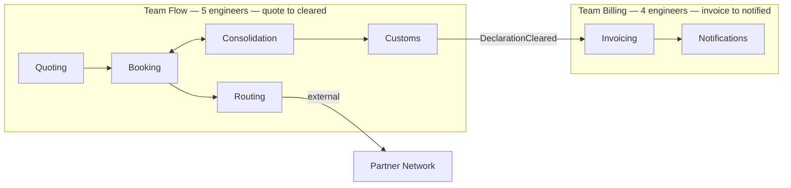

## Reality check first

| Input | Value | Source |
|---|---|---|
| Engineers | 9 | prompt |
| Existing teams | 2 — "Core Systems" (5), "Customer" (4) | prompt |
| Bounded contexts | 7 | `context-map.md` |
| Contexts with a domain model | 5 — Routing and Notifications have `aggregates: []` | per-context `model.yaml` |
| Ownership recorded anywhere in the repo | none — every doc is `owner: TBD` | `context-map.md`, `business-model.md`, `discovery/timeline.md` |

Seven contexts do not buy seven teams. A stream-aligned team needs roughly 5 people to hold a
backlog and an on-call rotation at the same time; 9 engineers fund **two** teams, and the two that
exist are already the right number. Everything below is about *where the line between them falls*,
not how many lines there are.

This document assigns **contexts to teams**. It names no individuals — the repo contains no roster,
and mapping people to teams is the tech leads' call, not a document's.

## Cognitive load, measured

Load is estimated from the mass figures the models already carry, not asserted.

| Context | Tables | Attributes | Densest entity | Aggregates | Invariants | Pattern |
|---|---:|---:|---:|---:|---:|---|
| Invoicing | 34 | 311 | 128 | 5 | 1 | full-domain-model |
| Customs | 12 | 96 | 34 | 1 | 1 | full-domain-model |
| Quoting | 11 | 78 | 26 | 1 | 1 | full-domain-model |
| Booking | 9 | 54 | 22 | 1 | 1 | full-domain-model |
| Consolidation | 5 | 41 | 18 | 1 | 1 | full-domain-model |
| Routing | 3 | 17 | 9 | 0 | 0 | transaction-script |
| Notifications | 2 | 11 | 7 | 0 | 0 | bought-adapter |
| **Total** | **76** | **608** | — | **9** | **5** | |

Two figures drive the whole proposal:

- **Invoicing is 45% of the tables, 51% of the attributes and 56% of the aggregates** in the entire
  system. It is a team's worth of work by itself.
- **Routing and Notifications carry 5 tables and 0 aggregates between them.** They are adapters, not
  streams. Counting them as two of the "seven contexts to staff" inflates the problem by 29%.

One caveat on the method: mass is a *floor* on cognitive load, not the whole of it. Consolidation
looks small at 5 tables, but `consolidation/model.yaml` records that load planning still runs partly
on a whiteboard in Gothenburg and that four senior planners override the optimiser by hand. That
complexity is real and currently sits outside the code, so any capacity plan that reads
Consolidation as "the small one" is reading the wrong number.

## Proposal — two stream-aligned teams, one cut

Cut the value chain once, between **Customs** and **Invoicing**.

| Team | Engineers | Contexts | Tables | Attributes | Aggregates | Invariants |
|---|---:|---|---:|---:|---:|---:|
| **Flow** (today's "Core Systems") | 5 | Quoting, Booking, Consolidation, Routing, Customs | 40 (53%) | 286 (47%) | 4 | 4 |
| **Billing** (today's "Customer") | 4 | Invoicing, Notifications | 36 (47%) | 322 (53%) | 5 | 1 |



Five contexts against two looks lopsided until you read the mass: 40/36 tables and 286/322
attributes is close to even, and Billing actually carries the heavier per-engineer share.

Four reasons this is the right seam:

1. **It leaves exactly one cross-team edge**, `DeclarationCleared`, which is already a one-way event
   with no shared write. Every other relationship in `context-map.md` becomes internal to a team.
2. **It follows the language fault line.** Hotspot #2 in `discovery/timeline.md` records that finance
   and operations use "consignment" to mean different things — a billable line versus a physical
   stack of pallets. `invoicing/model.yaml` defines Consignment as "a billable line on an invoice";
   `booking/model.yaml` defines it as "the goods a customer hands over as one unit". Two vocabularies
   that genuinely differ belong to two teams, and the boundary should sit between them.
3. **It puts the ConsignmentLine Shared Kernel inside one team.** See below.
4. **It keeps the Routing/Customs ordering rule internal.** "A shipment cannot be handed to a carrier
   before its declaration is submitted" spans Routing and Customs. Split those across teams and a
   safety rule becomes a cross-team contract with a release-ordering dependency.

### The ConsignmentLine Shared Kernel is an org cost, and this cut removes it

`context-map.md` lists `ConsignmentLine` as a Shared Kernel between Booking and Consolidation, with
both contexts writing it. Across a team boundary a Shared Kernel is the most expensive relationship
available: every change needs both teams to agree, both test suites to stay green, and both
deployments to line up. It couples two backlogs and two release cadences permanently.

There are two ways out. Break the kernel into two models with a translation between them, which is
real engineering work. Or put both contexts under one team, which costs nothing and is what this
proposal does. Booking and Consolidation stay together and the mutual-consent process simply does
not exist.

The invariant argument points the same way. "A container's committed volume must never exceed its
capacity" is owned by Consolidation, but `booking/model.yaml` records a *"synchronous
remaining-capacity check before reserving"* — Booking asks how much room is left, then commits.
Between the read and the write another booking can take the slot, which is hotspot #1: two shipments
committed to the same container slot in March, and nobody agreeing where the check should have
happened. Fixing it means moving the decision fully inside Consolidation, so that reserving either
succeeds or fails atomically. That is a one-team refactor if Booking and Consolidation share a team
and a cross-team API negotiation if they do not. Splitting them would need to be justified against
both the kernel and this invariant; nothing in the repo justifies it.

### Rejected alternatives

| Option | Why not |
|---|---|
| **Three teams (3/3/3)** | Cuts the chain twice instead of once, so cross-team contracts double, while every team drops below the size that can carry an on-call rotation and a backlog. Revisit at ~12 engineers. |
| **Make "Core Systems" a platform team** | The name invites it; the repo does not support it. Nothing here is a shared internal service — Notifications is a bought adapter at 2 tables, which is a vendor integration, not a platform. A platform team would take 5 of 9 engineers off product flow to serve exactly one consumer, which is a handoff with a nicer name. |
| **Move Quoting to the "Customer" team to preserve the team names** | Adds a second cross-team edge (Quoting→Booking) and loads the smaller team to 47 tables / 400 attributes — 100 attributes per engineer against 42 on the other side. Rename the teams instead; it is cheaper than moving the work. |
| **Split Booking from Consolidation** | Turns the Shared Kernel and the no-overbooking invariant into cross-team contracts. See above. |

### Rename both teams

"Core Systems" reads as a platform team to anyone who has not read the context map, and a platform
team is the one thing 9 engineers cannot afford. "Customer" will own invoicing and notifications
while the most customer-facing context, Quoting, sits on the other team. Name each team after the
slice of the value stream it owns — **Flow** (quote to cleared) and **Billing** (invoice to
notified), or any two names with that property. Renaming is a day of work; the misreading costs a
staffing argument every planning cycle.

## Finding: Invoicing has two owners, which means it has none

This is the actual pain in the request, and it is a boundary problem rather than a code-review
problem.

**Evidence.** Invoicing is the largest model in the system (34 tables, 311 attributes, 5 aggregates,
one entity with 128 attributes). It is the only context whose ubiquitous language directly
contradicts another context's. `invoicing/model.yaml` notes it has grown over eleven years, with
three of five aggregates existing only to model VAT variation across nine ports. No owner is
recorded anywhere in the repo. Two teams have been committing to it all year.

**Why "more code review" will not fix it.** Review adds latency to every change and still permits
two vocabularies, two mental models and two competing designs to land in one codebase. Shared
ownership is not a discipline failure; it is what happens when a context has no owner and two teams
have a legitimate reason to change it. Only one of those reasons should survive.

**Recommendation: Team Billing is the single owner of Invoicing.** Billing owns the finance
vocabulary, and Invoicing is the bulk of its load by design.

**Give Flow a contract instead of commit access.** The Flow team edits Invoicing today because there
is no other way to get a billing change made. Replace that with a published input contract —
`DeclarationCleared` from Customs plus a projection of the booking data Invoicing needs (customer,
consignment lines, surcharge inputs). Flow's billing needs then arrive as requests against a
versioned contract rather than as commits into someone else's aggregate.

**Enforce it with CODEOWNERS, not with a norm.** Once the invoicing paths are known, one entry does
the work a policy will not:

```
/services/invoicing/   @nordic-freight/billing
/services/notifications/   @nordic-freight/billing
```

(Adjust to the real paths — this repo holds documents, not code.)

## Interaction modes

Two teams give exactly one pair.

| Pair | Mode | Duration | End condition |
|---|---|---|---|
| Flow → Billing | **Collaboration** | Transition window, target 6 weeks from the topology decision | All three must hold: (a) `CODEOWNERS` on the invoicing paths resolves to Billing only; (b) zero commits from Flow engineers to invoicing paths for 3 consecutive weeks; (c) the Invoicing input contract (`DeclarationCleared` + booking projection) is written down and versioned. |
| Flow → Billing | **X-as-a-Service** | Ongoing, once the window closes | — |
| Billing → Flow | **X-as-a-Service** | Ongoing from day one | Billing consumes `DeclarationCleared`; it has no reason to change Flow's code. |
| Flow → Partner Network (external) | **X-as-a-Service** (consumed) | Ongoing | Routing holds the anti-corruption boundary. |

The Collaboration edge is deliberately time-boxed. Collaboration without an end date is how shared
ownership gets re-established under a better name. If the window closes without the end conditions
met, that is a signal the contract was scoped wrong, and the answer is to re-scope the contract, not
to extend the window.

Booking ↔ Consolidation appears in no row above. That is the point: inside one team it is not an
interaction mode, it is a refactor.

## Two things the topology cannot fix, flagged for the record

**Invoicing is a commodity carrying 45% of the system.** `business-model.md` classifies Invoicing as
`compliance-enforcer` / `commodity` / no differentiation, quoting the commercial director: *"nobody
has ever chosen us because of our invoices."* Yet `context-map.md` labels it `core` and it is the
biggest thing engineering owns. Three of its five aggregates model VAT across nine ports, which is
precisely what a bought tax engine does. Shrinking Invoicing is the highest-leverage move available
for the 4-person team's load, and it is a build-versus-buy decision that deserves its own RFC rather
than a line in a topology document. The same logic applies to Customs (12 tables, 96 attributes,
`no` differentiation), where `customs/model.yaml` already notes that two commercial platforms cover
all nine ports and Nordic Freight integrates with neither.

**Consolidation is labelled `supporting` and is the only differentiator.** `business-model.md` marks
load consolidation as the one capability with `differentiation: yes`, backed by an 18% premium and
the only numeric goal in the repo (container fill 71% → 80%). It has the smallest model of any
context with a domain model, and `context-map.md` calls it back-office. Four of seven contexts are
labelled `core` while the thing customers pay extra for is not one of them; that classification has
not been revisited since March, by its own admission. This proposal puts Consolidation on the larger
team on purpose, but a team assignment does not protect it inside a shared backlog. Give the
fill-rate work a standing allocation, and re-run the subdomain classification against the business
model before the next planning cycle.

## Assumptions and what to verify

| Item | Status | Cheapest check |
|---|---|---|
| Both teams commit to Invoicing | Stated in the request; unverifiable here, the repo holds no code or history | `git log --format='%an' -- <invoicing paths> \| sort \| uniq -c` — if the split is 90/10 rather than 50/50, this is a cleanup, not a re-org |
| Team sizes 5 and 4 | Given; no seniority or on-call data available | Confirm each team can staff an on-call rotation after the cut |
| Real code paths for CODEOWNERS | Unknown | Map contexts to directories before writing the entry |
| Routing is a context at all | 3 tables, 0 aggregates, `owns no rule of its own` per its own model | Flow team's call — likely an anti-corruption adapter belonging to Booking, which would take the count to 6 contexts. Modelling decision, no effect on this topology |
| Notifications is a context at all | 2 tables, 0 aggregates, adapter over a bought provider | Same. Attaches to Invoicing either way |

## Decision summary

1. Stay at two teams. Nine engineers do not fund a third, and seven contexts do not require one.
2. Cut at Customs → Invoicing. One cross-team edge, and it lands on the language fault line.
3. Keep Booking and Consolidation together, which removes the Shared Kernel's mutual-consent cost
   and makes the no-overbooking fix a one-team refactor.
4. Invoicing gets a single owner (Billing), enforced by CODEOWNERS and a published input contract.
5. Collaboration between the teams is time-boxed to the transition, with three stated end conditions,
   then drops to X-as-a-Service.
6. Rename both teams after the value-stream slice they own.
7. Open a separate decision on shrinking Invoicing and Customs. Both are commodity capabilities and
   together they are 60% of the system's tables.
