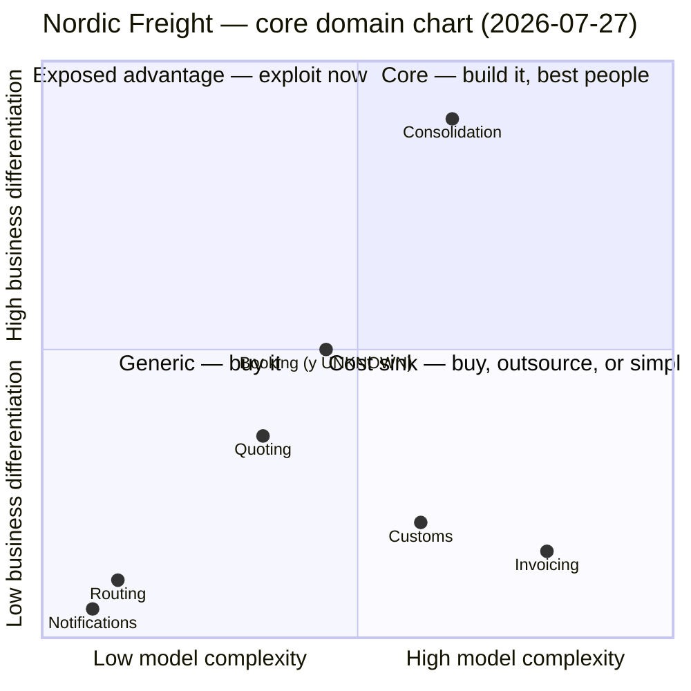

## How this was assessed

Desk assessment from the existing artifacts — no workshop was held for this chart.

| Axis | Sourced from | Confidence |
|---|---|---|
| **x — model complexity** | `docs/domain/*/model.yaml` mass figures, aggregate/invariant/event counts, `context-map.md` relationships, plus the operational notes in `consolidation/model.yaml` and `invoicing/model.yaml` | good for relative ordering; the counts are proxies, and the judged adjustments are called out separately in the placement table |
| **y — business differentiation** | `business-model.md` (2026-05-18) — pricing page, investor one-pager, commercial-director and depot-planner interviews | **medium, and uniformly second-hand.** No customer took part in that session; every differentiation row is the commercial director speaking for customers, marked `proxy` in the source. The one exception is the Guaranteed Consolidation premium, which is on the published pricing page — the only y evidence in this chart that is an artifact rather than an opinion. |

**Who still has to be in the room.** A customer (or five) to convert the proxy differentiation rows
into evidence. Whoever owns the P&L — `business-model.md` records the cost structure as unknown,
which means the buy-vs-build case below can be argued but not yet priced.

**What stayed unknown.** `Booking` has no capability row in `business-model.md` at all. Its
differentiation is not low — it is *unassessed*. It appears on the chart marked as such and should
not be read as a placement.

## Chart

`Booking` is drawn at the y midline as a placeholder so it is not silently dropped. That is not an
assessment — see *Open questions*.

Evolution annotation (from `business-model.md`, Wardley stages), carried onto the chart because it
says where each dot is drifting: Consolidation `custom-built` · Quoting `product` · Customs
`product` · Routing `product` · Invoicing `commodity` · Notifications `commodity`.

## Placement

| Context | Complexity | Evidence (measured) | Adjustment (judged) | Differentiation | Source | Quadrant |
|---|---|---|---|---|---|---|
| **Consolidation** | 0.65 | 5 tables, 41 attrs, densest entity 18; 1 aggregate, 2 events; 2 integrations (Booking sync, Customs) | **+ substantial.** Three reasons the mass understates it: (1) the one invariant it owns — committed volume never exceeds capacity — is the hardest in the system and is the invariant the paid promise rests on; (2) load planning still runs partly on a whiteboard in Gothenburg, with four senior planners hand-resolving infeasible stacks — that is real complexity the software has not absorbed yet; (3) the planners' know-how is named a key resource in the business model, i.e. specialist expertise that is expensive to hire | **high** | Pricing page: Guaranteed Consolidation premium, +18% of the forwarding fee. Value proposition: *"full-container prices on part-load shipments"*. Commercial director: a new entrant would need both the depot network and the planning know-how | **Core** |
| **Booking** | 0.45 | 9 tables, 54 attrs, densest 22; 1 aggregate, 1 invariant, 2 events, 1 VO; **3 integrations — the highest in the system** (Quoting, Consolidation, Routing), plus a Shared Kernel on `ConsignmentLine` | + slight, for integration load and the shared-kernel coupling | **unknown** | No capability row exists in `business-model.md` | **Unplaced** — hold |
| **Quoting** | 0.35 | 11 tables, 78 attrs, densest 26; 1 aggregate, 1 invariant (validity window), 2 events; 1 integration | − slight. 11 tables and 78 attributes behind a single aggregate with one time-window rule reads as breadth (lanes, tariffs, variants), not depth | **low-mid** | *"competitors quote in seconds too; we are no faster"* — partial at best; evolution `product` | **Generic**, drifting toward the left edge |
| **Customs** | 0.60 | 12 tables, 96 attrs, densest 34; 1 aggregate, 1 invariant, 2 events; 2 integrations | ± none. The complexity is genuine and regulatory — nine ports, real consequences for errors. But it is *not proprietary* complexity: `customs/model.yaml` records that two commercial platforms already cover all nine ports and we integrate with neither | **low** | *"required, and two vendors already do it well"*; evolution `product` | **Cost sink** |
| **Invoicing** | 0.80 | **34 tables, 311 attrs, densest entity 128 attributes**; 5 aggregates; 1 event; 1 invariant; 2 integrations | **− for essential complexity, and a debt finding.** One invariant across 311 attributes is a mass-to-rule ratio that says data, not domain. A 128-attribute entity is accidental complexity by any reading. Three of five aggregates model VAT variation across nine ports — that part is real regulatory complexity, but it is regulatory complexity every billing vendor already handles. Grown over eleven years | **lowest in the system** | Commercial director, verbatim: *"nobody has ever chosen us because of our invoices"*; evolution `commodity` | **Cost sink** |
| **Routing** | 0.12 | 3 tables, 17 attrs; 0 aggregates; transaction script; owns no rule of its own — receives `BookingConfirmed` and forwards to the carrier on the standing lane contract | none | **low** | Depot planners: *"the partner network is the asset, not the routing step"* | **Generic** |
| **Notifications** | 0.08 | 2 tables, 11 attrs; 0 aggregates; already a bought adapter | none | **low** | Commercial director: no | **Generic** |

## Decisions

| Context | Build / buy / outsource | Modelling rigour | Team type implied | Rationale |
|---|---|---|---|---|
| **Consolidation** | **Build**, in-house, and increase the investment | **Full domain model** — and specifically, absorb the whiteboard. The optimiser/planner conflict resolution is the modelling work worth doing. Property tests on the capacity invariant; scenario coverage on infeasible stacks | Long-lived **stream-aligned** team, most stable membership in the org, strongest modellers. Never outsource | It is the only capability with priced, artifact-backed differentiation, it is the only one at `custom-built` evolution, and the short-horizon company goal (fill 71% → 80%) lands entirely inside it |
| **Invoicing** | **Buy** — evaluate a billing engine behind an anti-corruption layer. Do not decide today; run a procurement spike (see open questions) | **Freeze.** Stop extending the model. Characterization tests before anything is touched. Contain behind the ACL | Minimum viable ownership. Explicitly **not** staffed with the people needed on Consolidation | Highest complexity, lowest differentiation, and `commodity` evolution — the textbook cost sink. Note the trap: a large part of that 34-table mass is accidental, so *refactoring it beautiful* is the most expensive available mistake. Contain or replace; do not polish |
| **Customs** | **Buy** — integrate one of the two platforms that already cover all nine ports | Thin adapter + contract tests at the seam. No domain model | Service consumed; nobody's full-time job | This is *building the generic* with the receipt attached: `customs/model.yaml` names two vendors and records that we integrate with neither, at a cost of 12 tables and 96 attributes. **Before buying, name the specific requirement neither vendor meets.** If nobody can state it in one sentence, there isn't one |
| **Quoting** | **Build thinly** (keep what exists), or buy if a lane-pricing vendor fits | Lighter model. Ship, measure, revisit. Do not deepen | Small team, part-time ownership | Parity is the goal the business already states — *we are no faster*. Being visibly first in the funnel is a reason to keep it reliable, not a reason to model it deeply |
| **Booking** | **Build** — hold, pending the y assessment | Keep the current model; do not deepen it or thin it until differentiation is assessed | Provisionally co-owned with the Consolidation team, because of the Shared Kernel | It carries the highest integration load and shares `ConsignmentLine` as a Shared Kernel with the core context. That coupling makes it a structural dependency of the core whether or not it differentiates on its own |
| **Routing** | **Buy / partner** — keep the transaction script, invest nothing further | None. It owns no rule; a pass-through does not earn an aggregate | Service consumed | The asset is the partner depot network, which is an operations asset and not software. Building routing intelligence would invest in the wrong side of that sentence |
| **Notifications** | **Buy** — already done | Thin adapter; contract test at the seam | Service consumed | Correctly classified and correctly built. The only context in the repo where the label, the model and the business evidence already agree |

### Cross-check — Purpose Alignment Model

Running the second lens because it resolves the argument the current classification is stuck in.

| | Market-differentiating | Not differentiating |
|---|---|---|
| **Mission-critical** | **Differentiating** → Consolidation | **Parity** → Customs, Invoicing, Booking, Routing |
| **Not mission-critical** | **Partner** → (none) | **Who cares** → Notifications, and largely Quoting |

The Parity cell is the useful output. Customs and Invoicing are *not unimportant* — mistakes there
are genuinely expensive, and reliability requirements stay high. They are important and **not worth
differentiating on**, which is a different instruction to a team than "core". High reliability
requirement, zero uniqueness investment. Buy the capability, hold the vendor to an SLA.

## Investment mismatch

Totals across the seven contexts: **76 tables, 608 attributes, 9 aggregates.**

| Context | Model mass | Differentiation | Mismatch |
|---|---|---|---|
| **Invoicing** | 34 tables (**45%** of the system), 311 attrs (**51%**), 5 of 9 aggregates (**56%**), densest entity 128 attrs | **lowest** — *"nobody has ever chosen us because of our invoices"* | **The headline.** Over half the modelled substance in the business sits in the one context whose differentiation was answered with a direct quote saying nobody buys it |
| **Consolidation** | 5 tables (**7%**), 41 attrs (**7%**), 1 of 9 aggregates (**11%**) | **highest** — the +18% Guaranteed Consolidation premium, on the published pricing page | **The urgent one.** The capability the company charges a premium for, names in its value proposition, and has set its short-horizon goal against carries a fourteenth of the system's attribute mass |
| **Customs** | 12 tables (16%), 96 attrs (16%) | low — two vendors already cover all nine ports | Built in-house against an available market solution. 16% of the model earning nothing |
| **Quoting** | 11 tables (14%), 78 attrs (13%) | low-mid — no faster than competitors | 14% of the model spent reaching parity that is already reached |
| **Routing / Notifications** | 5 tables (7%), 28 attrs (5%) | low | Correctly thin. No finding |

Three sentences that carry the roadmap argument:

> **Invoicing carries 6.8× Consolidation's tables, 7.6× its attributes and 5× its aggregates — and
> it is the context the commercial director says nobody has ever chosen us for.**

> **Invoicing and Customs together hold 61% of the tables, 67% of the attributes and 67% of the
> aggregates, and neither has any differentiation evidence behind it. Consolidation — the only
> capability with a price on it — holds 7%.**

> **Invoicing has 311 attributes and one invariant. Consolidation has 41 attributes and the one
> invariant the paid promise depends on.** Mass has been accumulating where the rules are not.

One more, because it is the same mismatch showing up as an incident rather than a number: hotspot #1
in `discovery/timeline.md` — two shipments committed to the same container slot in March, nobody
agreeing where the check belonged — is a failure of the no-overbooking invariant. That invariant *is*
the Guaranteed Consolidation promise. The system's thinnest model is the one guarding its only
premium, and it has already failed once in production.

## Trajectory

| Context | Today | Expected | Trigger that confirms the move |
|---|---|---|---|
| **Consolidation** | Core (`custom-built`) | Core for ~18–24 months, then contested | A vendor productising multi-depot load planning — the move from `custom-built` to `product` is what ends this. Second trigger: a competitor announcing guaranteed departure slots on part loads. Third, quieter one: fill rate reaching the 80% goal, after which the marginal advantage flattens and the next core is probably premium pricing or the two-port expansion, not fill optimisation. Start watching now |
| **Invoicing** | Cost sink (`commodity`) | Already arrived; only gets more expensive | The next tax-rule change. The 2024 Finnish change added two aggregates to a context that earns nothing — treat the next one as the forcing event for the buy decision, not as more work |
| **Customs** | Cost sink (`product`) | Generic, once bought | A new e-declaration mandate at any of the nine ports, or the two-port expansion in the medium-horizon goal. Each new port multiplies in-house customs work and costs a vendor nothing |
| **Quoting** | Generic (`product`) | Commodity | Instant lane quoting becoming table stakes — the business model already reports parity, so this is close |
| **Routing** | Generic (`product`) | Generic, stable | Only changes if the partner network becomes contested rather than contracted |
| **Notifications** | Generic (`commodity`) | Stable | None |

## Disagreements with the current classification

`context-map.md` records that the classification has not been revisited since March. Four of seven
contexts are labelled `core`. Read the *Why* column of that table against the differentiation axis:

- Quoting — *"first thing the customer sees"* → visibility
- Booking — *"where the money is committed"* → criticality
- Customs — *"regulated, and mistakes are expensive"* → criticality
- Invoicing — *"the largest and most business-critical system we run"* → **size** and criticality

Not one of the four is justified by differentiation. Every one is justified by mission-criticality,
visibility, or sheer size — the axis the chart deliberately separates out. Meanwhile the only
capability the business model marks `differentiation: yes` is labelled `supporting`.

| Context | `subdomain_type` today | Chart says | Proposed delta |
|---|---|---|---|
| **Consolidation** | `supporting` | **Core** | → `core`. The premium is on the pricing page, the value proposition is built on it, the short-horizon goal lives in it, and it owns the invariant the promise depends on. Raise the tactical rigour with it |
| **Invoicing** | `core` | **Cost sink** | → `generic`, with a migration note: the complexity is real but productised, and a meaningful share is accidental (128-attribute entity, one invariant across 311 attributes). Freeze the model; do not refactor it |
| **Customs** | `core` | **Cost sink → generic** | → `generic`, unless someone can name the requirement neither vendor meets. `tactical_pattern` should move from `full-domain-model` to `bought-adapter` |
| **Quoting** | `core` | **Generic / low-mid** | → `supporting`. Parity is the stated goal; a `full-domain-model` over one time-window rule is more ceremony than the context earns |
| **Booking** | `core` | **Unassessed** | No delta yet. Do not downgrade a context on missing evidence — get the differentiation row written first |
| **Routing** | `supporting` | **Generic** | → `generic`. It owns no rule; `transaction-script` is already the right pattern, so this is a label correction only |
| **Notifications** | `generic` | **Generic** | No change |

Net effect: **four `core` labels become at most one**, and the one is a context currently labelled
`supporting`. Per the hard rule, none of these are applied here — they are deltas for
`domain-decompose` to merge, since it owns stable ids and the tactical right-sizing that follows the
label.

## Open questions

**Blocking the recommendation:**

1. **What share of revenue does the Guaranteed Consolidation premium actually carry?** This is the
   kill criterion. The entire read above rests on the +18% premium being commercially material. If
   its attach rate is 3% of shipments, Consolidation is an interesting engineering problem attached
   to a rounding error, and the chart should be redrawn. *Needs: whoever owns the P&L.* Nobody in
   the 2026-05-18 session did.
2. **What does Invoicing cost to run per year?** The buy-vs-build case can be argued from the mass
   figures but not priced — `business-model.md` records the cost structure as unknown. *Needs: the
   P&L owner.*
3. **Does any billing vendor handle nine-port VAT plus the premium surcharge model?** A two-week
   procurement spike, not a decision meeting. *Needs: finance + one engineer.*

**Blocking the chart:**

4. **Booking's differentiation.** No capability row exists. *Needs: commercial director.*
5. **Customs — what do the two vendors not do?** One sentence, or the in-house build has no
   defence. *Needs: the customs clerk from the 2026-05-25 session.*
6. **Every y value is proxied through the commercial director.** No customer has been asked what
   they buy. Five customer interviews would either harden the Consolidation placement or collapse
   it — and it is the cheapest evidence available anywhere on this chart. *Needs: sales access to
   five customers.*

**The bet this chart records (2026-07-27):** that Nordic Freight competes on filling containers, and
on nothing else in this repo. Everything above follows from that one claim, and question 1 is what
would falsify it.
