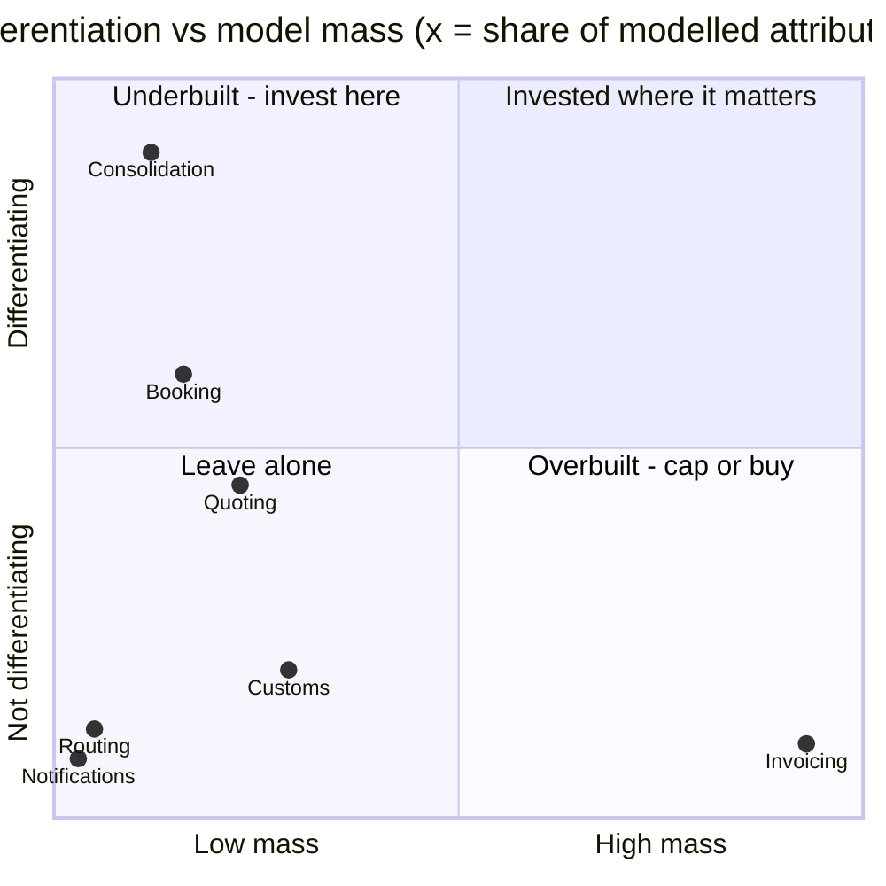

## Summary

Effort today is allocated almost exactly opposite to where the business says its money comes from.

**71% of the modelled complexity sits in capabilities the commercial director says are not
differentiating. 7% sits in the one capability she says the premium is charged for.**

The `subdomain_type` labels in the context map do not resolve this, because they were written
against a different question ("is this important?") than the one a roadmap needs ("would a
competitor beat us here?"). Four of seven contexts are labelled `core`; when most things are core,
the label stops sorting anything.

The recommendation is a reallocation, not a rewrite: move effort into **Consolidation** and the
**capacity-commitment path through Booking**, cap **Invoicing**, and open a buy decision on
**Customs**.

## 1. The mismatch, in numbers

Mass figures are taken from each `model.yaml`; differentiation from the business-model canvas.
Totals: 76 tables, 608 attributes across 7 contexts.

| Context | Label today | Tables | % of tables | Attributes | % of attrs | Business says it differentiates | Evolution |
|---|---|---:|---:|---:|---:|---|---|
| Invoicing | `core` | 34 | 45% | 311 | 51% | **no** — *"nobody has ever chosen us because of our invoices"* | commodity |
| Customs | `core` | 12 | 16% | 96 | 16% | no — required; two vendors do it well | product |
| Quoting | `core` | 11 | 14% | 78 | 13% | partial — *"we are no faster"* | product |
| Booking | `core` | 9 | 12% | 54 | 9% | not assessed | not assessed |
| **Consolidation** | `supporting` | **5** | **7%** | **41** | **7%** | **yes** — the premium; needs depot network + planning know-how | custom-built |
| Routing | `supporting` | 3 | 4% | 17 | 3% | no — the partner network is the asset, not the routing step | product |
| Notifications | `generic` | 2 | 3% | 11 | 2% | no | commodity |

Two readings that matter:

- **Invoicing carries 7.6× the modelled detail of Consolidation** (311 vs 41 attributes; 34 vs 5
  tables) while being the one capability the business explicitly disclaims as a reason anyone buys.
  Its own notes explain why: eleven years of growth, and 3 of 5 aggregates exist to model VAT
  variation across nine ports. That is regulatory surface area, not competitive advantage.
- **Consolidation is the smallest full-domain model in the system and is labelled `supporting`.**
  It owns the no-overbooking invariant, it owns fill rate, and it is the only context whose work
  moves either of the two revenue mechanisms below.

## 2. Why Consolidation is the core domain

The business earns from part-load shipments through two distinct mechanisms, and both terminate in
Consolidation.

**Mechanism A — fill rate is margin.** The value proposition is *"full-container prices on part-load
shipments"*. Every point of container fill is revenue on a container that was going to sail anyway.
The stated short-horizon goal is 71% → 80%. No other context in the map can move that number:
Quoting prices a lane, Booking records a commitment, Routing hands over a sealed box, Invoicing
bills after the fact. Fill is decided in load planning.

**Mechanism B — the no-overbooking invariant is the premium.** Guaranteed Consolidation is +18% of
the forwarding fee, and finance confirms the premium *is charged whether or not the container ends
up full*. So the premium is not paid for fill — it is paid for a promise of a departure slot. The
only way to break that promise is to bump a shipment, and the only rule preventing that is
Consolidation's invariant: *committed volume must never exceed capacity*. This already failed once
(hotspot #1, March: two shipments committed to the same slot). Every such failure is a direct hit
on the highest-margin line in the business.

Two revenue mechanisms, one context, 7% of the model. That is the finding.

**And it is the thinnest place in the system operationally.** Consolidation's own notes: planning
still happens partly on a whiteboard in Gothenburg, and the four senior planners resolve conflicts
by hand when the optimiser proposes an infeasible stack. The business-model canvas lists those four
planners as a key resource. That is a key-person dependency sitting on top of the differentiator —
and it is what blocks the medium-horizon goal of opening two more ports, because planning know-how
in four heads does not deploy to ports 10 and 11.

## 3. Revised classification

Proposed, not applied — the table in `context-map.md` is unchanged and stays the doc of record
until an owner accepts this. The rule used: *core = a competitor would have to beat us here*, not
*this system is big / regulated / expensive to get wrong*.

| Context | Today | Proposed | Reason for the change |
|---|---|---|---|
| Consolidation | `supporting` | **`core`** | Owns fill rate and the invariant behind the premium; custom-built; not replicable without the depot network |
| Booking | `core` | `supporting`, with a core seam | Order capture is table stakes; the *capacity-commitment* decision inside it is core and belongs in Consolidation (see §5) |
| Customs | `core` | `supporting` (compliance) | Regulated ≠ differentiating. Its own notes: two commercial platforms cover all nine ports, and we integrate with neither |
| Invoicing | `core` | `generic` trending to bought | Explicitly disclaimed as a purchase reason; commodity evolution stage; mass is VAT variation, not advantage |
| Quoting | `core` | `supporting` | "Partial" differentiation with an admission of parity — hold at parity, do not fund a lead |
| Routing | `supporting` | `generic` | Owns no rule of its own; a pass-through to the partner network. Candidate to collapse into Booking as an adapter |
| Notifications | `generic` | `generic` | Correct already. Bought adapter, leave it alone |

Result: one core context instead of four.

## 4. Where the money goes

Percentages are share of a year's engineering capacity, not headcount (no headcount data exists in
this repo — see §7).

| Context | Share of model today | Proposed share of FY effort | Direction | Play |
|---|---:|---:|---|---|
| Consolidation | 7% | **40–45%** | ↑↑ | **Build.** Codify planning know-how out of the whiteboard; make the optimiser produce feasible stacks; instrument fill rate per departure |
| Booking (capacity seam) | 9% | **15%** | ↑ | **Build, narrow.** Move the reserve decision behind Consolidation; split the shared kernel (§5) |
| Invoicing | 51% | **≤15%, trending down** | ↓↓ | **Cap and outsource the tax surface.** No rewrite. Strangle VAT/surcharge logic to a tax vendor; freeze feature work |
| Customs | 16% | **10%** | ↓ | **Buy.** Time-boxed spike to integrate one of the two commercial platforms and retire the in-house declaration model |
| Quoting | 13% | **8%** | ↓ | **Hold at parity.** Keep-the-lights-on plus response-time monitoring |
| Routing | 3% | **2%** | → | **Absorb.** Fold into Booking as a partner-network adapter |
| Notifications | 2% | **0–1%** | → | Leave alone |

The single sentence for the roadmap argument: *stop paying to maintain a bespoke tax engine and a
bespoke customs engine, and spend that on the load planning we charge a premium for.*

### Do not rewrite Invoicing

Capping is not the same as replacing. Invoicing is 34 tables with a 128-attribute densest entity —
a rewrite is the most expensive project available and it buys zero differentiation. Freeze it,
route the VAT/surcharge variation to a vendor, and let the rest sit. Big and boring is fine as long
as it is not also churning; see the falsifier in §7.

## 5. The two structural changes worth doing regardless

**Move the capacity commitment into Consolidation.** Booking currently does a synchronous
remaining-capacity check and then commands a reserve (`booking/model.yaml`, relationship note). The
invariant it depends on lives in Consolidation. Check-then-act across a context boundary is exactly
the shape that produces hotspot #1, and nobody could agree afterwards where the check should have
happened — which is the diagnosis, not a mystery. Replace it with a single `ReserveCapacity`
command that Consolidation accepts or rejects atomically. Small change, protects the premium.

**Break the `ConsignmentLine` shared kernel.** It is currently written by both Booking and
Consolidation. A shared kernel running through the core domain is the most expensive coupling in
the map: it means the differentiator cannot change shape without a negotiation with order capture.
Consolidation should own the physical line (volume, stackability); Booking keeps the commercial
line; translate between them.

**Resolve "consignment" while you do it.** Hotspot #2 — finance means a billable line, operations
mean a physical stack of pallets — and both meanings are already written down in the models
(`invoicing/model.yaml` vs `booking/model.yaml`). Two meanings in one word across the billing
boundary is a defect generator. Name them separately.

## 6. Sequencing

- **Q1 — instrument and stop the bleeding.** Fill rate per departure, premium revenue attribution,
  and Invoicing change traffic (§7). Move the capacity commitment into Consolidation. Freeze
  Invoicing feature work.
- **Q2 — build the core.** Planning know-how out of the whiteboard: feasibility rules, stack
  constraints, conflict resolution the optimiser can do unaided. Split the shared kernel.
- **H2 — buy down the commodity.** Customs platform integration; VAT/surcharge strangler on
  Invoicing. Both are bounded, both free capacity for the following year.

Opening two more ports (medium-horizon goal) should be gated on Q2 landing. Adding ports to a
whiteboard process multiplies the key-person problem instead of solving it.

## 7. What would falsify this — measure before committing the full year

The recommendation rests on evidence that is thinner than its confidence implies. Three things to
settle in the first four weeks:

1. **What share of revenue is the Guaranteed Consolidation premium?** The canvas gives the +18%
   rate but not the take-up. If the premium is 2% of revenue rather than 20%, Consolidation still
   deserves more than 7% of effort but not 45%. *Owner: whoever owns the P&L — currently nobody in
   the room.*
2. **What is a fill point worth?** 71% → 80% needs a euro figure per container-point before it can
   be ranked against anything else. Cost structure is listed as unknown in the canvas.
3. **Is Invoicing actually a drag, or just large?** Mass is not spend. Count what share of the last
   12 months' engineering tickets touched Invoicing. If it is ~45% of mass *and* ~45% of change
   traffic, capping it is the biggest single win available. If it is 45% of mass and 5% of traffic,
   it is inert — leave it entirely alone and take the reallocation from Customs and Quoting
   instead. **This is the one measurement that can change the plan most.**

Two standing caveats on the inputs:

- **No customer has been interviewed.** Every differentiation judgement above traces to the
  commercial director speaking as a proxy (`business-model.md` marks it as such). The claim that
  customers pay for the departure-slot promise is the load-bearing one and it is unverified.
- **The classification in `context-map.md` has not been revisited since March**, and the mass
  figures, the labels, and the differentiation column disagree with each other. This document
  treats the business model as the tie-breaker, because it is the only input tied to revenue.

## 8. Open decisions for the roadmap session

| # | Decision | Needs |
|---|---|---|
| 1 | Accept the reclassification (four `core` → one) | Doc owner |
| 2 | Freeze Invoicing feature work for the year | Finance + engineering lead |
| 3 | Open a build/buy evaluation for Customs | Customs clerk + engineering lead |
| 4 | Fund codifying planning know-how, and name a successor owner for it | Commercial director + the four senior planners |
| 5 | Gate the two new ports on Q2 | Investor-facing owner |
