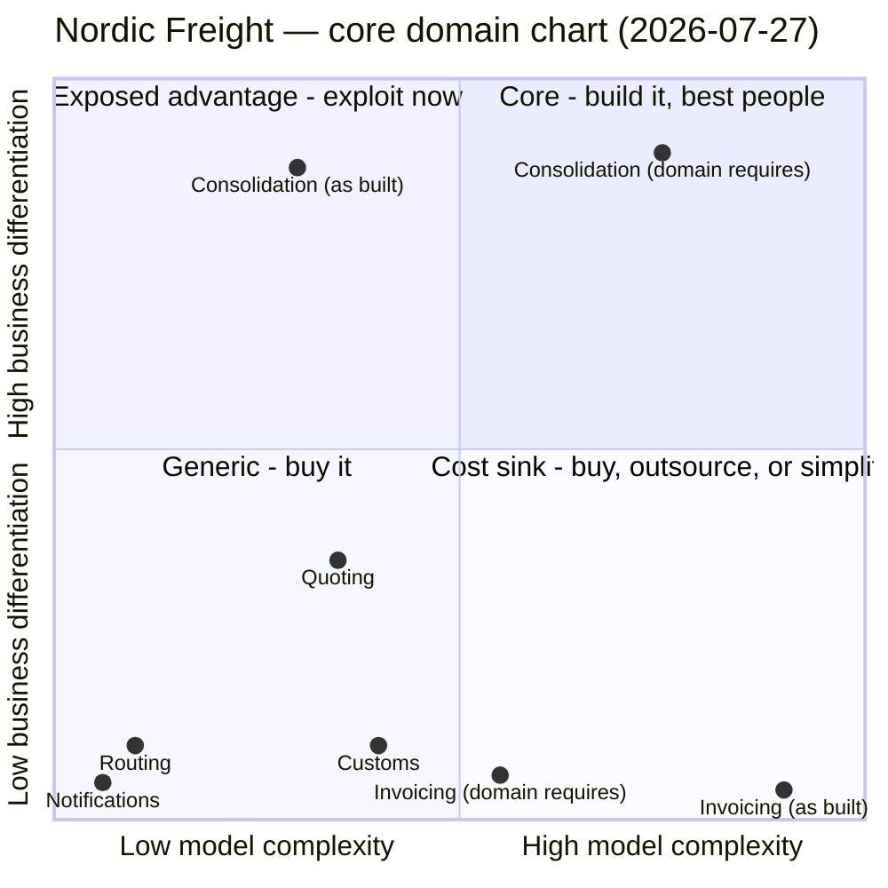

Assessed to answer one question put by the board: *outsource Customs and Invoicing, move the three
engineers to Quoting.* The chart is scoped to all seven contexts because a staffing move cannot be
judged against two of them in isolation — the question is not only what to stop doing, it is where
the freed capacity should land.

## How this was assessed

**In the room:** nobody. This is a desk assessment from existing artifacts —
`docs/domain/business-model.md` (2026-05-18), `docs/domain/discovery/timeline.md` (2026-05-25),
`docs/domain/context-map.md` (2026-06-02), and the seven `model.yaml` files.

| Axis | Who could speak to it | What we actually had |
|---|---|---|
| x — model complexity | engineers | mass figures, aggregate/invariant/event counts, integration notes in the models. Solid. |
| y — business differentiation | product / business | one source: the commercial director, 2026-05-18. |

**The y axis is single-sourced and proxied.** `business-model.md` says it plainly: no customer took
part, and the "what customers value" rows are the commercial director speaking for them. Every
differentiation value below inherits that confidence. It is enough to rank contexts against each
other; it is not enough to sign a multi-year vendor contract on. See *Open questions*.

**What stayed unknown:**

- **Booking has no differentiation row at all.** `business-model.md`'s capability table covers
  consolidation, quoting, customs, invoicing, notifications and routing. Booking — labelled `core`,
  described as "where the money is committed" — is absent. Its y is `unknown` and it is not plotted.
- **Cost structure is unknown.** `business-model.md`: *"nobody in the room owns the P&L."* No cost
  per context, no cost per shipment. The savings half of the board's proposal cannot be sized from
  anything in this repo.
- **Headcount and ownership are absent from the repo entirely.** There is no team list. The claim
  that Customs and Invoicing are staffed by three engineers is taken on trust; it is not verifiable
  here, and complexity is not headcount in any case.

## Chart

Two contexts are plotted twice — once at the complexity their **current implementation** carries,
once at the complexity the **domain itself requires**. That gap is the whole argument, so it is
drawn rather than described.

**Booking is deliberately not on the chart.** Its x is roughly 0.4; its y has no source. Plotting a
guess for the context that commits the revenue would be the exact bias this step exists to prevent.

## Placement

| Context | Complexity | Evidence (measured) | Adjustment (judged) | Differentiation | Source | Quadrant |
|---|---|---|---|---|---|---|
| **Consolidation** | 0.75 | 5 tables, 41 attrs, 1 aggregate, 1 invariant, 2 events. Measured mass reads ~0.3 — the lowest of the modelled contexts. | **++ large upward.** The one hard invariant in the system (`committed volume must never exceed capacity`) and it has been violated in production — hotspot #1, two shipments in one slot in March. Load planning still runs *on a whiteboard*: four senior planners resolve infeasible stacks by hand. That is operational complexity the software has not absorbed, not simplicity. Stacking feasibility across 9 ports; specialist planners are expensive and hard to hire. | **0.9** | Commercial director (proxy): the Guaranteed Consolidation premium is +18% of the forwarding fee; a new entrant needs both the depot network and the planning know-how. Value proposition verbatim: *"full-container prices on part-load shipments"*. | **Core — the only one** |
| **Quoting** | 0.35 | 11 tables, 78 attrs, 1 aggregate, 1 invariant (validity window), 2 events. | none — the measured mass is a fair reading. | **0.35** | Commercial director: *"partial — competitors quote in seconds too; we are no faster."* `evolution_stage: product`. | Generic / parity, low-mid |
| **Booking** | ~0.4 | 9 tables, 54 attrs, 1 aggregate, 1 invariant, 2 events. | **+ small.** Coordination cost: a synchronous remaining-capacity check against Consolidation, plus a Shared Kernel on `ConsignmentLine`. | **`unknown`** | **No source exists.** Not in `business-model.md`'s capability table. | **unplaced** |
| **Customs** | 0.4 | 12 tables, 96 attrs, 34 on the densest entity, 1 aggregate, 1 invariant, 2 events. Measured ~0.45. | **− downward.** Regulatory rules are complicated but they are *someone else's* product: `notes` says two commercial platforms cover all nine ports and we integrate with neither. The complexity the domain requires **of us** is integration, not declaration modelling. | **0.1** | Commercial director: *"no — required, and two vendors already do it well."* `compliance-enforcer`, `evolution_stage: product`. | Generic |
| **Invoicing** | 0.55 (as built: 0.9) | **34 tables, 311 attrs, 128 on the densest entity, 5 aggregates** — the largest model in the system by a wide margin. | **− large downward.** Mass without behaviour: 5 aggregates produce **1 domain event and 1 invariant**. A 128-attribute entity is a schema finding, not a rich domain. `notes`: grown over eleven years; 3 of 5 aggregates exist for VAT variation across nine ports, 2 more added for the 2024 Finnish rules. Multi-jurisdiction VAT is genuinely complicated — and fully productised by billing vendors. The essential complexity is real; the *bespoke* complexity is largely accidental. | **0.05** | Commercial director, verbatim: *"nobody has ever chosen us because of our invoices."* `evolution_stage: commodity`. | **Cost sink** |
| **Routing** | 0.1 | 3 tables, 17 attrs, **0 aggregates**, 0 invariants, 1 event. `aggregates_rationale`: *"it owns no rule of its own."* | none. | **0.1** | Depot planners: *"the partner network is the asset, not the routing step."* | Generic |
| **Notifications** | 0.06 | 2 tables, 11 attrs, 0 aggregates, already a `bought-adapter`. | none. | **0.05** | Commercial director: no. `commodity`. | Generic — correctly placed and correctly bought |

## Decisions

| Context | Build / buy / outsource | Modelling rigour | Team type implied | Rationale |
|---|---|---|---|---|
| **Consolidation** | **Build, in-house, best people.** Never outsource. **This is where the three engineers go.** | **Full domain model.** Make `ContainerLoad` a real consistency boundary that owns the no-overbooking invariant; model the fill/stacking decision that lives on the whiteboard today; property-test the invariant. | Long-lived **stream-aligned** team, stable membership, sitting close to the four senior planners. The planning know-how is the asset and it is currently in four heads. | It carries the +18% premium, it is the stated value proposition, it is the only context with a hard invariant, and the short-term company goal (fill 71% → 80%) is *entirely* its goal. It has 1 aggregate. |
| **Customs** | **Buy** — adopt one of the two platforms that already cover all nine ports. **Not outsource.** | Thin adapter + **anti-corruption layer**. Contract tests at the seam. No domain model. | Consumed as a service; nobody's full-time job. | Building the generic. `notes` says the vendors exist and we integrate with neither. Outsourcing pays a third party to keep hand-maintaining what is already a product — it moves the cost, not the work. **Constraint:** Customs owns a cross-context invariant (*no hand-off to a carrier before the declaration is submitted*) that Routing depends on. That rule must survive at the vendor seam, in our ACL. |
| **Invoicing** | **Contain now, buy next.** Freeze the model, stop extending, then evaluate a billing engine behind an ACL. **Not outsource, and not refactor.** | Characterization tests **before** anything is touched — 11 years of VAT behaviour is undocumented. Then freeze. | Minimum viable ownership while contained. Do not staff it with the people needed on Consolidation. | Textbook cost sink, and the complexity is mixed: nine-jurisdiction VAT is essential and productised; a 128-attribute entity is accidental. Buying relocates the accidental part unless it is separated first. **Prerequisite:** hotspot #2 — finance and operations use *"consignment"* to mean two different things (a billable line vs a physical stack of pallets). That conflict is unresolved *inside* the current boundary. Export it into a vendor contract and it becomes a change request with a price tag. |
| **Quoting** | **Hold.** Build thinly, staff flat. **Do not send three engineers here.** | Keep it light. Parity work: standardise, simplify. | Existing ownership, unchanged. | `product` stage, explicit parity (*"we are no faster"*), and no company goal points at it. Purpose Alignment reads it as **mission-critical parity**: do it as well as everyone else and no better. Tripling its staffing spends the core's capacity on a context the business itself says wins nothing. |
| **Routing** | **Absorb or buy.** Candidate to fold into Booking. | None. It has none today and needs none. | Not a staffing target. | 0 aggregates, no rule of its own, a pass-through to the partner network. |
| **Booking** | **Decide nothing yet.** | Unchanged pending a y value. | Unchanged. | Its differentiation has never been assessed. It is the context that commits revenue and it is missing from the capability table — that gap is the finding, not a reason to act. |
| **Notifications** | Already bought. No change. | Adapter + contract test. | Consumed as a service. | Correct as-is — the only classification in the repo the chart agrees with without adjustment. |

## Investment mismatch

Table mass across the seven contexts totals **76 tables / 608 attributes**.

| Context | Model mass | Differentiation | Mismatch |
|---|---|---|---|
| **Invoicing** | 34 tables (**45% of the system**), 311 attrs (**51%**), 5 aggregates | 0.05 — *"nobody has ever chosen us because of our invoices"* | **Half the system's model mass sits in the context with the lowest differentiation in the business.** And it is still growing: two aggregates were added in 2024 for Finnish tax rules. |
| **Consolidation** | 5 tables (**6.6%**), 41 attrs (**6.7%**), 1 aggregate | 0.9 — the +18% premium, the stated value proposition | **The mirror, and the more urgent one.** The capability customers pay extra for has one aggregate, and the decision it is supposed to make still happens on a whiteboard. |
| **Customs** | 12 tables, 96 attrs | 0.1 — two vendors already do it well | Twelve tables of hand-built compliance modelling in a context we ourselves classified as `product` stage, integrating with neither available platform. |
| **Quoting** | 11 tables, 78 attrs | 0.35 — parity | More than twice Consolidation's table mass for a capability we are explicitly *no faster* at. The board's proposal adds three engineers here. |

**The sentence for the board:**

> Invoicing carries 34 tables, 311 attributes and 5 aggregates — 45% of the system — for a
> capability our own commercial director says nobody has ever chosen us for. Consolidation, the
> capability we charge an 18% premium for and the one our short-term goal is entirely about, carries
> 5 tables, 41 attributes and 1 aggregate, and its central planning decision is still made by four
> people around a whiteboard. Invoicing has **6.8× the tables and 7.6× the attributes** of the thing
> we compete on.

## Trajectory

| Context | Today | Expected | Trigger that confirms the move |
|---|---|---|---|
| **Consolidation** | Core (0.75, 0.9). `custom-built`. | Core for ~18–24 months. The advantage is two things with different clocks: the **depot network** (slow to copy, 9 ports, and the medium-term goal adds two) and the **planning know-how** (four heads — fast to lose, fast to copy once productised). | A TMS or load-optimisation vendor productising multi-customer container fill; a competitor announcing a guaranteed-departure product. Either one moves the core from *planning skill* to *network coverage*, and the roadmap should follow it. Also watch the reverse trigger: one of the four planners leaving is a capability event, not an HR event. |
| **Customs** | Generic (0.4, 0.1). `product`. | Commodity. It is already there for everyone but us. | Any new EU customs regime. If we still own the code, the rewrite is our bill; if we have bought, it is the vendor's. This trigger argues for buying *sooner*, not later. |
| **Invoicing** | Cost sink (0.9 as built, 0.05). `commodity`. | Stays a cost sink and keeps growing unless frozen. | The next VAT rule change in any of the nine ports. The 2024 Finnish change cost two aggregates; that is the recurring price of staying non-differentiating in-house. |
| **Quoting** | Parity (0.35, 0.35). `product`. | Drifts down as quoting commoditises. | A competitor bundling instant quote-and-book. Note the trigger lands on **Booking**, not Quoting — which is one more reason Booking's missing differentiation row matters. |
| **Routing** | Generic (0.1, 0.1). | Absorbed or bought. | Nothing to watch. |
| **Notifications** | Generic, bought. | Stable. | Nothing to watch. |

## Disagreements with the current classification

`context-map.md` notes the classification *"has not been revisited since the first modelling session
in March"*. Four of seven contexts are labelled `core`. That is the everything-is-core anti-pattern:
when four contexts are core, differentiation was assumed rather than assessed.

These are **proposed deltas for `domain-decompose` to merge** — no `model.yaml` is edited here.

| Context | `subdomain_type` today | Chart says | Proposed delta |
|---|---|---|---|
| **Consolidation** | `supporting` — *"back-office load planning"* | **Core** — the only core in the system | `supporting` → **`core`**. Highest-value delta in this document. The rationale on file describes where the work happens, not what it wins. Raise tactical rigour to a full domain model with `ContainerLoad` owning the capacity invariant. |
| **Invoicing** | `core` — *"the largest and most business-critical system we run"* | Cost sink | `core` → **`generic`**, with a migration note that its complexity is largely accidental. The stated rationale confuses *largest* and *business-critical* with *differentiating*; the business model contradicts it directly. |
| **Customs** | `core` — *"regulated, and mistakes are expensive"* | Generic | `core` → **`generic`**. "Mistakes are expensive" is mission-criticality, not differentiation — it sets a reliability bar for the vendor seam, not an investment case. |
| **Quoting** | `core` — *"first thing the customer sees"* | Parity | `core` → **`supporting`**. First-seen is not differentiating when the business states we are no faster than competitors. |
| **Booking** | `core` — *"where the money is committed"* | **Cannot say** | Hold at `core` provisionally and **flag as unassessed**. Needs a differentiation source before any label is trusted. |
| **Routing** | `supporting` | Generic | `supporting` → **`generic`**. 0 aggregates, no rule of its own. Also a candidate for absorption into Booking. |
| **Notifications** | `generic` | Generic | No change. |

### Anti-patterns present

| Anti-pattern | Where |
|---|---|
| Everything is core | 4 of 7 contexts labelled `core` |
| The biggest model is in the least differentiating context | Invoicing: 45% of tables at 0.05 differentiation |
| The differentiator has a thin model | Consolidation: 1 aggregate, whiteboard planning, at 0.9 |
| Building generic because "our needs are special" | Customs: two platforms cover all nine ports, *"we integrate with neither"* |
| Extending the cost sink | Invoicing: 2 aggregates added in 2024 |
| A chart with no dates | Classification untouched since March, on file with no assessment date |

## Verdict on the board's proposal

Three moves, scored separately.

| Move | Verdict | Why |
|---|---|---|
| Stop investing in Customs | **Right, wrong instrument.** | Correct quadrant. But **buy**, don't outsource — the vendors exist and cover all nine ports. Outsourcing pays someone to keep maintaining a bespoke system that should stop existing. |
| Stop investing in Invoicing | **Right, wrong instrument and wrong sequence.** | Correct quadrant — it is the cost sink and it is 45% of the model. But outsourcing a cost sink freezes it *and* adds a contract: the 34 tables survive, the 11 years of undocumented VAT behaviour walks out of the building, and the `consignment` language conflict becomes a billable change request. Contain → characterize → buy. |
| Move the three engineers to **Quoting** | **Wrong.** | Quoting is `product`-stage parity by the business's own assessment (*"we are no faster"*). No company goal points at it. Meanwhile the context carrying the +18% premium and the entire short-term goal has one aggregate and a whiteboard. **Send them to Consolidation.** |

The freed capacity is real and the instinct to redeploy it is right. The destination is off by one
context — and it is the one the current classification calls `supporting`, which is presumably why
it was not considered.

**Sequencing, if this proceeds:**

1. Resolve the `consignment` language conflict (hotspot #2) — it straddles the boundary you are
   about to sell.
2. Characterization tests over Invoicing's VAT behaviour, *before* any transition and while the
   people who know it are still here.
3. Publish `ShipmentRef` as a contract. It is shared across Booking, Consolidation, Customs and
   Invoicing; two of those four are about to sit on the far side of a vendor boundary.
4. Preserve Customs' cross-context invariant (no carrier hand-off before declaration submitted) in
   our ACL, not in the vendor's terms of service.
5. Move the engineers to Consolidation **first**, not last — the transition work is precisely when
   the whiteboard knowledge is most at risk.

## Open questions

Ordered by what blocks the board's decision.

1. **Who owns the P&L?** `business-model.md`: cost structure *unknown*. The proposal is a
   cost-cutting proposal and there is no cost figure anywhere in this repo. Nobody can say whether
   outsourcing Customs and Invoicing saves money or spends it. **Needed before any contract is
   priced.** — CFO / whoever owns the P&L.
2. **Is Invoicing's complexity essential or accidental?** 5 aggregates producing 1 event and 1
   invariant, and a 128-attribute entity, point at accidental. Nine-jurisdiction VAT points at
   essential. Different answers, opposite decisions: accidental → simplify (buying relocates the
   mess); essential → buy. **Needed before choosing between contain-and-simplify and procure.** —
   Invoicing's engineers + a schema review.
3. **What is Booking's differentiation?** The context that commits the revenue has no entry in the
   capability table and is labelled `core` on a March intuition. — Commercial director.
4. **Would customers pay for guaranteed departure windows separately?** Already flagged open in
   `business-model.md`, never asked. It is the direct test of whether Consolidation's 0.9 is real
   or the commercial director's optimism. — customers, ~5 interviews. **No customer has been
   interviewed at any point in this repo; the entire y axis rests on one person's proxy.**
5. **Who actually staffs Customs and Invoicing, and who holds the 11-year VAT knowledge?** No
   headcount, team list or ownership data exists anywhere in the repo. "Three engineers" is
   unverifiable here, and named key-person risk is a transition blocker. — engineering management.
6. **Can Consolidation absorb three engineers usefully right now?** Its bottleneck may be planner
   know-how, not engineering capacity. Adding three people to a one-aggregate context with the
   domain expertise still in four heads needs a ramp plan. — the four senior planners.

**Who has to be in the room to close this:** the commercial director (y axis), whoever owns the P&L
(the cost case), at least two senior planners (Consolidation's real complexity), and — for the first
time in this repo — a customer.
