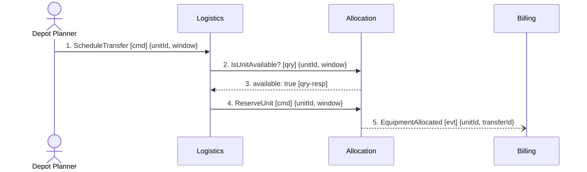

# Domain Message Flow — notation reference

Adapted from ddd-crew/domain-message-flow-modelling (CC BY-SA 4.0). This file covers *how to draw
a flow correctly*; `coupling-heuristics.md` covers *what to conclude from it*.

## 1. The elements

A flow contains four kinds of participant and three kinds of message.

| Participant | What it is | Draw it when |
|---|---|---|
| **Actor** | an individual person playing a role, who starts the scenario | every flow starts with one — a flow with no actor is usually a technical sequence, not a business use case |
| **Bounded context** | a sub-system aligned to a domain area, from `docs/domain/` | it sends or receives a message in this scenario |
| **External system** | something outside the organisation's model (a payment provider, a partner's API) | it participates, but its internals are not yours to model |
| **Read model** | a projection someone consults to decide | a human or context looks at data before issuing the next command |

| Message | Definition | Reading it aloud |
|---|---|---|
| **Command** | a request for another participant to do something | *"Logistics asks Allocation to reserve the unit."* |
| **Event** | a notification that something already happened; past tense | *"Allocation announces that the unit was allocated."* |
| **Query** | a request for information, **with its response**, drawn as one unit | *"Logistics needs to know from Allocation whether the unit is free, before it can continue."* |

Draw a query and its response as a single message. Splitting them into two arrows doubles the
diagram's size and hides that the sender is *blocked* in between — which is the only interesting
thing about a query.

## 2. The three parts of a message

Every message on the diagram carries:

1. **Name** — `ScheduleTransfer`, `EquipmentAllocated`. Commands imperative, events past tense.
   The ubiquitous language applies here exactly as it does in the model.
2. **Contents** — the *significant* data only. Not a schema: the two or three fields that make the
   message meaningful and that reveal what one context has to know about another. Contents are how
   coupling becomes visible — a message carrying eleven fields from another context's model is a
   finding.
3. **Order** — a number. Order is what turns a picture of relationships into a picture of a
   process.

## 3. Two formats

| Format | Shape | Use when |
|---|---|---|
| **Separate** | one shape carries name + order, a second carries contents | the room is arguing about *sequence and boundaries*; get the flow right first, fill in contents after |
| **Combined** | one shape carries name, order and contents together | the room is arguing about *what data crosses the boundary* |

Default to separate when facilitating live: stopping to specify payload fields kills the momentum
of laying out the flow, and half the payloads turn out not to matter once the sequence is right.

## 4. The 5-to-9 rule

Aim for **between 5 and 9 messages** per diagram.

Below 5, the scenario probably does not cross enough boundaries to teach anything — merge it into
a bigger one or pick a different use case.

Above 9, two things happen at once: the diagram exceeds what people can hold in working memory
(Miller's law), and — more usefully — you have learned something. A single business scenario that
needs fifteen domain messages is evidence of one of:

- **two scenarios wearing one name** — split it, and check whether the split falls on a business
  boundary,
- **too many contexts on the path** — count the distinct contexts; if a scenario touches six, the
  decomposition is fragmenting one capability,
- **chatty pairs** — two contexts exchanging six of the fifteen messages belong closer together.

Record which of these it was. "The flow exceeded nine messages" alone is a formatting complaint;
"the flow needed fifteen messages because Pricing and Billing exchanged six of them" is a finding.

## 5. Temporal semantics

When a scenario depends on time, say which relation holds — they are three different rules and
they produce three different designs:

| Relation | Means | Design consequence |
|---|---|---|
| **within** | must complete inside an interval | a deadline, a timeout, and a decision about what happens when it expires |
| **after** | triggered by an elapsed period following an event | a scheduled reaction; something must remember the event |
| **every** | recurs on a period | a scheduler and an idempotency question |

*"Invoice the transfer within 24 hours"*, *"Invoice the transfer 24 hours after it completes"*, and
*"Invoice all transfers every 24 hours"* are three different businesses. Ask which one is meant
rather than picking the one that is easiest to draw.

## 6. Rendering

**A domain message flow is not a sequence diagram.** In the original notation there are no
lifelines and no vertical time axis — order lives in the **numbers on the stickies**. Bounded
contexts are clouds, systems are cogs, actors are people, messages are boxes coloured by type
(command / event / query), and direction is a dashed arrow. Its ancestry is the C4 container diagram
plus Domain Storytelling, not UML.

In a text repo you still need something that renders, so use a Mermaid `sequenceDiagram` as the
**approximation** — and know what the approximation costs: it reintroduces a time axis that the
original deliberately omits, which makes flows look more sequential and more synchronous than they
are. Keep the numbers in the labels; they, not the vertical position, are the ordering.

Conventions that keep the diagram readable and honest:

- solid arrow `->>` for commands and queries (the sender is waiting on something),
- dashed arrow `-->>` for a query response,
- open arrow `--)` for events (the sender is not waiting, and does not know who listens),
- `[cmd]` / `[evt]` / `[qry]` tags so the type is legible in the raw markdown as well as the render.

Always pair the diagram with the message **table** in the output. The table is what a reviewer can
diff, quote a line of, and check against `model.yaml`; the diagram is what a room can look at.

## Sources — go and check

| Claim | Source |
|---|---|
| Elements, the three-part message, separate/combined formats, the 5-to-9 rule, temporal semantics, "one scenario", the initial-cut prerequisite | https://github.com/ddd-crew/domain-message-flow-modelling |
| Notation legend (cloud / cog / person / coloured box / dashed arrow / numbered sticky) | the repo's `resources/` legend image, same URL |
| Its ancestry: C4 container diagram | https://c4model.com/#ContainerDiagram |
| Its ancestry: Domain Storytelling | https://domainstorytelling.org/ |
| command / event / query vocabulary | Eric Evans, *DDD Reference* — https://www.domainlanguage.com/ddd/reference/ |
