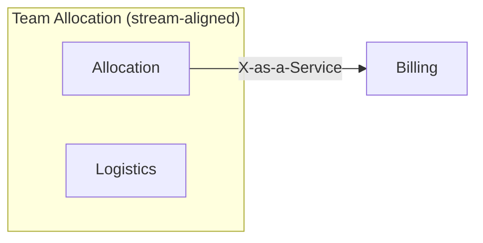

# Domain Organise

> *"Organisation is not something that is done to teams, rather teams should be involved in the
> process of defining their boundaries, interactions, and responsibilities."* — ddd-crew, Organise

Conway's law is not a warning, it is a mechanism: the system will end up shaped like the
communication structure that built it. So the last step of the modelling process is the one that
decides whether the previous four survive contact with reality. A beautiful decomposition owned by
the wrong team shape becomes a distributed monolith within two quarters, and nobody will be able to
point at the decision that caused it.

**What this skill produces:** a proposal — which contexts a team owns, what type of team each is,
what it costs that team in cognitive load, and how each pair of teams should interact. It is
explicitly a **shape**, not a staffing plan. Moving named people is a human act requiring their
consent, and a document that skips that step gets ignored by exactly the people it needs.

## Inputs

| Input | Supplies | If missing |
|---|---|---|
| `docs/domain/` | contexts, `subdomain_type`, model mass (aggregates, entities, events) | run `3-decompose` first — there are no boundaries to organise around |
| `docs/domain/core-domain-chart.md` | which contexts deserve a long-lived team, which are bought | placement is unknown; note it, and expect the ownership proposal to be weaker |
| `docs/domain/message-flows/` | which context pairs actually talk, and how much | interaction modes become guesses — say so |
| **The org's real shape** | how many engineers, what teams exist today, what they know | **stop and ask.** A topology proposed without headcount is a template, not a proposal |

That last row is not a formality. Most team-topology advice fails because it describes an
organisation that does not exist. Ask three questions before drawing anything: *how many engineers,
in how many teams, and what does each team know today?*

## Reference files (read as needed)

- `references/team-topologies.md` — the four team types and three interaction modes with the test
  for each, cognitive-load budgeting, team-first sizing, Conway and the inverse Conway manoeuvre,
  and the Independent Service Heuristics checklist. Read before assigning a single team type.
- `references/sociotechnical-context-map.md` — the nine context-mapping patterns, the power dynamic
  each encodes between teams, what each costs organisationally, and how to draw the map. Read at
  step 5.

## Who to involve

- people who design, build and test software
- people who have domain knowledge
- people who understand the product and business strategy

And, above all, **the teams themselves**. Some organisations go as far as full team self-selection.
Whatever the mechanism, this document is input to a conversation with the people affected — write it
so it can be argued with, and say who has not been consulted yet.

## Process

### 1. Reality check — count first

Before any topology, write down: number of engineers, number of existing teams, number of contexts.
Then divide.

Twelve contexts and eight engineers does not produce twelve teams; it produces two or three teams
that each own several contexts, and a set of explicit trade-offs about what that costs. Naming that
arithmetic first prevents the whole exercise from drifting into a topology for a company that would
need three times the headcount.

If the counts are unknown, say so and mark every ownership row `proposed — unstaffed`.

### 2. Assign a team type per context

Defaults, with the test that justifies each (details in the reference):

| Type | Owns contexts? | The test |
|---|---|---|
| **Stream-aligned** | yes — the default | Can it deliver value to a user end to end without handing off? |
| **Platform** | it owns internal products, not domain contexts | Are several stream-aligned teams solving the same non-domain problem separately? |
| **Complicated-subsystem** | rarely, and only one | Does it genuinely need specialist maths or expertise that cannot be spread? Reach for this last — it is the most over-applied type, and every use of it creates a handoff. |
| **Enabling** | **no** | Is the gap a missing capability rather than missing work? Enabling teams are temporary and have an exit. |

Most contexts should end up owned by stream-aligned teams. If your proposal has three
complicated-subsystem teams and one stream-aligned team, the topology has been drawn around
technical layers, not around flow.

### 3. Budget the cognitive load

A team can hold a bounded amount of domain. Exceed it and the symptoms are predictable: slower
change, defensive process, and knowledge concentrating in one person.

Use the model's own mass as the proxy — it is already measured, and it is harder to argue with than
a feeling:

| Load contribution | Read from |
|---|---|
| intrinsic — how much domain must be held | aggregate count, invariant count, entity count per owned context |
| extrinsic — accidental overhead | deployment, environments, on-call, tooling the team also carries |
| germane — the useful thinking | what is left for actual domain work, which is what you are protecting |

Rule of thumb worth stating and then arguing with: **one core context plus one or two light ones
per stream-aligned team.** Two core contexts in one team means one of them gets the leftovers.

Record the estimate per team and what would have to be removed to add anything. Leaders break teams
by continuously adding responsibilities without ever taking any away; making the budget explicit is
what makes a removal discussable.

### 4. Derive interaction modes from the flows

Do not invent the interaction pattern — read it off the message flows.

| Mode | Use it for | Signal in the flows |
|---|---|---|
| **X-as-a-Service** | the target for most pairs | a stable contract, few message types, no back-and-forth |
| **Collaboration** | genuine uncertainty at a boundary — **and it must have an end date** | many messages both directions, or an invariant spanning both contexts |
| **Facilitation** | one team lacks a capability the other has | not visible in flows; comes from the team conversation |

The most valuable finding in this step is a **permanent collaboration edge**. Collaboration is
expensive by design and is meant to be temporary; a pair that must collaborate forever is telling
you the boundary is in the wrong place. Send it back to `4-connect` and `3-decompose`
rather than institutionalising the meeting.

### 5. Map the DDD relationships onto team relationships

Take each relationship from `context-map.md` and read what it means for the two *teams* (patterns
and power dynamics in the reference). Three fall out repeatedly:

- **Shared Kernel across two teams** — every change needs mutual consent. Sometimes correct, always
  expensive; state the cost on the map rather than letting it live unlabelled.
- **Conformist under an upstream that will not negotiate** — the downstream team has no leverage.
  Name it, because it predicts where the pain will land and who has to fix it politically.
- **Partnership treated as permanent** — two teams whose delivery fails together. Fine while a new
  capability is being built; a smell when it has lasted a year.

### 6. Score the boundaries — Independent Service Heuristics

For each candidate team boundary, run the ISH checklist (ten questions in the reference — sense
check, brand, revenue, cost tracking, data, personas, teams, dependencies, impact, product
decisions). The more *yes* or *probably* answers, the stronger the case that this is a genuine
stream of change a stream-aligned team can own.

Report the score with its weakest answers, not just a number. *"Eight yes, but the team could not
own its own roadmap and its input data comes from another team's database"* is a specific,
actionable objection to a proposed boundary; "6/10" is not.

### 7. Flag what is broken today

The findings that matter most are usually about the current state:

- a context with **no owner** — it will rot, and the first incident will be a surprise
- a context owned by **two teams** — shared ownership is no ownership; every change needs a
  negotiation nobody scheduled
- a team owning **more than one core context** — the second one gets the leftovers
- **bus factor 1** on a core context — the differentiator depends on one person's availability
- a team whose contexts sit in **three different quadrants** of the core domain chart — it is being
  asked to be careful and fast at the same time
- **inverse Conway pressure** — where the current org shape would produce a different architecture
  than the model intends, say what would have to change and roughly what it costs

### 8. Emit

Write `docs/domain/team-topology.md`, `status: draft`, `owner: TBD`. Close with what has to be
decided by people — and by which people.

## Output shape

````markdown
---
id: DOMAIN-ORG-0001
title: <Organisation> — team topology proposal
status: draft
owner: TBD
date: <date>
---

## Reality check
<!-- engineers, existing teams, contexts; what is known vs assumed -->

## Ownership
| Context | Proposed team | Team type | Sub-domain type | Load contribution | Notes |
|---|---|---|---|---|---|

## Team cognitive load
| Team | Contexts owned | Intrinsic (model mass) | Extrinsic | Verdict |
|---|---|---|---|---|

## Interaction modes
| Team A | Team B | Mode | Why (flow evidence) | Ends when |
|---|---|---|---|---|

## Sociotechnical map


## Independent Service Heuristics
| Candidate boundary | Yes / probably | Weakest answers |
|---|---|---|

## Findings
| # | Finding | Evidence | Suggested move |
|---|---|---|---|

## Open decisions
<!-- one line each: the decision, and who must make it -->
````

## Hard rules

- **Length budget: `team-topology.md` ≤ 150 lines.** A budget caps prose, not findings: over it,
  cut rationale a reader can infer and anything restated from an upstream artifact — never open
  questions, provenance, or a stated absence.
- **Never assign named individuals.** This produces a team *shape*; who joins which team involves
  consent, career context and things no document knows. Naming people also guarantees the proposal
  is read as a reorg and rejected on that basis.
- **Never propose more teams than the organisation can staff.** A topology requiring six teams in a
  fourteen-person company is not a plan; it is a wish. Propose what fits and state what the second
  option would need.
- **Collaboration mode carries an end date.** Without one it silently becomes the permanent
  operating model, and its cost stops being visible.
- **Don't redraw boundaries here.** If the topology cannot work with the current contexts, that is a
  finding for `3-decompose` and `4-connect` — with the evidence attached. Organisational
  convenience is a legitimate input to boundary design, but it goes through the skill that owns the
  model.
- **Teams participate in defining their own boundaries.** Write the document as a proposal to be
  argued with, and record who has not yet been consulted. A topology imposed on teams gets the
  compliance it deserves.
- **Say what you do not know.** Headcount, existing team skills, on-call load and political
  constraints usually are not in the repo. Unknowns marked as unknowns keep the proposal honest;
  unknowns filled in with plausible guesses make it confidently wrong.

## Worked example

**Input:** the equipment-rental model — nine contexts, of which `Allocation` is core (0.7 / 0.9 on
the chart) and `Invoicing` is a cost sink. Message flows show `Allocation` and `Logistics`
exchanging six messages in the transfer scenario, including an invariant spanning both. Org reality:
**11 engineers, 3 existing teams**.

**Reality check first:** 9 contexts, 11 engineers. Three teams, each owning several contexts. The
arithmetic rules out a team per context before anyone gets attached to the idea.

| Team | Contexts | Type | Why |
|---|---|---|---|
| Rental Flow | Allocation, Logistics | stream-aligned | they share the no-double-booking invariant; splitting them would create a permanent collaboration edge |
| Commercial | Invoicing, Pricing, Contracts | stream-aligned | one flow, one customer-facing outcome; Invoicing is contained, not extended |
| Foundations | (no domain contexts) Notifications adapter, CI, environments | platform | all three teams were solving deployment separately |

**Interaction modes read off the flows:** Rental Flow → Commercial is **X-as-a-Service** (one event,
`EquipmentAllocated`, stable contract). Rental Flow ↔ Foundations is **Facilitation**, ending when
the deployment pipeline is self-service — with a date on it.

**ISH on the Rental Flow boundary:** eight *yes*. Weakest answers: cost tracking (depot costs are
booked centrally) and data (utilisation data comes from Commercial's warehouse). Both are real
objections and both are fixable; recorded rather than averaged away.

**Findings:**

| Finding | Evidence | Suggested move |
|---|---|---|
| `Invoicing` is owned by two teams today | both teams have merged to it in the last quarter | single owner — Commercial; Rental Flow consumes via contract |
| Bus factor 1 on the allocation scheduler | one engineer holds the depot-constraint logic | pair rotation before any transfer work starts |
| Foundations would own `Notifications` domain logic | its adapter has grown business rules | the rules belong to Commercial; platform owns the delivery mechanism only |

Note what the example does **not** do: it does not propose nine teams for nine contexts, it does not
put names in the ownership table, and it does not merge `Allocation` and `Logistics` into one
context to make the topology tidy — the two stay separate contexts owned by one team, which is a
different and reversible decision.
