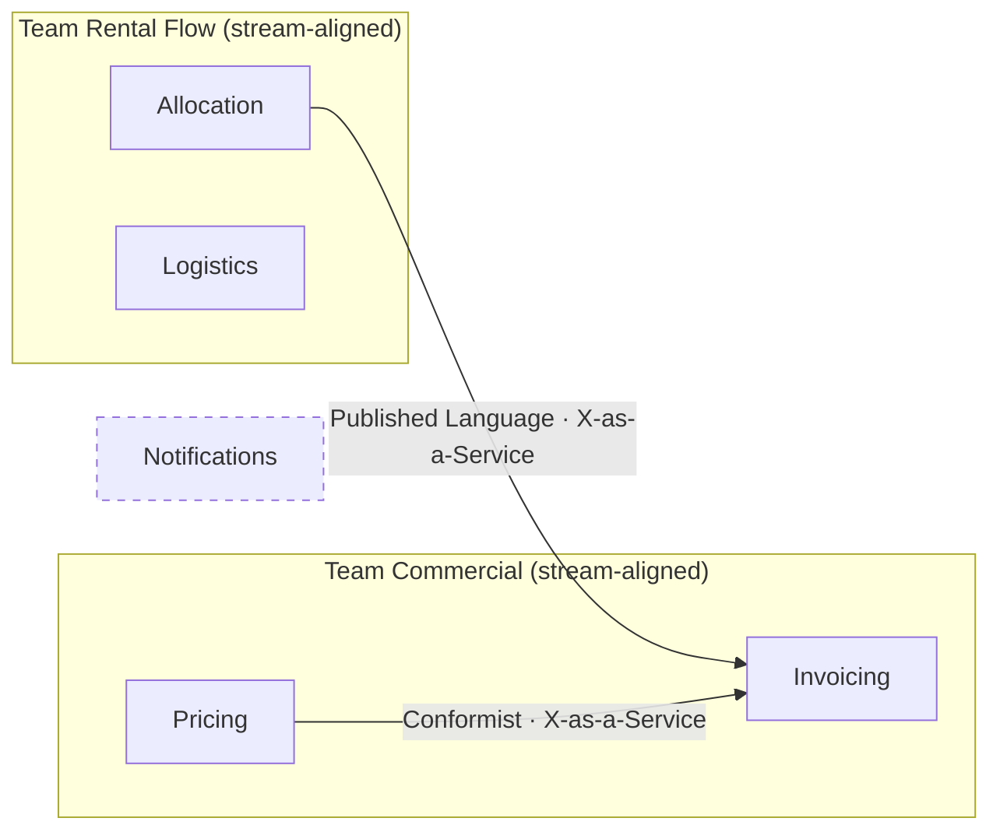

# The sociotechnical context map — patterns as team relationships

Adapted from ddd-crew/context-mapping (CC BY-SA 4.0) and Michael Plöd, *Visualising Sociotechnical
Architecture with Context Maps*.

A context map is usually read as a technical diagram. Read it as an **organisational** one and it
tells you more: each pattern encodes a power dynamic between two teams, and each one has an ongoing
cost somebody pays in meetings, negotiation, or resentment.

## 1. The three power dynamics

Every relationship between two contexts sits in one of three positions. Establish this first — it
narrows the pattern choice to a handful.

| Dynamic | Meaning | Patterns available |
|---|---|---|
| **Mutually dependent** | neither side succeeds alone; reciprocal influence | Partnership, Shared Kernel |
| **Upstream–downstream** | asymmetric — upstream can succeed without downstream | Customer/Supplier, Open-host Service, Conformist, Anticorruption Layer, Published Language |
| **Free** | no interdependence | Separate Ways |

The most common mistake is drawing an arrow between two contexts without deciding which dynamic
holds. Once it is decided, the argument stops being about diagram notation and starts being about
who has leverage — which is the real question.

## 2. The nine patterns

| Pattern | Definition (Evans) | Team reading | Ongoing cost |
|---|---|---|---|
| **Open-host Service** | *"A protocol that gives access to your subsystem as a set of services… enhance and expand the protocol to handle new integration requirements."* | upstream serves many downstreams through one published protocol | maintaining a general contract, and saying no to one-off requests |
| **Published Language** | *"Use a well-documented shared language that can express the necessary domain information as a common medium of communication."* | both sides translate at their own edge | versioning discipline; often paired with Open-host |
| **Conformist** | *"Eliminate the complexity of translation between bounded contexts by slavishly adhering to the model of the upstream team."* | downstream accepts upstream's model wholesale, and its language with it | downstream has no leverage; upstream's model bleeds into its own |
| **Anticorruption Layer** | *"Create an isolating layer to provide your system with functionality of the upstream system in terms of your own domain model."* | downstream protects its model without needing upstream to change | the layer itself — real code, forever |
| **Customer/Supplier** | *"Establish a clear customer/supplier relationship between the two teams, meaning downstream priorities factor into upstream planning."* | downstream's needs enter upstream's backlog by agreement | negotiation, and an upstream that must budget for it |
| **Partnership** | *"Where development failure in either of two contexts would result in delivery failure for both, forge a partnership between the teams."* | coordinated planning, joint interface evolution, synchronised releases | continuous coordination — the most expensive steady state |
| **Shared Kernel** | *"Designate with an explicit boundary some subset of the domain model that the teams agree to share."* | joint ownership of a shared model | every change needs mutual consent; keep the core domain out |
| **Separate Ways** | *"Declare a bounded context to have no connection to the others at all, allowing developers to find simple, specialized solutions."* | deliberate duplication, zero coordination | duplication — usually cheaper than the coordination it replaces |
| **Big Ball of Mud** | mixed models, inconsistent boundaries | not a design choice — a demarcation | mark it, contain it, and stop it propagating into neighbours |

**Big Ball of Mud earns its place on the map.** Drawing it is not an insult; it is how a team knows
to put an anticorruption layer between itself and that region instead of letting the mess spread by
accident.

## 3. Reading a map for organisational pain

Three configurations predict trouble reliably enough to check for by name:

**Shared Kernel across two teams.** Every change to the shared model needs both teams to agree —
which means every change is scheduled twice. Sometimes correct (two teams building one capability
together), but the cost must be on the map, not discovered later. Prefer, in order of coupling:
duplicate → extract a context and integrate via Published Language → Shared Kernel as a last resort.

**Conformist under an unresponsive upstream.** The downstream team absorbs the upstream's model
*and* its release schedule, with no negotiating position. This is where "why is that team so slow"
usually originates, and it is not a downstream capability problem. Fix it politically
(Customer/Supplier), technically (Anticorruption Layer), or accept it explicitly — but name it.

**Permanent Partnership.** Two teams whose delivery fails together, indefinitely. Appropriate while
a new capability is being built together; a smell after a year, because it means neither team is
autonomous and the boundary between them was never designed.

## 4. Drawing it

Overlay teams onto the context map so ownership and interaction are visible in one picture — that
overlay is what makes it *sociotechnical* rather than just architectural. Show, on one diagram:

- **team boundaries** as subgraphs containing the contexts each team owns,
- **the DDD pattern** on each edge (what is shared, and how),
- **the interaction mode** on each edge (how the teams work together),
- **anything unowned**, marked loudly.

Two edge labels, not one: the DDD pattern says *what crosses the boundary*, the interaction mode
says *how the teams behave*. They are independent — an X-as-a-Service interaction can sit on a
Conformist relationship, and that combination is worth seeing, because it means the consuming team
is comfortable while quietly having no leverage.

Mark unowned contexts visibly. An orphan on a diagram gets an owner; an orphan in a table does not.

## Sources

- ddd-crew, *Context Mapping* (CC BY-SA 4.0) — the nine patterns, definitions quoted from Eric
  Evans, and the power-dynamic grouping.
- Michael Plöd, *Visualising Sociotechnical Architecture with Context Maps* — reading the map as an
  organisational artifact.
- Eric Evans, *Domain-Driven Design* / *DDD Reference* — the pattern definitions themselves.
